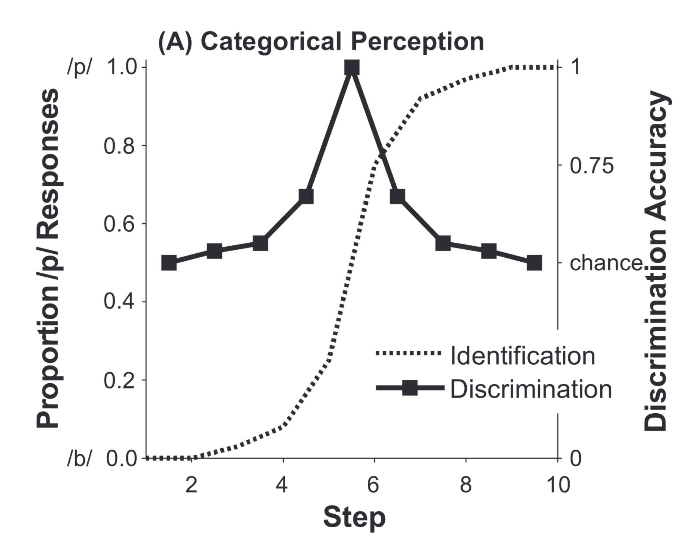
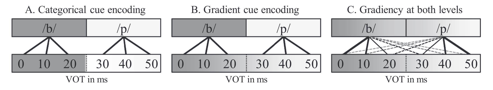

# Literature Review {#chp2-lit-review}

```{r, include=FALSE}

# all that needs to be changed is seq_id in the run_autonum function, which restarts figure/table numbering with each chapter

# create functions for table and figure captions using officer functions

# these functions use the chunk label to enable cross-referencing with bookdown syntax 

table_caption <- function(caption){
  block_caption(label = caption,
              style = "Table Caption",
              autonum = run_autonum(seq_id = "chp2tab", 
                       pre_label = "Table ", 
                       tnd = 1, tns = ".", 
                       bkm = opts_current$get("label"),
                       prop = fp_text_lite(bold = TRUE)))
}

figure_caption <- function(caption){
  block_caption(label = caption,
              style = "Image Caption",
              autonum = run_autonum(seq_id = "chp2fig", 
                       pre_label = "Figure ", 
                       tnd = 1, tns = ".", 
                       bkm = opts_current$get("label"),
                       prop = fp_text_lite(bold = TRUE)))
}

# an alternative to include_graphics - figures are in their original aspect ratio (but huge in the output, usually like 200% so I might have to manually go in and change everything...)

officer_figure <- function(file){
fpar(external_img(file, guess_size = T), fp_p = fp_par_lite(word_style = "Figure", keep_with_next = T))
}
```


## The role of gradient categorization in speech perception {#gradient-speech-perception}

<!-- full section is all good! -->

### Competing theories of speech perception: categorical perception vs. gradient categorization {#competing-theories}

<!-- done! -->

It is widely understood that speech perception involves processing continuous acoustic information into recognizable speech and that the perceptual system must contend with the issue of linguistic and extralinguistic variability. What is less understood is the nature of the information that is processed from physical speech stimulus to the mental lexicon. Two camps of theoretical frameworks approach the nature of speech representations differently: the prototype-based abstractionist viewpoint and the exemplar-based memory viewpoint [see @Nguyen2009dynamical for a review]. By far the more popular viewpoint is the abstractionist framework, which posits that the representation of speech units arises from the encoding of fine acoustic detail into discrete phonetic representations which govern the rules of phonemic representations; the resulting phonetic and phonological categories are centered on prototypes abstracted from each speech encounter, against which incoming input are compared [@Kingston2003What; @Miller1997Internal; @Pierrehumbert1990Phonological; @Samuel1982Phonetic; @Stevens2002model]. The alternative memory trace viewpoint posits all information conveyed in a speech stimulus, including both linguistic and talker information, are stored in memory and incoming input are grouped into the category with the most similar exemplars [@Goldinger1998Echoes; @Goldinger1996Words; @Johnson2005Speaker; @Johnson1997Speech; @Johnson1997auditory; @Medin1978Context; @Pierrehumbert2001Exemplar; @Port2007How]. Other researchers have been advocating against either extreme by embracing the integration of both viewpoints and positing that the perceptual system both creates discrete representations of speech sounds based on the encoding of relevant acoustic cues *and* stores talker-specific information, through memory traces of word exemplars and/or through connecting talker characteristics to talker-related acoustic cues [@Pisoni1995Variability; @Nguyen2009dynamical; @Cutler2010How; @Rhodes2019Phonological; @Crinnion2020graphtheoretic]. As it is most relevant to the constructs investigated here, this dissertation largely follows the abstractionist framework and the viewpoint that speech categorization occurs through the encoding of variable acoustic information into discrete category representations.

There is evidence that speech perception can take place at all three acoustic, phonetic, and phonemic levels, meaning that listeners can process speech sounds in order to distinguish differences in acoustic properties, phonetic features, and phonemic segments [@Werker1985Crosslanguage]. As much of the goals of early speech perception was to understand how the perceptual system overcomes the problem of the lack of invariance, researchers attempted to understand what information is being encoded at each level of processing, when and how linguistically-irrelevant variability was handled, and how perceptual categories interact with speech perception. This cooccurred with research that searched for acoustic invariance amidst the multidimensional variability of speech signals, or in other words, the search for acoustic correlates corresponding to specific speech categories, for example, the relevancy of voice onset time (VOT) in distinguishing between voiced vs. voiceless segments, among other acoustic cues [@Blumstein1979Acoustic; @Delattre1955Acoustic; @Stevens1980Acoustic].

The earliest theoretical claim of perceptual encoding was categorical perception for English voiced stop consonants, which was first empirically measured by Liberman and colleagues at Haskins Laboratory [@Liberman1957discrimination; @Liberman1961discrimination]. The classical categorical perception paradigms derived from these seminal studies are identification and discrimination tasks that ask listeners to identify/discriminate between acoustic tokens that vary in equal steps along a continuous dimension. From these tasks, three behavioral measures characterize categorical perception: 1) a sudden shift in identification choice at the category boundary along the continuous acoustic dimension, resulting in a steep sigmodal curve separating the continuum into two different phonemic contrasts; 2) discrimination choices resulting in a mountain-shaped curve, indicating lower discrimination accuracy between two contrasts at either end of the continuum and increased discrimination accuracy between two contrasts on either side of the category boundary; and 3) alignment of the category boundary at the same location along the continuum for both the identification and discrimination tasks. Figure \@ref(fig:mcmurray-2afc-discrimination-curves) depicts an example of canonical categorical perception behavior from identification and discrimination tasks [@McMurray2022myth].

```{r fig.id="mcmurray-2afc-discrimination-curves", label="mcmurray-2afc-discrimination-curves"}
#

officer_figure("figure/mcmurray-2afc-discrimination-curves.png")
figure_caption("Hypothetical 2AFC identification and discrimination data showing canonical categorical perception behavior (from McMurray, 2022). The dotted S-shaped curve is proportion of /p/ responses (y-axis, left) in a 2AFC identification task as a function of continuum step along an acoustic dimension that varies from /b/ to /p/. The solid black line with squares is the mean discrimination accuracy between two tokens at neighboring continuum steps (e.g., discrimination between Step 1 and Step 2, Step 2 and Step 3, etc.). Canonical categorical perception behavior is the alignment of the inflection point of the identification curve with the peak of the discrimination accuracy curve.")
```

These behaviors seemed to suggest that, for the identification task, tokens on either side of the category boundary are consistently identified with high accuracy, despite the fact that tokens vary in feature value at each step along the acoustic dimension, with a sudden switch in identification choice at the point along the continuum that marks the category boundary. For the discrimination task, these behaviors seemed to suggest that within-category tokens were more difficult to discriminate between than between-category tokens despite being the same distance from each other along the continuum.

As a theory, categorical perception posits that categories influence the perception of auditory input characterized across continuous, multidimensional perceptual space. In other words, the theory suggests that after acquiring perceptual categories, perception itself is warped such that within-category differences are minimized and between-category differences are enhanced, thereby producing an asymmetry in the distance between stimuli in the perceptual space that is dependent on if the distance crosses a perceptual boundary or not [@Goldstone2010Categorical; @Harnad2003Categorical; @Harnad1987Psychophysical]. Essentially, if a set of stimuli is separated along a physical dimension by a given distance, the distance is perceived as smaller if the stimuli are on the same side of a perceptual boundary, while it is perceived as larger if the stimuli are on opposite sides of a perceptual boundary. As such, categorical perception is a theory on how perceptual categories influence the perceptual encoding of incoming stimuli, also known as perceptual warping.

Subsequently, the field sought out to find evidence of categorical perception in more speech perception contexts. For adult L1 speech perception, following the original Haskins Laboratories studies, additional studies investigated categorical perception of other classes of phonemes and speech stimuli, including English fricatives [@Cutting1974Categories; @Ferrero1982Continuous], and a variety of synthesized English stop consonants and vowels [@Liberman1961Effect; @VanHessen1999Categorical], which found that the strength of categorical perception increased with increasing complexity of the synthesized speech as it approaches that of natural speech. Categorical perceptual greatly influenced the field of speech perception from the influx of studies that compared categorical perception in L1 and non-L1 users. For example, these studies found evidence of categorical perception of Mandarin Chinese lexical tone [@Halle2004Identification; @Shen2016Categorical; @Xu2006Effects], Thai lexical tone [@Burnham2002Categorical] and English /r/-/l/ [@Miyawaki1975effect] for L1 listeners but *not* for naïve non-L1 listeners. @Kim2013Categorical found evidence of categorical perception of lexical pitch accent for users of a dialect of Korean that uses lexical pitch accent, and did not find evidence of categorical perception in Korean listeners of a dialect that does not use lexical pitch accent. @Shen2016Categorical also found that L2 learners had comparably high categorical perception similar to L1 listeners. This evidence seemed to suggest that categorical perception is the standard for L1 speech perception, and proponents of categorical perception assumed a direct correlation between behavioral outcome (perceptual warping) and learning mechanism; if having acquired categories leads to categorical perception, as is the case in adults, then behavioral evidence of categorical perception must mean that these infants had already acquired phonetic categories.

A few studies attempted to verify the correlation between mechanism and behavior [@Pollack1971comparison; @Schouten2003end]. Categorical perception was challenged as the processing mechanism of at least some speech categories, such as vowels. @Fry1962Identification provided evidence that English vowels were not perceived categorically, but instead were perceived in a gradient fashion as stimuli features changed in value along the continuum of the most informative acoustic dimension. Rapidly following was the wave of experiments providing evidence against categorical perception of segmental and suprasegmental speech categories, even those that had been previously shown to produce categorical perception behaviors [@Abramson1979noncategorical; @Carney1977Noncategorical; @Hary1982Categorical; @Ladd1997perception; @Massaro1983Categorical; @Pisoni1974Categorical; @Samuel1977effect; @Utsugi2008Determining].

The weakening evidence for categorical perception put its traditional identification and discrimination tasks under scrutiny. Skeptics have noted that these tasks collect measures that are as much of a product of the task demands as they are of categorical perception as a perceptual phenomenon, and that discrimination tasks are subject to influence from working memory as a confounding factor [@Gerrits2004Categorical]. Recent work has also revealed that reduced within-category discrimination and increased between-category discrimination, behaviors that suggest perceptual warping, can occur in the absence of robust category representations [@Schatz2021Early; @Feldman2021Infants]. This directly challenges the extrapolated assumption of categorical perception that warped perceptual processing, as shown in discrimination outcomes, reflected already acquired category knowledge. Additionally, forced choice identification tasks by definition force the listener to choose one category label or another when presented with a stimulus, which makes it impossible to measure potential gradient processing of within-category variation. When given only discrete options for decision-making, a listener will necessarily only report to perceive objects categorically, as they are not given any response choices to communicate possible gradient processing. Thus, categorical perception and the tasks used to measure it may not reflect the construct of category acquisition and knowledge as initially posited [see @McMurray2022myth for a full synthesis].

In light of evidence that speech categories may be encoded with the continuous information present in the auditory signal, researchers began to rethink the role of categorical perception in speech perception and instead reconsidered speech perception as a process of categorization that uses general auditory processes [@Holt2010Speech; @Holt2008Speech]. Unlike categorical perception, categorization does not require that phonetically irrelevant within-category variation be discarded. Instead, categorization compresses, but retains, acoustic features of the input when mapping onto the perceptual space, which enables the extralinguistic features to remain accessible to the speech system. With such within-category variation accessible, the speech system is free to engage in gradient perception. In line with gradient perceptual strategies, there is evidence that phonetic categories themselves are mapped as gradient representations [@Miller1997Internal], which also aligns with the prototype-based framework of category representations [@Stevens2002model]. A phonetic category may be robustly represented by relatively tight clustering around values somewhere along the relevant dimension that signify category membership [@Delattre1955Acoustic; @Stevens1980Acoustic], and category membership may be graded based on distance from the category center.

This gradient encoding strategy offers a compelling solution to the problem of the lack of invariance. Encoding both phonetically-relevant and phonetically-irrelevant cue features in a gradient fashion allows for the perceptual system to create both flexible and stable perceptual categories [@McMurray2011What; @Oden1978Integration]. Perceptual flexibility primes the speech system to be sensitive to context changes, and perceptual stability allows the speech system to function in the face of these changes. In other words, stable categories are necessary to ascribe functional equivalence to variable sounds, yet perceptual flexibility is just as necessary to adapt to irregular or novel input, such as those introduced by coarticulatory, prosodic, or pragmatic contextual effects, and those introduced by idiosyncratic speech or foreign-accented speech [@Baese-Berk2018Perceptual]. The flexibility and adaptability of the speech system can shift boundaries based on non-phonetic cues to attune to persistent change, and enables robust generalization when encountering further novel speech contexts [@Kleinschmidt2015Robusta]. Indeed, gradient perception supports both the flexibility and stability necessary for speech learning, adaptation, and generalization [@McMurray2023acquisition; @McMurray2022myth].

### Measuring gradient categorization in speech perception {#measuring-gradient}

<!-- all good -->

In order to measure whether listeners use continuous acoustic information in the encoding of speech sounds, researchers must use more gradiently-oriented tasks [@Apfelbaum2022Dont]. Early on, researchers who suspected continuous perception provided evidence of this perceptual strategy by showing that discrimination reaction times increased for ambiguous stimuli at the perceptual boundary [@Pisoni1974Reaction], that lexical decision reaction time increased as a function of subphonemic distance [@Andruski1994effect], and that analyzing identification rating scores as a distribution across the continuum instead of as the average rating score showed that empirical rating distribution data matched the predicted distribution of continuous identification rather than categorical identification [@Massaro1983Categorical].

Since then, online measures of speech perception have regularly been employed to show the use of continuous acoustic detail. These online measures evaluate speech perception in real time using techniques such as eye-tracking, electroencephalography (EEG), and magnetoencephalography (MEG), and procedures such as lexical decision tasks, visual world paradigms, and auditory oddball tasks. These tasks can also employ stimuli that synthetically vary in equal steps along a continuum, much like classical categorical perception tasks, but in such a way as to truly evaluate the effect on processing behavior as a function of steps along the continuum. In lexical decision tasks and the visual world paradigm, participants must make a lexical decision, often times among phonologically similar lexical competitors. Participants eye movements are monitored as they see visual representations of competing lexical items and hear a word which is only lexically disambiguated part-way through the word (e.g., *pencil* vs. *pendant* vs. *penthouse*). These studies have consistently shown that L1 listeners use continuous acoustic detail and phonetic cues and show sensitivity to within-category variation during word recognition through phoneme categorization [@Clayards2008Perception; @Desmeules-Trudel2019Gradient; @McMurray2008Gradient; @Ou2021Individual], lexical tone categorization [@Qin2019Influence], lexical access [@McMurray2002Gradient], and downstream referential disambiguation [@Brown-Schmidt2017Gradient].

In auditory oddball tasks, participants hear a number of words with equal probability and must detect a predetermined target word amongst competing non-target words for each trial. Certain patterns of brain activity, as measured by an event-related potential (ERP), responds to non-target "oddball" stimuli, and the amplitude of the wave pattern has been shown to vary as a function of acoustic distance between the target and non-target stimuli, indicating neural patterns that recognize and encode continuous acoustic information [@Getz2021timecourse; @Toscano2010Continuous]. EEG and MEG have also been used with classical identification tasks and have similarly provided evidence of gradient perception [@Gwilliams2018Spoken; @Ou2022Neural]

A paradigm that is gaining popularity to measure categorization and gradiency is the visual analog scale (VAS), the prototype of which was first used by @Massaro1983Categorical, which offers an alternative to the 2AFC identification task. Like the 2AFC task, in the VAS task, listeners hear a series of speech tokens that vary in equal steps along a continuous auditory dimension from one member of a phonemic contrast to another (e.g., /b/-/p/ that varies along the voice-onset-time (VOT) dimension). Unlike the 2AFC task, the VAS task allows listeners to report what they heard as a function of how much they think it sounds like one end of the continuum versus the other [@Apfelbaum2022Dont; @Kutlu2022Moving].

The VAS task is advantageous over the 2AFC task in two related ways. First, comparing VAS responses to 2AFC responses offers a more specific deduction of the perceptual strategy used by listeners when encountering ambiguous stimuli at the midpoint between the contrast pair. In the 2AFC task, listeners are forced to categorize an ambiguous stimulus that may lie at the category boundary as one of the two choices, while the VAS task allows listeners to report what they may perceive to be a sound that actually lies in between the two endpoints. A listener with categorical tendencies may consistently perceive an ambiguous stimulus as a good exemplar of a category and thus rate it close to the endpoint, while a listener with gradient tendencies may rate the same stimulus somewhere close to its location on the continuum. Either way, the VAS task allows for both behaviors to be captured.

The second advantage of the VAS task is that plotting VAS data offers an opportunity to deduct the perceptual source of a shallow 2AFC slope. One way to analyze gradiency from VAS data (among several) is by fitting the data with a sigmoid S-shaped curve function, which predicts rating results for each step along the continuum, and the slope is measured at the inflection point; this type of data modeling is also done on 2AFC data. Categorical data would result in a steep slope as the ratings quickly transition from one side of the rating scale to the other at the inflection point along the continuum, which mimics the canonical categorical perception steep slope that would arise from plotting 2AFC data. Gradient VAS data would result in a shallow slope as the ratings gradually move along the full range of the rating scale. Typically, a shallow slope in the plotting of 2AFC data was interpreted as non-categorical perception. A shallow slope itself came to be interpreted as a perceptual deficit, given that non-category perceptual behavior was found in children with communication disorders [@Thibodeau1979Performance] and individuals with dyslexia [@Noordenbos2015Categorical]. While it is possible that a shallow identification curve may suggest perceptual deficits, a shallow slope may also be a result of gradient category representations. Shallow slopes with inconsistent ratings, especially for ambiguous stimuli are likely to result from the former while shallow slopes with consistent ratings at each step of the continuum are likely to result from the latter. Overall, the VAS is a compelling alternative that allows for proper investigations of gradiency in categorization and de-emphasis of the steep vs. shallow identification curve dichotomy [@Apfelbaum2022Dont; @Kutlu2022Moving].

### Some evidence of the role of gradient categorization in L1 speech perception {#role-of-gradient-l1-perception}

<!-- all good! -->

A number of studies have used a variety of techniques in tandem with the VAS task to provide not only evidence of the use of gradient categorization strategies in L1 speech perception of English phonemes, but the benefit of gradient categorization as well. Researchers first sought to characterize individual differences in perceptual categorization strategies and link these categorization to other perceptual behaviors, such as acoustic cue sensitivity and cue weighting strategies, word recognition in ambiguous and adverse conditions, and components of executive function [@Kong2011Individual; @Kong2016Individual; @Kapnoula2017Evaluating; @Kapnoula2021Gradient; @Kapnoula2021Idiosyncratic; @Kim2020Individual].

By far the most influential and consistent findings of these papers is that individuals differ in their degree of categorization gradiency, and this correlates with multiple cue integration. With VAS being used to measure categorization gradiency, these studies found that more gradient categorization (more shallow VAS slope) was found to correlate with increased secondary cue use, whether measured by anticipatory eye movement (AEM) eye-tracking [@Kong2016Individual; @Kong2011Individual], 2AFC identification [@Kapnoula2017Evaluating; @Kapnoula2021Gradient], and the VAS task itself [@Kapnoula2021Idiosyncratic; @Kim2020Individual]. This correlation between gradiency along the primary cue and secondary cue use was also found for the voicing contrast /t/-/d/ [@Kong2011Individual; @Kong2016Individual; @Kapnoula2017Evaluating; @Kapnoula2021Idiosyncratic] and /b/-/p/ [@Kapnoula2017Evaluating; @Kapnoula2021Gradient; @Kapnoula2021Idiosyncratic] using VOT/F0, and the vowel contrast /ɛ/-/æ/ using spectral quality and vowel duration [@Kim2020Individual].

This correlation between gradiency and secondary cue integration is relevant for the purpose of perceptual flexibility, especially as it relates to down-stream, higher-level speech processes. For L1 speech perception, acoustic cue sensitivity is implicated in listeners' ability to rapidly adapt to variant patterns of speech input, such as those that may be encountered from foreign-accented speech. In these situations where familiar phoneme categories are distributed along known acoustic cues in unfamiliar ways (e.g., when the canonical correlation between VOT and F0 for English voicing contrasts is reversed), even after short or passive exposure to the unfamiliar distribution, listeners are able to shift their weighting of the acoustic cues to adapt to the distribution of the input and accurately identify phonemes that have shifted in location in the dimensional space [e.g., @Idemaru2011Word; @Idemaru2014Specificity; @Liu2015Dimensionbased; @Lehet2017DimensionBased; @Lehet2020Nevertheless; @Zhang2018Simultaneous; @Zhang2021Learning; @Hodson2023Statistical]. This evidence aligns with other results that have shown that speech perception involves the optimal integration of acoustic cues [@Clayards2008Perception] and that some listeners are better than others at making use of multiple cues [@Clayards2018Differences]. Given the correlation between gradiency and secondary cue use, it is possible that gradiency is related to the perceptual flexibility necessary for this kind of perceptual adaption. @Kim2020Individual measured categorization gradiency, secondary cue use, perceptual adaptation to an artificial accent, and various measures of executive function. While the results confirmed a correlation between increased gradiency and increased secondary cue use, there was no evidence of a correlation between gradiency and perceptual adaptability. Perceptual adaptability was instead correlated with inhibitory control.

There are other forms of down-stream speech perception, including word recognition in various adverse conditions, that may be correlated with perceptual flexibility. One such situation is speech perception in noise, whether that be non-speech noise or overlapping talkers; it is possible that in noisy environments, certain acoustic cues that inform category membership are masked, in which case it would be advantageous for the listener to have the perceptual flexibility to attend to other acoustic cues that redundantly inform category membership, i.e. secondary acoustic cues [e.g., @Fogerty2011Perceptual; @Lee2012Cue; for reviews, see @Assmann2006Perception; @Mattys2012Speech]. Another situation that benefits from perceptual flexibility is encountering lexical garden paths, such that the availability of fine-grained acoustic details at higher levels of speech processing can affect lexical activation during temporarily ambiguous speech when multiple lexical competitors compete for word recognition [@Andruski1994effect; @McMurray2002Gradient; @McMurray2008Gradient]. Gradient VAS slopes were not found to correlate with speech perception in noise outcomes, which instead were found to correlate with inhibitory control, attention switching, and working memory [@Kapnoula2017Evaluating; @Kapnoula2021Gradient]. However, gradiency did predict increased likelihood of recovering from lexical garden paths, as measured from visual world paradigm eye-tracking tasks [@Kapnoula2021Gradient; @Kapnoula2021Idiosyncratic]. A number of these studies have linked VAS evidence with measures of executive function to suggest that gradient perceptual patterns may interact, albeit weakly, with components of executive function such as working memory [@Kapnoula2017Evaluating; @Kim2020Individual] and inhibitory control [@Kapnoula2021Idiosyncratic] to exert more controlled constraints at higher levels of speech processing.

This evidence comes together to show that the role of gradient categorization in speech perception is carried out at multiple levels, from lower sensory levels to higher cognitive levels. Different patterns of categorization strategies have not been able to be captured by typical categorization tasks of forced choice identification and discrimination [@Hary1982Categorical; @Massaro1983Categorical; @Gerrits2004Categorical]; in fact, VAS slopes and 2AFC slopes were not found to be correlated, which seems to suggest that these two tasks capture different constructs altogether [@Kapnoula2017Evaluating]. In investigating the role of different categorization strategies, it becomes necessary to consider how the perceptual system handles continuous auditory information when mapping from level to level. Figure \@ref(fig:kapnoula-mcmurray-category-mapping), from @Kapnoula2021Idiosyncratic, shows how gradient vs. categorical combinations at the levels of cue encoding and cue-to-representation mapping. Figure \@ref(fig:kapnoula-mcmurray-category-mapping)A depicts both categorical cue encoding and mapping, as theorized by the framework of categorical perception. Figures \@ref(fig:kapnoula-mcmurray-category-mapping)B and \@ref(fig:kapnoula-mcmurray-category-mapping)C both depict gradient cue encoding, but Figure \@ref(fig:kapnoula-mcmurray-category-mapping)B shows how gradient cue encoding can be categorically mapped to representations, while Figure \@ref(fig:kapnoula-mcmurray-category-mapping)C shows gradient cue encoding and gradient mapping to representations.

```{r fig.id="kapnoula-mcmurray-category-mapping", label="kapnoula-mcmurray-category-mapping"}
#

officer_figure("figure/kapnoula-mcmurray-category-mapping.png")
figure_caption("Categorical vs. gradient cue encoding and category mapping behaviors (from Kapnoula & McMurray, 2021). The bottom level represents encoding of continuous acoustic cues and the top level represents higher-level categories, depicted here as phonemes, that are activated by the cue value. A. Cues are categorically encoded and categorically mapped, leading to the activation of discrete categories. B. Cues are gradiently encoded but categorically mapped, leading to the activation of discrete categories. C. Cues are gradiently encoded and mapped, leading to the gradient activation of categories.")
```

Evidence from EEG and MEG studies have supported the idea that in general, the perceptual system encodes the continuous information of incoming auditory signals in a linear fashion, which discounts the hypothetical system depicted in Figure \@ref(fig:kapnoula-mcmurray-category-mapping)A and favors the systems shown in Figures \@ref(fig:kapnoula-mcmurray-category-mapping)B and \@ref(fig:kapnoula-mcmurray-category-mapping)C [@Toscano2010Continuous; @Pereira2018Perceptual; @Gwilliams2018Spoken; @Kapnoula2021Idiosyncratic; @Ou2022Neural]. Neural data have been compared to behavioral data to show that individual differences in phoneme categorization, which is the evidence that we see from VAS and eye-tracking tasks, occur from differences in how individuals map subphonetic continuous detail to more abstract speech categories. For gradient listeners, continuous phonetic information is encoded linearly and mapped to phonemic categories gradiently, as shown in Figure \@ref(fig:kapnoula-mcmurray-category-mapping)C, while for categorical listeners, continuous information is encoded linearly until reaching category boundaries, where linear encoding is warped, and that the continuous information tends to be mapped rather categorically, as shown in Figure \@ref(fig:kapnoula-mcmurray-category-mapping)B [@Kapnoula2021Idiosyncratic; @Ou2022Neural]. While gradient categorization has not been implicated in all downstream speech recognition processes, such as speech perception in noise [@Kapnoula2017Evaluating; @Kapnoula2021Gradient] and speech adaptability [@Kim2020Individual], the benefit of gradient categorization is still clear at multiple levels for its role in perceptual flexibility through multiple cue integration [@Kong2011Individual; @Kong2016Individual; @Kapnoula2017Evaluating; @Kim2020Individual; @Kapnoula2021Gradient; @Kapnoula2021Idiosyncratic; @Ou2021Individual] and through making subphonemic continuous details available in order to resolve lexical ambiguity during word recognition and lexical activation [@Desmeules-Trudel2023Spoken; @Kapnoula2017Evaluating; @Kapnoula2021Gradient; @Kapnoula2021Idiosyncratic; @Ou2021Individual; @Ou2022Neural].

## The role of gradient categorization in speech learning {#gradient-speech-learning}

<!-- full section all good -->

### Perceptual learning of speech in children vs. adults {#children-vs-adults-learning}

<!-- all good -->

Categorization is likely to have much more of a relevant role in speech learning and perceptual adaptation to novelty [@Holt2010Speech]. Perceptual learning involves the reorganization of perceptual categories, which can further be described as the process by which the auditory system creates and continually updates category boundaries, the rules for sound-to-meaning mappings, and the attachment of category labels to perceptual units [@Samuel2009Perceptual; @Samuel2011Speech]. A unified perspective of abstract and exemplar category representation suggests that learning speech categories depends on characteristics of the distribution of input, or bottom-up factors, just as much as it depends on the function of the input, or top-down factors [@Pierrehumbert2003Phonetic]. This is a popular perspective that has been supported by time-sensitive measures of neural activity during non-learning speech perception as well [@Getz2021timecourse]. Bottom-up factors typically arise from statistical learning or distributional learning, through which listeners acquire sensitivity to the statistical structure and distributional regularities of speech; in the case of speech, this includes tracking the probability of cooccurrence between certain sounds and the distribution of acoustic features across sounds [@Erickson2015Statistical]. Top-down factors include higher-level constructs, such as lexical, syntactic, and semantic knowledge, among others.

Infants can take advantage of their perceptual blank slate during L1 acquisition to make use of both bottom-up (statistical distribution) and top-down (developing lexicon) information as they steadily learn phonetic and phonological categories [@Johnson2016Constructing]. Research in L1 acquisition measuring discrimination behavior through infant habituation tasks has found that up to approximately 6-months-old, infants are able to discriminate between speech sounds of any language regardless of language background, and that sometime between 6-12 months of age, cross-linguistic discrimination ability declines while L1-specific discrimination ability strengthens [for reviews, see @Feldman2021Infants; @Galle2014development; @Tsuji2014Perceptual; @Werker1988CrossLanguage; @Werker1993Developmental; @Werker2005PRIMIR]. Statistical learning and distributional learning through L1 language experience seems to play a larger role, especially early on, in increasing sensitivity to L1 speech sounds [@Maye2002Infant; @Maye2008Statistical; @Kuhl2004Early; @Romberg2010Statistical; @Thiessen2013Discovering], and infants steadily learn to use their developing lexicon to incorporate top-down constraints in the development of their speech perceptual space [@Feldman2013Role; @Martin2013Learning; @Yeung2009Learning]. In this way, distributional statistical learning (bottom-up constraints) and word learning (top-down constraints) work together to facilitate the development of parallel phonological and lexical systems and the mappings between them [@Erickson2015Statistical; @Werker2005Infant].

However, even during the 6-12 month period, infants remain sensitive enough such that distributional learning through even short-term exposure to live foreign language speech can lead to successful discrimination of foreign language contrasts once more [@Kuhl2003Foreignlanguage]. The ability of infants and young children to remain sensitive enough to the distribution of foreign languages suggests that increasing sensitivity to L1 statistical structure does not necessarily entail pruning of sensitivity towards foreign language sounds [@Galle2014development]. One possible explanation for this is that infants are not necessarily learning the phonetic categories of their L1, but instead building their perceptual space according to the acoustic distributions to which they are exposed [@Feldman2021Infants]. Computation models of learning have shown that distributional statistical learning on its own does not support phonetic category learning [@McMurray2009Statistical; @Schatz2021Early], but does lead to behavior that reflects perceptual space learning [@Matusevych2023Infant], while lexical knowledge fine tunes the space to develop phonetic categories [@Feldman2009Learning]. This perceptual space learning may explain why foreign language speech learning is much easier for children than for adults; children continue to develop stable L1 speech categories through adolescence [@McMurray2009Statistical], which may indicate that early on, their perceptual space is much more flexible and susceptible to change from the distribution of the speech environment. Some researchers theorize that all of the same learning mechanisms that are present in infancy are also available to adults [@McMurray2023acquisition; @Thiessen2016Statistical]. There is evidence that during perceptual learning of speech, adults can use distributional learning [e.g., @Escudero2014Distributional; @Escudero2011Enhanced], lexical knowledge [e.g., @Norris2003Perceptual; @McQueen2006Dynamic; @Feldman2013Wordlevel], or both [e.g., @Hayes-Harb2007Lexical; @Wiener2018Early]. So while the learning mechanisms available are the same, adults differ in both their internal (perceptual space) and external (type of input) ecologies for language learning [@McMurray2023acquisition]. Thus, distributional space learning will lead to different outcomes when starting with a still developing perceptual space compared to a fully developed perceptual space.

### Psycholinguistic models of L2 speech perception and category learning {#category-learning-models}

<!-- all good -->

While adults are capable of being sensitive to distributional information, adjusting the perceptual space based on statistics, and using lexical knowledge to fine tune phonetic categories, the process is much more difficult than for children. For adults, L1 phonological knowledge does impact learners' ability to use statistical information [@Finn2008curse], and how the perceptual system is organized around acoustic cues based on language experience also influences the processing of incoming statistical information [@Emberson2013statistical]. This means that the distribution of acoustic information of L2 input is processed by a system already biased to listening for L1 acoustic properties. Consequently, adults' perception of L2 speech and learning of L2 categories is influenced by the presence of L1 categories in their L1-constrained perceptual space. There is a plethora of research showing the constraints of language experience on foreign language speech learning [@Bohn2007Language].

Major psycholinguistic models of L2 speech perception and learning view L2 speech perception through the lens of L1 influence. These models include the Revised Speech Learning Model [SLM-r: @Flege2021Revised], the Perceptual Assimilation Model extended to L2 [PAM-L2: @Best2007Nonnative], and the Second Language Linguistic Perception Model Revised [L2LP-revised: @vanLeussen2015Learning]. These models all theorize how learners perceive L2 sounds, how L2 phonetic categories are formed, the nature of learned L2 phonetic categories, and the learning mechanisms that map sound to meaning. They subsequently make predictions on the perceptual system behaviors in various contexts of encountering novel L2 sounds and contrasts. Additionally, they all agree that the degree of difficulty in L2 speech acquisition is learner-specific and dependent on a number of linguistic and individual factors [@Baese-Berk2022nature; @Nagle2022Advancing]. I argue that gradient categorization tendencies are an example of combined linguistic and individual factors and that these models correspond well to the gradient categorization viewpoint that the perceptual system is capable of gradient mapping of acoustic cues to category representations. Although it was found that categorization gradiency is not a stable characteristic across all speech contrasts within an individual's perceptual system, such that an individual may be gradient for some acoustic cues but not for others [@Kapnoula2021Gradient], it is clear that for a given acoustic cue informative of a phonemic contrast, gradiency varies across individuals and consistently predicts secondary cue integration, at least in English [e.g., @Kong2011Individual; @Kong2016Individual; @Kapnoula2017Evaluating; @Kapnoula2021Gradient; @Kim2020Individual; @Kapnoula2021Idiosyncratic]. I believe that gradiency and multiple cue integration is especially meaningful in the perceptual learning of L2 contrasts, especially those that vary along one or more acoustic cues to which a learner of a particular L1 may not be accustomed to paying attention.

#### Revised Speech Learning Model (SLM-r) {#slm-r}

<!-- all good -->

The SLM-r [@Flege2021Revised] argues that L2 sounds are perceived based on degree of phonetic similarity to the closest L1 categories [see also @Flege1995Second] The greater the dissimilarity between the distributions of the L2 phoneme and L1 phoneme, the more likely a new, separate L2 phonetic category is to form. The model hypothesizes that perceived similarity is influenced by the quantity and quality of L2 input, the precision and organization of L1 phonetic categories, and individual auditory processing abilities. L2 input is relevant in that L2 learners that are exposed to more of the L2 in meaningful contexts are more likely to use both the distributional information of acoustic features (bottom-up factors) and meaningful functions (top-down factors) to perceive dissimilarities between the L2 sounds and closest L1 category. The precision and organization of L1 phonetic categories is relevant in that learners with more precisely defined L1 categories will be able to perceive the acoustic and phonetic differences between related L1 and L2 sounds, and this interacts with individual differences in L1 category mapping, which itself is a function of L1 cue-weighting factors and L1 input (e.g., dialectal input). Individual auditory processing abilities is relevant in that those with greater general auditory acuity, or the precise encoding of acoustic information, are more likely to be able to process the dissimilarities between L1 and L2 sounds to create separate L2 categories.

In terms of the category formation process, the SLM-r predicts that L2 sounds that are too similar to the nearest L1 category are not likely to be processed into a separate L2 category, but that while the sounds are perceived as similar, encoding subtle differences in the acoustic properties of the L2 sound will result in a L1-L2 composite category [for empirical work, see @Flege2003Interaction; @Flege1989Nativelanguage; @Guion2000investigation]. For L2 sounds that are perceived as dissimilar, the model predicts first that a link is formed between the L2 sound and the closest L1 category, and after the accumulation of input, a functionally equivalent class of L2 phonemes that are similar to each other in acoustics and higher-level form are grouped together. Finally, as the proto-L2 category has stabilized as separate, the link to the nearest L1 category is cut. Clearly, the SLM-r model is positioned to accept the framework of gradient categorization. Gradient encoding and category representations are necessary for each step in the L2 perception process as defined by the SLM-r, as the first step depends on the continuous degree of similarity or dissimilarity between the L2 sound and the nearest L1 category. Precise gradient perception is especially crucial in determining whether L2 sounds go on to form a L1-L2 composite category or form a new category.

#### Perceptual Assimilation Model for L2 (PAM-L2) {#pam-l2}

<!-- all good -->

The PAM-L2 [@Best2007Nonnative] is similar to the SLM-r in that it argues that L2 sounds are perceived on basis of their phonetic goodness-of-fit to an existing L1 category, and those which are deemed to be good exemplars of L1 categories are assimilated [see also @Best1995direct; @Tyler2019PAML2; @Tyler2021Phonetic]. PAM-L2 assumes a shared L1-L2 perceptual space and makes a distinction between phonetic categories and phonological categories, such that the formation of new L2 phonetic categories is related to but separate from the formation of new L2 phonological categories. That is, L2 phonetic category formation is dependent on perceived goodness-of-fit to an L1 phonetic category (the less "good" of an exemplar the L2 phone is, the more likely a new L2 phonetic category will form) and L2 phonological category formation is dependent on ease of discrimination into different lexical functions (the easier it is to discriminate between two L2 phonemes in minimal pair contexts, the more likely a new L2 phonological category will form).

PAM-L2 predicts outcomes on the learning of new phonetic and phonological categories on the basis of L2 contrasts. L2 sounds that are phonetically (acoustically) and phonologically (functionally) similar to L1 sounds are assimilated into L1 categories as "good" exemplars. An L2 contrast where both sounds are assimilated as "good" exemplars into separate L1 categories will be easily discriminated, and new L2 categories are unlikely to form. L2 sounds that are phonetically dissimilar to the nearest L1 phonetic category may first be assimilated to the category as a "bad" exemplar, after which a new L2 phonetic category may arise depending on the degree of dissimilarity. The likelihood of learning the new L2 phonological category is dependent the functional load the contrast serves in the L2; if the contrast is present across many minimal pairs or featured in high frequency words, the lexical relevancy of the contrast will apply a top-down constraint on the phonological space to encourage learning of the L2 phonological categories. An L2 contrast where one sound is assimilated as a "good" exemplar and one sound is assimilated as a "bad" exemplar into the same L1 category will at first be somewhat harder to discriminate, though still relatively easy based on phonetic differences. The phonetic dissimilarity will eventually lead to the "bad" exemplar forming a new L2 phonetic category, and the ease of phonetic discrimination will make it easier to learn the phonological distinction, leading to a new L2 phonological category. The "good" exemplar may either remain assimilated into a combined L1-L2 phonetic category or go on to form a new L2 phonetic category, depending on the degree of phonetic similarity to the L1 category. An L2 contrast where both sounds are perceived as equally "good" or "bad" exemplars of the same L1 category will be very difficult to discriminate at first, and the listener must learn to perceive the fine-grained acoustic differences in order to form new phonetic categories, and from there learn new phonological categories.

It is possible for L2 sounds to fail to be perceived as any L1 category and fail to be assimilated, and uncategorized sounds are likely to be perceived as a mixture of similarities to several L1 categories. An L2 contrast where both members are uncategorized may either be difficult or easy to discriminate, depending on if the set of L1 categories that are closest to each sound overlap. Low overlap will likely lead to two new separated L2 phonetic and phonological categories; high overlap may lead to both sounds of the contrast forming one new L2 phonetic and phonological category, and the L2 contrast will remain difficult to perceive. Here too we see that gradient categorization fits in well with the postulates of PAM-L2. Gradient encoding and gradient category representations would enable more precise phonetic comparison between L1 and L2 speech sounds and more specific goodness ratings of L1 category membership. Just as well, learners with more precise perception will better accumulate the speech input needed to separate L2 contrasts that are first assimilated into the same L1 category.

#### Second Language Linguistic Perception Revised (L2LP-revised) {#l2lp-revised}

<!-- all good -->

Like SLM-r and PAM-L2, L2LP-revised model [@vanLeussen2015Learning] assumes that L2 sounds are perceived against an L1-attuned perceptual space and L1-specific sound-to-meaning mapping rules [@Escudero2005Linguistic]. Unlike the other two models, L2LP-revised assumes that L2 perception occurs on a *copy* of the L1 speech system, such L2 perception starts with L1 bias, but learning updates the structure and mapping rules on the *copy*; in other words, that the L1 and L2 perceptual spaces are separate, but the L2 space starts as a copy of the L1 space and updates through L2 exposure. L2LP-revised is a computation model that proposes information encoding in the speech system at four levels of representation (acoustic, phonetic, phonemic, and lexical) connected by three types of connection (cue connections that encode perception between acoustic forms and phonetic forms, phonological connects that encode recognition between phonetic forms and phonemic forms, and lexical connections that connect phonemic forms to lexical forms). The acoustic and phonetic levels are explicitly distinguished from the phonemic and lexical levels as pre-lexical and lexical stages of speech perception, respectively.

The model proposes speech perception occurs through the flow of speech information from level to level through the connections using the most optimal path as determined in the weights of the connections. Learning alters the strength and weights of the connections, thus updating the most optimal path as necessary for efficient and effect speech recognition. The learning mechanism is modeled to be error-driven and highly meaning-driven, as the model was constructed from a trickle-down lexicon-driven perceptual learning framework, meaning that top-down meaningful information drives learning more so than bottom-up structural information. However, bottom-up structural information is still relevant as the model identifies that within the new L2 perceptual space, learners need to shift L1 category boundaries, create new categories, and merge or delete existing categories in order to update connection weights to create the most optimal path from acoustic input to lexical recognition. I argue that gradient categorization is relevant for the pre-lexical stage of speech processing proposed by L2LP-revised.

The model makes predictions on the perception and learning of L2 contrasts in similar scenarios as predicted in PAM-L2 [for empirical work, see @Escudero2004Bridging; @Boersma2008Learning; @Escudero2009linguistic]. A learner may encounter an L2 contrast that requires the creation of a new L2 category. The category may be formed by creating a boundary that divides an existing L1 category into two along a familiar primary acoustic cue or learning to integrate a novel acoustic cue and placing a new boundary along an auditory dimension. A learner may also encounter an acoustic contrast where the sounds are similar to the contrasts in the L1 but requires shifting the boundary to a different location along the primary acoustic cue. Additionally, a learner may encounter a single L2 sound whose distribution of production spans across two different L1 categories, which reduces the optimal path of lexical recognition for lexical items with this L2 sound. In all cases, gradient encoding of acoustic features as well as gradient category representations lead to more optimal perception and adjusting of category mappings. The L2LP model proposes that sound-to-meaning mappings are carried in the weights of connections between representation levels, thus the weighted connections in and of themselves are the gradient encoding. For example, within-category sounds that are closer or further away from the category boundary with a contrast will have different connection weights to the downstream representations, thus enabling both within-category and between-category discrimination. Further, acoustic features that correspond to the center of a speech category would have the strongest weights connecting them to downstream representations. Subsequently, using error-driven mechanisms from meaning-driven lexical influence, learners with more gradient perceptual patterns would be more able to update and fine-tune the pre-lexical and lexical connections towards the most optimal path for L2 speech perception.

### The potential role of gradient categorization in L2 speech perception and learning {#role-of-gradient-l2-speech-perception-learning}

<!-- all good -->

As I have discussed, all of these models of L2 speech perception and category learning align with the gradient categorization framework. With the rise in the investigation of gradiency in L1 speech perception, newer studies have since been conducted released to investigate individual differences in gradient categorization and its possible role in L2 speech perception and category learning. Given that more gradient patterns of categorization predict higher weighting of secondary cues in L1 speech [@Kong2011Individual; @Kim2020Individual; @Kong2016Individual; @Kapnoula2017Evaluating; @Kapnoula2021Gradient; @Kapnoula2021Idiosyncratic], it can be hypothesized that gradiency also predicts secondary cue use in L2 perception. This kind of perceptual flexibility for input-driven speech learning would be beneficial for cue reweighting, which may help reorganize the perceptual system to be more sensitive to L2 speech patterns [@Ellis2006Selective; @vanLeussen2015Learning; @MacWhinney1997Second]. This is supported by evidence that showed that L2 learners tend to weight acoustic cues differently than L1 listeners [e.g., @Aoyama2004Perceived], and that L2 learners who use more L1-like cue weighting strategies tended to have more success in the learning of difficult L2 contrasts [e.g., @Chandrasekaran2010Individual], while those who maintained L2-like cue weighting strategies continued to struggle [@Lotto2004Mapping].

Studies investigating gradiency as it relates to L2 learners have mostly investigated the relationship between specifically L1 gradiency and L2 learning performance by naïve listeners with no experience with the L2 of interest. @Fuhrmeister2023Relationships investigated whether individual differences in L1 English categorization gradiency and consistency, predicted success in the learning and perception of difficult L2 contrasts. The authors used a different form of the VAS scale where listeners rated their judgement of continuum stimuli along 7 discrete points along the VAS task corresponding to the number of steps on the continuum in order to measure both categorization gradiency and categorization consistency for each continuum step. This is one method to elucidate whether a shallow VAS slope corresponds to noisy categorization or gradient categorization. The participants underwent a training paradigm and were tested on their perception of L2 speech before and after training. The results of the first experiment showed that although the participants showed signs of learning the contrast after training, neither categorization gradiency or consistency of English contrasts /b/-/d/ and /s/-/ʃ/ were correlated with performance in the perception or learning of Hindi voiced retroflex vs. dental contrast /ɖ/-/d̪/. The authors attributed the null results to low statistical power. In the second experiment, recruiting more participants and using a simpler procedure, they found that L1 categorization consistency, but not gradiency, weakly predicted success in the discrimination sensitivity to the Hindi contrast /ɖ/-/d̪/ contrast and Polish voiceless alveolo-palatal and retroflex fricative contrast /ɕ/-/ʂ/.

@Honda2024Exploring measured categorization patterns in L1 listeners on the English stop consonant /d/-/t/ contrast and vowel /ɛ/-/æ/ contrast and compared the results to the listeners' naïve perception of German vowels (/øː/ vs. /œ/, /yː/ vs. /ʏ/) and consonants (/ʃ/ vs. /ç/). They replicated the finding of @Fuhrmeister2023Relationships that L1 categorization consistency, but not gradiency, predicted L2 perception outcomes by naïve L1 listeners. An interesting finding of the study was that the authors used the VAS task to measure both gradiency and consistency and 2AFC to measure consistency and found that VAS slopes and 2AFC slopes do not correlate, while the measure of VAS consistency and 2AFC slope *do* correlate. Thus, as initially suggested by @Kapnoula2017Evaluating, their results showed that VAS and 2AFC do not measure the same construct of categorization, but instead that VAS measures gradiency (and can capture consistency) while 2AFC measures consistency.

@Lee2024Acoustic trained naïve L1 English users to learn L2 Korean three-way lenis-fortis-aspirated contrast /p/-/p\*/-/pʰ/. They first measured categorization gradiency and secondary cue use of the English /d/-/t/ contrast and tested listeners before and after high-variability phonetic training on discrimination sensitivity, secondary cue use, and learning generalization of the Korean contrast, the three phonemes of which are distinguished by the equal weighting of the informativeness of VOT and F0. In measuring L1 secondary cue use for the stop consonant contrast, which uses VOT as the primary cue and F0 as the secondary cue, this was an attempt to measure the transfer of L1 secondary cue sensitivity to L2 learning that relies on familiar cues that are used in different ways. Here, the results did show that those with more gradient categorization of the L1 contrast (who showed higher secondary cue use) had more success in L2 contrast learning, generalized to novel stimuli, and increased their reliance on the F0 cue in perception of the L2 Korean contrast, compared to those with more categorical categorization.

Instead of using naïve listeners, @Kapnoula2024Sensitivity investigated the relationship between L1 gradiency and its potential long-term/broader effects on L2 proficiency in highly proficient L2 learners. Using the VAS task, they measured L1 Spanish gradiency, consistency, and secondary cue use of the Spanish /b/-/p/ contrast, which has a different category boundary along the VOT dimension compared to English /b/-/p/. L2 English proficiency was measured using a word knowledge test. Here too, L1 categorization gradiency (as measured by boundary warping such that lower boundary warping indicated higher gradiency) was found to predict higher L2 English vocabulary knowledge. Interestingly, gradiency was not associated with secondary cue use of F0, as it seemed that Spanish speakers did not use F0 at all in /b/-/p/ categorization (the difference between English and Spanish weighting of VOT and F0 for their respective /b/-/p/ contrasts is discussed in the paper). Another interesting finding is that categorization consistency did *not* predict L2 vocabulary knowledge, which contradicts the findings from @Fuhrmeister2023Relationships and @Honda2024Exploring. This contradiction is no doubt in part due to the differences in measurement of L2 success.

To the best of my knowledge, only two studies have used the VAS scale to measure categorization gradiency for both L1 and L2 speech (although see @Kutlu2022Moving for a study that used a heterogeneous sample of monolingual L1 English users, heritage-Spanish English-dominant users, L1 Spanish L2 English users, and L2 Spanish L1 English-dominant users, and measured their categorization gradiency of English contrasts). @Kong2019Individual measured gradiency of L1 English /d/-/t/ contrast and L2 Korean /t/-/tʰ/ contrast in L1 English residents of South Korea. Although there was a positive trend in the correlation between L1 and L2 gradiency, the correlation test was not significant. Further, neither L1 nor L2 gradiency was found to correlate significantly with L2 Korean proficiency, as measured by the Test of Proficiency in Korean. In contrast with previous studies, the author found no significant correlations between gradiency and secondary cue use in L1 English, nor any significant correlation between L2 gradiency and L2 cue use. The most interesting results showed that L2 proficiency with correlated with lower weighting of the VOT dimension and higher weighting of the F0 dimension for L2 Korean perception, suggesting that more proficient learners showed more L1-like perceptual weighting strategies. The benefit of measuring gradiency and cue weighting using the VAS is shown here is that these results emphasize individual differences in the way in which the primary and secondary cues are weighted for L1 vs. L2 speech, rather than a more simplified finding that gradiency leads to increased secondary cue use, as was found when only investigating L1 English speech.

Lastly, @Kong2023Individual investigated L1 Korean and L2 English gradiency with the VAS task using the same contrasts as in @Kong2019Individual. Acoustic sensitivity was measured using a 2AFC task for L2 English and a 3AFC task (/t/-/t\*/-/tʰ/) for L1 Korean. L2 English proficiency was measured from participants' latest scores from the Test of English for International Communication (TOEIC). On average, there was a significantly positive relationship between L1 and L2 gradiency such that listeners that showed gradient L1 categorization also tended to show gradient L2 categorization. On average, listeners were more gradient in their L2 than they were in their L1. However, the study did not include a measure of categorization consistency, thus it is difficult to distinguish gradient slopes from noisy slopes. In terms of L1 gradiency and cue sensitivity, because VOT and F0 can be equally weighted to categorize Korean /t/-/tʰ/, and some listeners weight VOT more while others weight F0 more, there was no unified relationship between categorization gradiency and secondary cue use. When split between participants who weighted VOT vs. F0 as the primary cue, more gradient categorization predicted more integration of the secondary cue of VOT for those who use F0 as the primary cue, but no significant trend in any direction was found in the integration of F0 for those that use VOT as the primary cue. In terms of L2 gradiency and cue sensitivity, the results showed that greater sensitivity to VOT (primary cue for English) was correlated with more categorical responses, while greater sensitivity to F0 (secondary cue for English) was correlated with more gradient responses. The latter result is consistent with the L1 findings that gradient categorization is correlated with secondary cue sensitivity. However, the most surprising finding of the study was that higher L2 proficiency was correlated with more *categorical* responses. The authors offer an argument that these results of L2 gradiency, cue sensitivity, and proficiency may suggest that, rather than reflecting cue weighting strategies used by L1 English listeners, the correlations between L2 gradiency and increased secondary cue use and L2 gradiency and lower L2 proficiency may reflect *overreliance* of the secondary cue in a way that reflects cue weighting biased by L1 Korean cue-weighting strategies. Overreliance of secondary cues and under-reliance of primary cues has been implicated in poor L2 speech perception [e.g., @Lotto2004Mapping]. However, recall that shallow slopes with inconsistent ratings at each step of the continuum are likely to be a result of inefficient categorization (i.e. noisy categorization), while shallow slopes with consistent ratings are likely to result from gradient categorization [@Kutlu2022Moving]. Given that this study did not measure rating consistency, again, it is difficult to distinguish noisy slopes from gradient slopes and difficult to extrapolate the reason why shallow VAS slopes were associated with lower L2 proficiency.

The culmination of this conflicting evidence reflects that the role of gradient categorization in L2 speech perception and category learning is still unclear. The contradictions may arise from the lack of consistency across VAS data extraction, data analysis plans, and construct measures. Some studies measured the VAS slope using logistic regression S-shaped curvefitting on data plotting rating scores per continuum step [@Fuhrmeister2023Relationships; @Honda2024Exploring; @Kapnoula2024Sensitivity], while others measured the slope from a polynomial curve fitted on counts of rating scores plotted as a histogram, unrelated to continuum location [@Kong2023Individual; @Kong2019Individual; @Lee2024Acoustic]. The results conflicted even among studies using the same type of VAS fitting function. Moreover, the studies differed both in how they measured and extracted data on acoustic cue sensitivity, and on which cues they studied to relate categorization in L1 and L2, with some studies measuring L2 gradiency/proficiency/learning for contrasts that use acoustic cues that may or may not be shared with the L1. Also, studies differed in how they operationalized L2 performance/proficiency. Lastly, the methods of statistical analysis to relate categorization patterns to other measurements varied across studies, with most studies using some form of regression modeling, and some studies using correlational analyses. It is clear that more research needs to be conducted, and, as appropriate for the research questions, researchers must pay special attention to the acoustic cues under study, how the L1 and L2 under study relate in their usage of the acoustic cues, and how "secondary cue use" is interpreted as "cue sensitivity" in how it relates to cue-weighting strategies used by L1 and L2 listeners.

## The role of linguistic diversity and language experience in L2 speech perception and learning {#role-of-LD}

<!-- all good -->

The research remains clear that there are individual differences in gradient categorization of speech, across groups of monolinguals and L2 learners, and, as was recently shown, heritage bilinguals [@Kutlu2022Moving]. More specifically, categorization strategies can vary both across and within individuals for different phonemic contrasts. For a given contrast, why do some individuals have perceptual strategies and category representations that are more gradient than others? One possibility is language experience and exposure.

A recent study on L1 English monolingual children has shown that children exposed to a more linguistically diverse social network showed more gradient categorization of English phonemes compared to children exposed to a less linguistically divers social network [@Kutlu2024Social]. This was simply measured as the number of people with whom the child interacted that knew languages other than English, suggesting that even a generalized, non-specific exposure to multiple languages may lead children to develop greater perceptual flexibility compared to their peers.

This finding aligns well with other literature on linguistic diversity and language experience. Of note, language experience does not have to mean being multilingual. Increasingly, the field of bi/multilingualism research is acknowledging the multidimensionality and range of experiences of monolinguals, bilinguals, and multilinguals and expanding their tools to collect and reflect these differences [@deBruin2019Not; @DeLuca2019Redefining; @Gullifer2021Bilingual; @Kalamala2023Bilingualism; @Kalamala2022multidimensionality; @Kremin2021Why; @Luk2013Bilingualism; @Luk2015Who; @Marian2021Measuring; @Rothman2008Linguistic; @Titone2023Rethinking]. The field of bilingualism research is very split on the "bilingual advantage" that purports that bilinguals have an advantage in domain-general cognitive and executive function processes over monolinguals, and the evidence has been inconsistent [for reviews, see @TakahesuTabori2018Exploiting; @Luk2015Who]. One difficulty in finding consistent evidence of the "bilingual advantage" is the aforementioned diversity and dynamicity of bilingual and monolingual experiences. Bi/multilinguals differ in in the quantity and quality of multilingual, their proficiency, usage, and switching and mixing of their known languages, and their sociolinguistic and sociocultural interactions with their language identity, and these differences complexly interact to result in brain structure and function differences that may or may not differ from so-called monolinguals [@deBruin2019Not; @DeLuca2019Redefining; @Luk2015Who]. Just as well, so-called monolinguals themselves are not a monolith and may be exposed to a variety of dialects, languages, and social contexts [@Castro2022Am], which interact to produce individual differences in cognitive processes to such a degree that monolingualism need not be a disadvantage in and of itself [@Luk2015Who].

Individual differences in language perception outcomes among monolinguals that may arise from varying degrees of exposure to linguistic diversity are starting to be captured through neurological evidence. A particularly pivotal study from @Bice2019English showed that after a language learning task training naïve L1 English listeners to learn Finnish sounds and words, between two groups of functional "monolinguals," those living in a more linguistically diverse region in the United States (California) showed brain patterns of sensitivity to the non-L1 speech compared to monolinguals in a less linguistically diverse region (Pennsylvania), despite similar language histories and despite no differences in behavioral outcomes. This may suggest that non-generalized ambient exposure to linguistic diversity can shape the perceptual system of monolinguals to be more sensitive to non-L1 speech sounds, at least at lower levels of activation.

On the other hand, frequent exposure to a particular language may lead the perceptual system to become attuned to that specific language, despite not speaking it. In terms of frequent exposure, non-Spanish speaking English speakers that grew up and currently lived in California and Texas showed evidence of implicit lexical and phonotactic knowledge of Spanish, despite never having learned it [@Todd2023Language]. Similarly, non-Māori-speaking New Zealanders showed evidence of having implicit proto-lexical knowledge of Māori through lifelong exposure [@Oh2020NonMaorispeaking].

These studies showed the role of input from exposure to linguistic diversity on L2 speech perception and learning for a diverse group of monolinguals. Nonetheless, there may be possible advantages of bi/multilingualism for L2 speech perception and learning. Evidence for a general, non-specific benefit is conflicting. On the one hand, @Werker1986effect found that mono-, bi- and trilingual users of English performed no differently from each other in the perception of difficult place-of-articulation (POA) contrasts present in Hindi and Thompson (an endangered indigenous language spoken in British Columbia, Canada), languages with which none of the participants were familiar. The POA contrasts for Hindi (dental /t̪/ vs. retroflex /ʈ/) and Thompson (velar ejective /k'/ vs. uvular ejective /q'/) were likely very difficult for all participants in the study not only because these contrasts likely assimilate into a single category for English listeners, but also because one or both members of each contrast do not exist in English, nor any of the other languages known by the bi- and trilingual participants in the study. The participants likely would not be familiar with the acoustic cue primarily used to distinguish these contrasts as they may rely on cues not used in their languages. On the other hand, although the sample size was small, @Enomoto1994L2 found that a group of bilinguals with knowledge of English performed better than a group of English monolinguals in the perception of length contrasts in Japanese, a language with which none of the participants were familiar. The group of bilinguals contained those with knowledge of languages that do contrast consonant and/or vowel length phonemically, and those with knowledge of languages that do not, and the results showed that performance was no different between these groups of bilinguals. Enomoto noted that length contrasts may be easier for naïve listeners of English (whether monolingual or bilingual) compared to the contrasts used by @Werker1986effect given that long vowels/consonants do exist as segments in English, but instead of serving as a phonemic contrast, long vowels or consonants tend to appear only at word or morphological boundaries (e.g., *unknown*), at least for North American English. Although the sample size was small, this indicates the presence of a bi/multilingual advantage, and whether the advantage is language-specific or non-specific likely depends on the acoustic, phonetic, and phonological similarities between languages and the specific characteristics of the novel contrast to be learned.

More recent studies have attempted to tease apart any potential language-specific benefits from non-specific benefits by directly comparing different groups of multilingual listeners to each other in addition to monolinguals rather than collapsing across multilingual speakers with different language backgrounds. @Patihis2015Phoneme compared monolingual English, bilingual English-Spanish, bilingual English-Armenian, and a diverse set of trilingual naïve listeners in their performance on a discrimination task for the Korean lenis-fortis-aspirated contrast for bilabial, dental/alveolar, and velar stop consonants. The results showed that bilingual English-Armenian listeners performed better than bilingual English-Spanish listeners and monolingual English listeners, who performed at similar levels to each other. This suggests a language-specific advantage rather than a non-specific bilingual advantage, as Armenian has a similar phonemic contrast as the Korean contrast used in the study. Further, the various languages trilingual group (which contained a few individuals with knowledge of at least one language with a similar phonemic contrast but mostly individuals with knowledge of languages that do not contain a similar phonemic contrast) did not perform significantly better than the Armenian-English bilingual group, further providing evidence against the idea of non-specific multilingual advantage. These results were corroborated when collapsing across monolingual, bilingual, and trilingual individuals whose languages did not contain a similar contrast compared to those who did, who performed significantly better, despite none of these participants having experience with Korean.

Another study similarly showed that experience with a language that meaningfully uses a specific acoustic cue is beneficial in perceiving a foreign language that uses the same cue, even if the cue is used in different ways. @Wiener2019Second compared various groups of English, Mandarin, and Japanese speakers on their perception of Japanese pitch accent, a suprasegmental element in Japanese that uses F0 contour as the primary acoustic cue that differentiates different pitch accent patterns. The authors showed that L1 and L2 speakers of Mandarin, a language that uses F0 as a primary cue for lexical tone, performed better than L1 speakers of English without knowledge of Mandarin, even L1 English L2 Japanese speakers. Additionally, the L1 Mandarin-L2 English-L3 Japanese speakers outperformed all other groups, including L1 Mandarin monolinguals and L1 Japanese monolinguals. This suggests an additive benefit of specific language knowledge, such that those with knowledge of Mandarin, a language with lexical contrasts that heavily relies on sensitivity to F0, seem to have an advantage in the perception of Japanese pitch accent patterns, another lexical contrast that uses F0, above those with knowledge of just Japanese.

The evidence from @Patihis2015Phoneme and @Wiener2019Second may suggest that the participants with knowledge of languages that share a similar or identical phonemic contrast were more successful because this language knowledge facilitates familiarity with the informative acoustic cues of the novel contrast. This works well with the idea that difficulty in perception and acquisition of novel non-L1 contrasts depends as much on the specific acoustic cues informing category membership as it does the identity of the phonemes themselves. These two factors interact with each other, as well as endogenous and exogenous variables, to create complex language-specific, contrast-specific, and individual-specific differential outcomes in L2 language learning. The evidence discussed in this section may suggest that linguistic diversity, multilingualism, and specific language experience may impact an individual's perceptual system to be sensitive to and optimally integrate particular acoustic, phonetic, and phonological cues in a way that can be advantageous for the learning of a particular target L2 phonemic contrast easier.

## Target L2 phonemic contrast {#target-l2-contrast}

<!-- full section all good -->

To investigate the ways in which linguistic diversity, multilingualism, and specific language experience may be advantageous in the learning of a difficult target L2 phonemic contrast, in Studies 2 and 3, I investigated the perception and learning of Japanese phonemic length contrasts. Short and long instances of vowel and consonant length are highly featured across the Japanese language and serve phonemically meaningful functions to distinguish word meanings and verb tenses, among other linguistic functions. Thus, phonemic length is a phonemic contrast of high importance for L2 learners to acquire. In the following sections, I describe the acoustic and perceptual characteristics of phonemic length in Japanese and in another language that will serve as the "specific" linguistic diversity in the present research, Modern Standard Arabic.

### L2 acquisition of Japanese length contrasts {#l2-length-contrasts}

<!-- all good -->

Vowel length is phonemically contrastive for all five vowels of Japanese /a, i, u[^02-litreview-1], e, o/. Vowel length contrastive in word-initial, word-medial, and word-final positions. Consonant length is phonemically contrastive for most Japanese voiceless obstruent and nasal consonants. Consonant length is most commonly seen for the voiceless stop consonants /t, tt, k, kk/, the voiceless fricatives /s, ss, ɕ, ɕɕ/, the voiceless affricate /tɕ, ttɕ /, and the nasal consonants /m, mm, n, nn/, although the latter is sometimes interpreted as the syllable-coda nasal /N/ + nasal consonant /n/ rather a geminate, as reflected in the orthography of Japanese, for example, みんな *minna* 'all' is phonologically /miNna/ instead of \*みっな /miQna/, where /Q/ represents the geminating character っ [@Labrune2012Phonologya, p. 136]. In terms of less frequent consonant length contrasts, singleton /p/ and /ts/ and geminate /pp/ and /tts/ all exist as sounds in Japanese, but they are not primarily contrastive except in some foreign loanwords. Voiced obstruent geminates /bb, dd, gg, zz, rr, etc./ and voiceless fricative /hh/ are very rare in Japanese, but they do appear in loanwords or onomatopoeia words. Geminates, and thus the consonant length contrast, are restricted to word-medial positions [@Labrune2012Phonologya; @Kawahara2015phonetics; @Sano2019distribution].

Duration is the primary acoustic cue for length contrasts, i.e., vowel duration for vowels, closure duration for stop consonants and affricates, frication duration for fricatives, or nasal murmur duration for nasal consonants [@Fujisaki1975Auditory]. Rather than absolute duration, long and short segments are contrasted by duration ratio, which seems to remain reliable across different speaking rates [@Hirata2005Effects; @Hirata2004Effects; @Hirata2004Role]. Acoustic analysis has revealed that short-to-long vowel duration ratio can range on average from 1:1.35 -- 2.60 across slow, normal, and fast speech rates and across accented and unaccented vowels [@Arai2007Analysis; @Hirata2004Effects; @Kozasa2005acoustic]. The ratio of singleton-to-geminate duration has been shown to range anywhere from 1:1.4 -- 1:2.74 across voiceless obstruents and nasals [@Arai2007Analysis; @Sano2019distribution; see @Kawahara2015phonetics for a review].

There are a number of secondary cues that contribute to contrasting long and short segments, including durational and spectral qualities of surrounding segments [see the Introduction of @Takeyasu2017Effects for a comprehensive review]. One of the more highly salient secondary cues that can be used to contrast long from short segments near the category boundary is fundamental frequency (F0). For vowels, F0 contour can be used to discriminate between long and short vowels when duration is ambiguous, with a flat pitch contour generally corresponding with short vowels and a dynamic pitch contour (i.e. rising or falling) generally corresponding with long vowels [@Kinoshita2002Duration; @Kozasa2005acoustic; @Takiguchi2010Effects; @Hui2020Pitch], although this pattern may be disrupted in word-final positions [@Takiguchi2010Effects], potentially due to word-final vowel shortening [@Kubozono2008Temporal], flat pitch accent patterns of long vowels in word-final positions, or utterance-final pitch fall [@Deguchi2015Role]. For consonants, acoustic analysis has shown that for singleton-geminate pairs produced with a falling pitch accent, the drop in pitch from the pre-consonant vowel to the post-consonant vowel is lower after geminates than after singletons [@Kawahara2006Faithfulness; @Idemaru2008Acoustic]. Perceptually, pitch accent patterns tend to influence judgement such that words with a falling pitch accent pattern are more likely to be judged as containing a geminated consonant compared to words with a flat pitch accent pattern that are of the same duration [@Hirata1990Tango; @Ofuka2003Sokuon; both cited by @Ren2022Perception; @Kubozono2011Pitch].

The acquisition of length contrasts is usually quite difficult for L1 American English learners [e.g., @Han1992Timing; @Hirata2004Training; @Hayes-Harb2008Development; see @Hirata2015L2 for a review]. This is likely because length is not phonologically contrastive in American English[^02-litreview-2] for either vowels or consonants, although long consonants can contrast utterances at word or morphological boundaries (e.g. *this sin* vs. *this inn*). Part of the difficulty too is that Japanese is a mora-timed language while English is a stress-timed language (with stress placed on syllables); a mora is a time unit of speech, containing one or two phoneme segments for Japanese, for which duration is held roughly constant across morae for a given speech rate [@Han1994Acoustic]. A mora unit in Japanese can be a single vowel, a consonant-vowel pair, the moraic syllable-coda nasal /N/, or the gemination of a consonant /Q/; consequently vowel and consonant length contrasts are not only phonetically differentiated by duration, but phonologically differentiated in number of mora, such that short vowels and singletons are one mora long, and long vowels and geminates are two morae long [for reviews, see @Warner2001Japanese; @Kubozono2017Mora]. A syllable unit can consist of one or more morae, which often causes confusion for L1 English listeners, who are unfamiliar with mora-timing. For example, *ka.ta* 'shoulder' is two morae and two syllables long, while *ka.t.ta* 'won' is three morae and two syllables long (period dots symbolize mora separation). This unfamiliar rhythmic usage of duration may contribute to the difficulties of learning Japanese length contrasts for L1 American English learners [e.g., @Cutler1994Mora].

Although some naïve L1 American listeners acoustically show sensitivity to duration as an acoustic cue more so than others [e.g., @Hisagi2011Perception], there is little to no lexical influence in American English that would drive separate category formation. The PAM-L2 [@Best2007Nonnative] would predict that the short and long counterparts of the same segment would be assimilated into a single category for early learners, which was shown for naïve L1 American English listeners in perceiving Japanese vowel length contrasts and rating their category goodness against American English vowels [@Nishi2008Acoustic]. Nonetheless, after initial difficulty with phonological categorization, L1 English listeners have been shown to improve their perception of vowel and consonant length contrasts and show signs of learning after classroom experience and increased exposure to Japanese [e.g., @Hayes-Harb2008Development] and after perceptual training [@Tajima2003Perception; @Hirata2004Training; cf. @Hirata2007Training who found small effect sizes; and @Tajima2008Training who found no significant difference in learning between the trained group and control group].

As mentioned, L1 American English learners are not completely insensitive to temporal acoustic cues, as VOT is a primary cue for voicing contrasts [@Lisker1964CrossLanguage] and vowel duration is a secondary cue for tense-lax contrasts [@Hillenbrand2000effects]. Evidence shows that naïve L1 American English listeners who were better at selectively attending to durational cues showed higher sensitivity to the length contrast as measured by neural activity patterns, and this has implications for the role of cue flexibility and cue reweighting [@Hisagi2010Perception]. Additionally, listeners who struggle with the durational cues may benefit from integrating F0 contour as a secondary cue [@Deguchi2015Role]. The ability to flexibly shift cue weighting strategies may or may not be related to individual differences in categorization gradiency, and it is possible that if L2 learners of Japanese show multiple cue integration in L1 English, they may be able to direct their attention to the primary cue of duration and supplement perception by using the secondary cue of F0 pitch contour.

### Length contrasts in Modern Standard Arabic {#length-contrasts-MSA}

<!-- all good -->

Many languages have either a vowel length contrast (e.g., Thai, German) or a consonant length contrast (e.g., Italian, Hindi), but few have both vowel and consonant length contrasts whose durations are independent of each other. Examples of languages other than Japanese that have both include Arabic, Tamil, and Finnish. Arabic was chosen to be used in the linguistic diversity perceptual training paradigm due to the fact that there are likely more L1 English speakers learning Arabic compared to Tamil or Finnish, and thus the results of these experiments could be generalized to a wider population of L1 English users learning an L2 in adulthood. Specifically, the training paradigm makes use of minimal pairs from Modern Standard Arabic (MSA).

It should be noted that MSA is a language for which there are no "native" speakers, as it was developed as a standardized literary system; instead, the L1 of Arabic speakers is their regional dialect, and MSA must be learned through formal schooling to be used in formal written and spoken contexts [@Watson2002Phonology, p. 8]. Fluent *speakers* of MSA are more often than not limited to those who are well-educated. Nonetheless, L2 learners of Arabic necessarily learn MSA, and thus will likely be first exposed to the acoustics of MSA length contrasts before the acoustics of length contrasts in regional Arabic dialects. As the distinction between MSA and regional dialects of Arabic is both linguistically and culturally critical, I specifically use the term MSA throughout, rather than the generic "Arabic."

Vowel length is contrastive for MSA vowels /i, ii, a, aa, u, uu/, which is also true for many dialects of Arabic. Some Arabic dialects also contain the sounds /ee, oo/, but they are not contrasted with short counterparts /e, o/, which tend to occur as allophones [@Alqarhi2019Arabic; @Fathi2013Vowel; @Mustafawi2018Arabic]. Long vowels can only occur in word-medial and word-final positions, and length contrasts tend to be restricted to word-medial positions due to word-final vowel shortening of long vowels [@Fathi2013Vowel; @Kiparsky2003Syllables; @McCarthy2005Length]. All consonants in MSA and the various dialects of Arabic can be geminated, but geminates, and thus consonant length contrasts, are largely restricted to word-medial and word-final positions in MSA, although some dialects of Arabic also allow word-initial geminates [@Alqarhi2019Arabic; @Davis2014Geminate; @Kiparsky2003Syllables].

Like Japanese, the primary acoustic cue for length contrasts is duration. A few studies have directly compared the acoustics of vowel length in Japanese and MSA, and found that short-to-long ratio was very similar between the two languages, despite some differences in the raw durations of short and long vowels [@Tsukada2009acoustic; @Tsukada2009Acoustica; @Aldholmi2022Medial]. One acoustic study on the durational values for Lebanese Arabic vowel and consonant length contrasts similarly confirmed that the two languages show a similar range of short-long duration ratios [@Khattab2014Geminate]. I hypothesized that the slight differences in the acoustic realizations of length contrasts between Japanese and MSA would theoretically further aid the perceptual training given that the primary acoustic cue informing the category boundary, that is, short-long duration ratio, is largely the same between the languages.

## Specific aims and research plan {#specific-aims}

<!-- all good! -->

The key pieces from the literature review that motivated this dissertation project were 1) the evidence that more gradient categorization is typically associated with stronger perceptual flexibility and acoustic cue integration in L1 perception (Section \@ref(role-of-gradient-l1-perception)); 2) the argument that L2 perceptual learning involves reorganizing the speech perceptual space, and that perceptual flexibility, cue sensitivity, and optimal cue integration are all necessary for successful reorganization (Section \@ref(category-learning-models)); and 3) the specific piece of evidence that increased exposure to linguistic diversity is associated with more gradient patterns of categorization compared to categorical or noisy patterns [@Kutlu2024Social], combined with the specific pieces of evidence that there is a perceptual advantage from having experience with languages that have a similar phonemic contrast as the target novel contrast [@Patihis2015Phoneme] or use a similar primary acoustic cue [@Wiener2019Second]. These observations all led to the hypothesis that exposing learners to some form of specific "linguistic diversity" may push them towards gradient perception and the perceptual flexibility needed for efficient L2 speech category learning.

The following specific aims further describe the research plan of the experiments that were conducted to answer the major research questions.

Aim 1 was to determine whether [experiential linguistic diversity]{.underline} from listeners' language history, usage, and exposure predicts (1) degree of [gradient categorization]{.underline} of L1 and L2 speech and (2) [perceptual flexibility and acoustic cue integration]{.underline}. Here, *experiential linguistic diversity* was operationalized as language entropy, a measure of "the relative balance or diversity in language usage and exposure" in various everyday communicative contexts, such that higher values of language entropy indicate "more balanced language usage and greater language diversity" [@Gullifer2020Characterizing, p. 284]. Everyday communicative contexts include entertainment contexts (television, music, video games, social media, etc.) and interpersonal contexts (family, friends, co-workers, community, etc.). This answered RQ1.

Aim 2 was to investigate the effects of [short-term exposure to specific linguistic diversity]{.underline} through perceptual training on (1) [gradient categorization]{.underline} of L1 and L2 speech and (2) L2 [phoneme discrimination]{.underline}. Here, *specific linguistic diversity* was operationalized as the number of languages used in the perceptual discrimination training task. This answered RQ2.

Aim 3 was to investigate the effects of [long-term exposure to specific linguistic diversity]{.underline} through perceptual training, *in conjunction with foreign language classroom instruction,* on the (1) [gradient categorization]{.underline} of L1 and L2 speech, (2) L2 [phoneme discrimination]{.underline}, and (3) L2 [speech perception and listening]{.underline}. This answered RQ2 and RQ3.

The chapters that follow present the three empirical studies that were conducted to address these specific aims.

[^02-litreview-1]: The low back vowel is romanized and phonemically represented as /u/, however it is typically phonetically realized with less lip rounding, though not to the extent that is implied by the IPA symbol [ɯ] (cf. @Nogita2013Japanesea for lip rounding during careful speech). Instead, the Japanese /u/ is typically produced in natural speech with compressed lips but little to no protrusion; despite this, [ɯ] remains the closest broad transcription in IPA [@Okada1991Japanese].

[^02-litreview-2]: Vowel length has found to be phonemically contrastive in certain dialects of English, such as Australian English [@Yazawa2023Australian].
