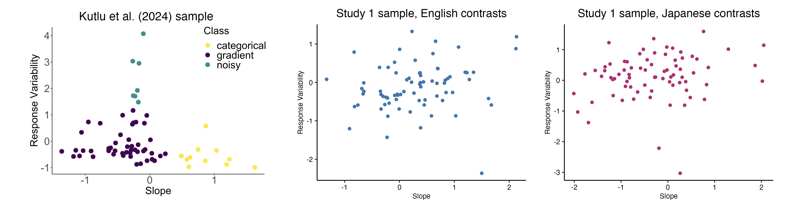
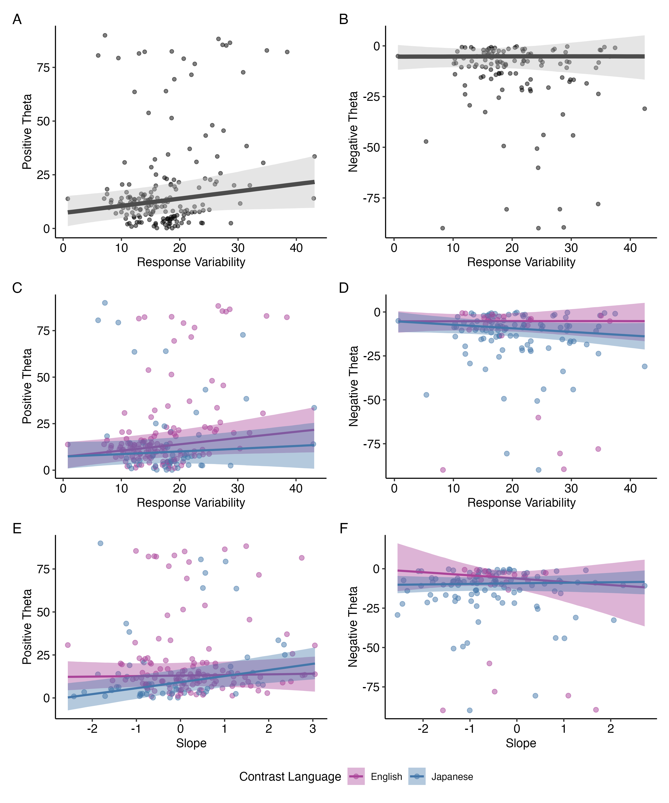

# Study 1 {#study1}

```{r, include=FALSE}
# all that needs to be changed is seq_id in the run_autonum function, which restarts figure/table numbering with each chapter

# create functions for table and figure captions using officer functions

# these functions use the chunk label to enable cross-referencing with bookdown syntax 

table_caption <- function(caption){
  block_caption(label = caption,
              style = "Table Caption",
              autonum = run_autonum(seq_id = "chp3tab", 
                       pre_label = "Table ", 
                       tnd = 1, tns = ".", 
                       bkm = opts_current$get("label"),
                       prop = fp_text_lite(bold = TRUE)))
}

figure_caption <- function(caption){
  block_caption(label = caption,
              style = "Image Caption",
              autonum = run_autonum(seq_id = "chp3fig", 
                       pre_label = "Figure ", 
                       tnd = 1, tns = ".", 
                       bkm = opts_current$get("label"),
                       prop = fp_text_lite(bold = TRUE)))
}

# an alternative to include_graphics - figures are in their original aspect ratio (but huge in the output, usually like 200% so I might have to manually go in and change everything...)

officer_figure <- function(file){
fpar(external_img(file, guess_size = T), fp_p = fp_par_lite(word_style = "Figure", keep_with_next = T))
}
```

<!-- I think this opening section is good enough -->

RQ1 asked: Is increased experience with linguistic diversity (hereafter, *experiential linguistic diversity*) from one's language history, usage, and exposure predictive of higher degrees of gradient categorization of L2 speech as it is with L1 speech? If so, do higher degrees of L2 gradient categorization predict the degree of usage of the secondary acoustic cue in the perception of L2 phonemic contrasts, as we see with L1 gradiency and secondary cue use?

To answer each part of this research question, I conducted a quasi-experimental study that employed the use of a questionnaire and speech categorization rating task to investigate the degree to which experiential linguistic diversity from listeners' language history, usage, and exposure predicts (1) gradient categorization of L1 English and L2 Japanese speech and (2) perceptual flexibility and secondary cue use. I hypothesized that listeners who use and/or are exposed to more linguistic diversity would display more gradient response patterns for L1 English, as well as increased secondary cue use, indicating higher perceptual flexibility. On the other hand, I hypothesized that those with less experience with linguistic diversity would display more categorical response patterns for L1 English and a lower degree of secondary cue integration. As for L2 Japanese, I hypothesized that those with more experience with linguistic diversity would show less noisy response patterns and more secondary cue integration than those with less experience.

## Methodology {#st1-methods}

<!-- last things are stimuli descriptions and MLD-P math -->

Table \@ref(tab:st1-proc-tab) describes the general procedure for Study 1. Participants were recruited and monetarily compensated through the participant recruitment platform Prolific (www.prolific.com). After joining the study on Prolific, participants performed the experiment entirely online, restricted to only desktop or laptop computers, through the experiment builder and data collection platform Gorilla.sc [@Anwyl-Irvine2020Gorilla]. All participants provided informed consent approved by the Carnegie Mellon University Institute Review Board (IRB). After completing the consent form, participants underwent a system check to ensure the auto play of sound at a comfortable level and a short task to ensure compliance with the use of wired binaural headphones [@Milne2021online]. The participants then completed the Visual Analog Scale (VAS) task and Linguistic Diversity Questionnaire (LDQ), after which they read a short debriefing on the purpose of the experiment. All study parts took approximately an hour to complete.

```{r tab.id="st1-proc-tab", label="st1-proc-tab"}

table_caption("Order and Description of Tasks for Study 1.")
st1e$ft.st1.proc
```

### Participants {#st1-participants}

<!-- done! -->

Participants were 100 adult (aged 18-40 years) monolingual or multilingual L1 English users, who confirmed through self-report having normal hearing and no history of learning disability, memory impairment, or auditory processing disorder. Given that the aim of this experiment is to determine the effect of experiential exposure to linguistic diversity on gradient speech categorization, I was interested in participants with a broad range of linguistic backgrounds. For the purpose of the research design, the only language requirement was that participants must be an L1 English user, but recruitment was open to both mono- and multi-lingual participants, including participants with knowledge of both English and Japanese. Here, an L1 user is defined as someone for whom English a) was the first language acquired and used in the home before the age of five; b) is the primary language used in daily life; and c) is a language that the participant self-identifies as being a fluent in @Brown2023Searching. English need not be the only first language acquired. To filter for L1 English users, pre-screening took place through the Prolific system of self-reported attributes. The following Prolific questions were used for pre-screening, which only allowed participants to find the study if they answered as indicated:

-   What is your first language?” (Answer must include English)
-   What language(s) did you speak earliest in life?” (Answer must include English)
-   Which of the following languages are you fluent in?” (Answer must include English)
-   Which of the following is your primary spoken language?” (Answer must include English)

Of the 100 participants recruited, all 100 completed the VAS task but two participants did not complete the LDQ. An additional 22 participants did not provide usable answers to the questionnaire. These 24 participants who did not adequately complete the questionnaire were filtered from the data, resulting in n = 76 for the statistical analyses (36 female, 39 male, 1 non-binary; mean age = 30.6, SD = 5.9, range = 18-40). Due to IRB restrictions, participation was limited to persons present in the United States at the time of the study, excluding 11 states with certain data privacy laws.

### VAS Task: Measuring categorization gradiency and secondary cue use {#st1-vas}

<!--last thing is stimuli section-->

#### Speech stimuli {#st1-vas-stim}

<!-- almost done, just need to add descriptions of cues and manipulations, don't forget to cite Matt Winn, add table caption and also add process to normalize amplitude -->

The VAS task was used to measure gradient categorization of L1 (English) and L2 (Japanese) speech and perceptual flexibility. Listeners were asked to judge a series of stimuli from a continuum that varies in equal steps along auditory dimensions between a pair of phonemic contrasts.

The speech contrasts used were the English stop consonant voicing contrast using /d/-/t/ (*indent-*[verb]{.smallcaps} vs. *intent*), the English vowel tense-lax contrast using /i/-/ɪ/ (*reason* vs. *risen*), the Japanese consonant gemination contrast using /t/-/tt/ (*kita* 'come-[past tense]{.smallcaps}' vs. *kitta* 'cut- [past tense]{.smallcaps}'), and the Japanese vowel length contrast using /o/-/oː/ (*toru* 'take' vs. *tooru* 'pass through'). These words were chosen to match in number of syllables and to have the contrast occur word-medially. Specifically for *indent* vs. *intent*, the words were chosen to have the stress fall on the second syllable to avoid flapping, or the phonological process in which intervocalic [t] is pronounced as a flap [ɾ] when the second syllable is unstressed. These English contrasts were chosen in order to assess categorization of L1 phonemes along temporal-based cues (i.e., VOT for the voicing contrast and vowel duration as the secondary cue for the tense-lax contrast) to relate them to the primary cue of the target L2 phonemes, i.e., consonant and vowel duration. These were also chosen in order to have both a consonant and vowel contrast for both English and Japanese.

The continua were synthesized from naturally recorded speech of each endpoint word embedded in carrier sentences (English: "Please say '\_\_' again"; Japanese: また「\_\_」と言ってください *mata \_\_ to itte kudasai*). The target word was surrounded by quotation marks/brackets for the talker to add a slight but natural pause in between the target word and the rest of the carrier sentence. The speech for both English and Japanese were recorded by the same 37-year-old female Japanese-English bilingual speaker who is fluent in both languages. The speaker was born in Japan and spent her childhood in France, the UK, and Japan. At the time of recording, the speaker had lived in the US for 13 years and speaks American English without any discernible foreign accent. The speaker was recorded in a sound-attenuated booth with a Shure SM48 microphone fitted with foam windscreen connected via XLR cable to a Focusrite Scarlett 4i4 3rd Gen USB audio interface connected to a 2021 M1 MacBook Pro laptop. The speech was recorded in mono via Praat [@Boersma2024Praat] with a sampling rate of 44,100 Hz. The speaker was presented with each sentence individually on a computer screen and asked to produce each sentence twice at a natural speaking rate. After denoising the recordings using the Praat function `Filter -> Reduce noise`, the best production of the two repetitions was chosen and the target word excised for further processing. The stimuli for each pair were chosen to minimize the differences in acoustic variation for the non-contrasting segments shared between the minimal pair.

For each of the four pairs, I constructed a 7x5 two-dimensional continuum using Praat (v.6.4.12) by orthogonally manipulating the primary acoustic cue in seven equal steps and the secondary acoustic cue in five equal steps between each endpoint. This created a total of 35 synthesized tokens for each continuum. All continua synthesis involved using Praat's Pitch Synchronous Overlap and Add (PSOLA) algorithm. Table \@ref(tab:st1-continua-2d) describes the acoustic characteristics of each step of the primary and secondary dimension manipulations. The endpoint values were all based on the values measured in the natural recordings. Step 1 values always corresponded with the left word, and Step 7 (of the primary dimension) and Step 5 (of the secondary dimension) always corresponded with the right word of the pair in the column headings. All manipulations involving pitch (F0) were interpolated using the log scale, and formant frequencies were interpolated using the Bark scale. The final stimuli for all continua were RMS normalized to 67 dB using the `Scale intensity` function in Praat, were appended with at least 50 ms of silence before and after the word, and were saved in both .wav and .mp3 formats. Specific details of the synthesis process, Praat scripts, and the audio stimuli are available in the supplementary materials online.

```{r tab.id="st1-continua-2d", label="st1-continua-2d"}

table_caption("Acoustic Characteristics of Two-Dimensional VAS Continua.")

st1e$ft.continua
```

For the /d/-/t/, the primary dimension varied along the cue of voice-onset-time (VOT) and the secondary dimension varied along the cue of vowel onset F0 following the stop consonant. Both dimensions were manipulated orthogonally using the progressive cutback and replacement approach [@Winn2020Manipulation]. This method creates synthesizes a continuum by incrementally deleting the consonant onset of the voiced sound and replacing it with equivalent amounts of the burst onset from the voiceless sound, dictated by the set VOT-to-vowel-cutback ratio. F0 manipulation occurs after the step of vowel cutback from the voiced sound and before the appending of the aspiration burst from the voiceless sound. Because the contrast occurs in a word-medial position, the script, adapted from @Winn2022Make, first constructed the continuum on the second syllable -/ent/, after which the first syllable /ɪn/ was appended to all tokens. Additionally, because the progressive cutback and replacement approach made it so the -/ent/ of the second syllable was sourced from the *indent* recording, the /ɪn/ was sourced from the *intent* recording, and a closure duration intermediate of that of *indent* and *intent* was used to append the two syllables.

For the /i/-/ɪ/ continuum, the primary dimension varied along the cue of formant frequencies of F1/F2/F3, and the secondary dimension varied along the cue of vowel duration. To make the formant continuum, the script, adapted from @Winn2022GUIbased, used *reason* as the base word and interpolated the F1/F2/F3 values of the vowel segment to those of *risen* (see Appendix C for visualization). I had manipulated the pitch contour of the vowel segment of *reason* by multiplying it by 0.7 and shifting it up 50 Hz to better match the pitch contour of *risen*, in order for the Step 7 token of the formant continuum to better sound like the natural recording of *risen*. To make the duration continua, the script, adapted from @Winn2014Calculate, used the seven steps of the formant continuum as the base word and interpolated to the shorter vowel duration of *risen*. Notably, due to the difference in formant transition amplitude and rate from [ɹ] to the different vowels, [ɹ] was treated as a semi-vowel and included in the vowel segment for both the formant and duration manipulations. Including the formant transitions from [ɹ] to the vowel in the manipulations ensured that the stimuli sounded relatively more natural as they morphed from one endpoint to the other.

For the /t/-/tt/ continuum, the primary dimension varied along the cue of stop closure duration, and the secondary dimension varied along the cue of pitch drop from the first syllable vowel to the second syllable vowel. It was necessary first to make the pitch drop continuum, as the script to interpolate pitch between two words, adapted from @Winn2021Interpolate and @Bujok2023Interpolate, needed to work on sounds with the same timing landmarks for the relevant segments. As such, the script separately interpolated pitch between the first syllables of *kata* and *katta* and the second syllables of *kata* and *katta*, using *kata* as the base word for both syllables and interpolating to the pitch of *katta*; this was possible because the durations of the syllables in the natural recordings were roughly equivalent between the two words (see Appendix C for visualization). The syllables were then concatenated with a stop closure silence in between that had a duration derived from the natural recording of *kata*. Finally, the duration of the stop closure, at each step of the pitch drop continuum, was interpolated between the values for *kata* and *katta*.

For the /o/-/oː/ continuum, the primary dimension varied along the cue of vowel duration, and the secondary dimension varied along the cue of pitch accent contour. As with the /t/-/tt/ continuum, it was necessary to interpolate the pitch contour between sounds with the same timing landmarks for the relevant segments, which means that pitch needed to be interpolated at each step of the vowel duration continuum. However, because synthetically lengthening vowels begins to sound unnatural after exceeding a 2.4x duration ratio [@Winn2020Manipulation], using just one word as the base and interpolating to the value of the other was undesirable for the duration continuum (104 ms for *toru* to 329 ms for *tooru*, resulting in a 3.16x duration ratio). This was also undesirable for the pitch contour continuum because, unlike the /t/-/tt/ continuum, the interpolation of pitch contour between different vowel lengths did not have as simple of a solution as interpolating pitch separately for each syllable, as was possible between different consonant lengths. The pitch accent pattern for *toru* is HL (high-low), while the pitch accent pattern for *tooru* is HLL; by virtue of lengthening the vowel, the number of morae over which the pitch drops is different, which changes the location of the pitch drop across syllables. The pitch drops to low *after* the first syllable for *toru* while the pitch drops to low at the midpoint of the first syllable for *tooru*, keeping in mind that both words have the same number of syllables despite the difference in morae[^03-study1-1]. To solve both of these problems, *toru* and *tooru* were each used as a base word for the duration continuum, resulting in two continua that were identical in duration steps but different in their pitch contours. From here, pitch contour was interpolated between the corresponding duration steps. For the pitch interpolation process, *toru* served as the base for Steps 1-4 of the duration continuum (104 ms to 216 ms for a 2.08x ratio) and *tooru* served as the base for Steps 4-7 (216 ms to 329 ms for a 1.52x ratio). The best sounding tokens for the five steps of the pitch continuum at Step 4 of the duration continuum was chosen between the *toru*-origin tokens and *tooru*-origin tokens, based on my personal judgement of token naturalness. The final set of stimuli used *toru* as the base word for all five steps of the pitch continuum for Steps 1-3 of the vowel duration continuum and Step 1 of the pitch continuum for Step 4 of the duration continuum. Then, *tooru* was used as the base word for Steps 2-5 of the pitch continuum for Step 4 of the duration continuum and for all five steps of the pitch continuum for Steps 5-7 of the duration continuum. For a graphical representation of the base words used for the 7x5 continuum matrix for *toru*-*tooru*, see Appendix C.

#### Procedure {#st1-vas-proc}

<!-- done! -->

Listeners received detailed instructions on how to complete the VAS task. Because the task also involved categorizing non-L1 words they have possibly never heard before, participants were given the chance to listen to the natural speech recordings of all eight words (i.e., *indent*, *intent*, *reason*, *risen*, *kata*, *katta*, *toru*, *tooru*) and a chance to interact with the sliding scale used in the task. In each experimental trial (see Figure \@ref(fig:st1-vas-trial)), the participant heard a stimulus token while viewing a fixation cross, after which they were presented a horizontal line in the center of the screen with each word of the contrast pair at either end. To avoid biasing the participants, there are no anchor points anywhere along the line, such as at either endpoint or in the center [@Paul-Dauphin1999Bias]. The anchor point appeared after the participant clicked anywhere on the line with a number indicator from 0-100 appearing above it corresponding to the location of the anchor point. Participants were instructed to move the anchor point along the line based on their judgement of how close the token sounded to one word or the other. Although the participant did not hear the token more than once in a given trial, they were able to adjust their rating any number of times and submit their response by clicking a button to move on to the next trial. There was a 150 ms buffer from the end of a trial at response submission to the presentation of the stimulus for the next trial, and a 150 ms buffer after the stimulus finished playing before presentation of the scale.

```{r fig.id="st1-vas-trial", label="st1-vas-trial"}

#include_graphics(path = "figure/st1-vas-example-trial.png")


officer_figure("figure/st1-vas-example-trial.png")

figure_caption("Procedure of VAS Trial.")
```

For the English contrast pair continua, the words on either side of the VAS sliding scale on the screen were written in English. For the Japanese contrast pair continua, the words on either side of the VAS sliding scale were written in both *hiragana* and *romaji* (Roman letters). The romanization of the Japanese words were *kata*, *katta*, *toru*, and *tooru*. For each contrast pair, the left-right position of each word on the endpoints was randomized to be counterbalanced across participants (but consistent within-participant across the trials of a given continuum).

Trials were blocked by continuum (i.e., trials within a block are derived from the same continuum). Within each block, the 35 continuum tokens (7 primary cue x 5 secondary cue) were presented three times in randomized order, for a total of 105 trials per continuum block. To avoid fatigue, each block of 105 trials was divided into three mini-blocks of 35 trials each with a timed 20-second break in between. Each participant was presented with all four continua, for a grand total of 420 trials, with a timed 60-second break in between continuum blocks. The VAS task took approximately 20-30 minutes to complete.

In order to reduce the cognitive load that may be associated with switching between continua and languages, the two blocks per continua were always presented in succession. Additionally, to reduce task confusion especially for participants naïve to or having low proficiency with Japanese, the English continuum blocks were presented first, followed by the Japanese continuum blocks. This followed the only precedent with regards to the order of the presentation of blocks for both L1 and non-L1 continua, set by @Kong2023Individual. Participants were randomized into conditions that counterbalanced the order of within-language continuum blocks.

#### VAS data preprocessing {#st1-vas-prep}

<!-- done! -->

Figure \@ref(fig:apfelbaum-vas-curve) [@Apfelbaum2022Dont] displays hypothetical VAS data plotted on a graph with one-dimensional continuum step along the x-axis (Step 1-7) and response rating on the y-axis (0-100, with 0 representing one side of the rating scale (e.g., *indent*) and 100 representing the other side (e.g., *intent*) on the y-axis. When plotted as such, VAS data is typically fit with a logistic curve function from which four parameters are estimated: (1) the minimum and (2) maximum asymptotes of the curve, (3) the cross-over/inflection point, which is the location on the x-axis where the curve crosses 50% of the way between the minimum and maximum asymptotes, i.e., the category boundary, and (4) the slope derived from the curve at the cross-over point. As each token is repeated multiple times, response variability can also be measured as the deviation of each VAS rating from the mean response rating predicted by the logistic curve at each step of the continuum [@Apfelbaum2022Dont; @Kutlu2022Moving]. The slope and response variability measures from VAS data are best analyzed together to jointly represent a measurement of gradiency. Shallower slopes may be an indicator of gradient categorization, especially in comparison to steeper slopes which theoretically indicate categorical response patterns, but shallow slopes can be further disambiguated using response variability. Shallow slopes with low response variability theoretically represent consistent, "true" gradient response patterns (Panel B), while shallow slopes with high response variability theoretically represent inconsistent, noisy response patterns (Panel C).

```{r fig.id="apfelbaum-vas-curve", label="apfelbaum-vas-curve"}
#include_graphics(path="figure/apfelbaum-vas-curve.png")


officer_figure("figure/apfelbaum-vas-curve.png")

figure_caption("Hypothetical one-dimensional VAS response data resulting in a shallow response curve (from Apfelbaum et al., 2022). A. Parameters of a logistic curve that can be estimated from averaged response data. B. A shallow response curve with individual trial responses showing a gradient response pattern with low response variability. C. A shallow response curve with individual trial responses showing a categorical response pattern with high response variability.")
```

However, two-dimensional VAS data results in multiple category boundaries (along the primary dimension) at the different steps of the secondary dimension. A single parameter of category boundary must be estimated with an alternative function that must take into account use of both the primary and secondary acoustic cues. Figure \@ref(fig:kapnoula-2d-vas-heatmap) [@Kapnoula2017Evaluating] provides two hypothetical response patterns from two-dimensional VAS data when plotted on a graph with the primary acoustic cue on the x-axis and the secondary acoustic cue on the y-axis, (in these examples, voice onset time (VOT) and fundamental frequency (F~0~) respectively). VAS ratings are plotted with a third dimension of color gradient. Starting from the cross-over point along the primary cue, a category boundary is drawn using both dimensions. Relative use of the primary and secondary cues is calculated as the angle between the x-axis and the boundary line, $\theta$ (theta).

```{r fig.id="kapnoula-2d-vas-heatmap", label="kapnoula-2d-vas-heatmap"}
#include_graphics(path="figure/kapnoula-2d-vas-heatmap.png")


officer_figure("figure/kapnoula-2d-vas-heatmap.png")

figure_caption("Hypothetical two-dimensional VAS response patterns (from Kapnoula et al., 2017). A. Response pattern resulting from exclusive use of the primary acoustic cue (VOT), as indicated by the right angle between the primary dimension and category boundary (dashed line). B. Response pattern resulting from balanced use of the primary and secondary acoustic cues (VOT and F0), as indicated by the acute angle between the primary dimension and category boundary (dashed line).")
```

Crucially, unlike one-dimensional logistic curve fitting, slope cannot be simply derived from the two-dimensional category boundary, as there is no way to model the logistic curve in the three-dimensional space (with response as the third dimension). Thus, parameter estimates of two-dimensional VAS data must be analyzed to assess gradiency and secondary cue use separately using a rotated logistic function; Figure \@ref(fig:kapnoula-rotlog-fit) provides a visualization of the fitting process [@Kapnoula2017Evaluating]. The rotated logistic function estimates minimum (*b~1~*) and maximum asymptotes (*b~2~*), the two-dimensional category boundary (*x~0~, y~0~*), where *x~0~* is the location of the boundary along the primary cue and *y~0~* is the location of the boundary along the secondary cue, multiple cue integration ($\theta$), and finally slope (*s*). Here, slope is calculated after the coordinate space is rotated such that the rotated x-axis is orthogonal to the two-dimensional category boundary. From there, a standard logistic curve function is fit, and slope is calculated at the inflection point of the curve where VAS response is 50. This slope estimate serves as a proxy measurement for gradient use of the full scale independent of secondary cue use and does not conflate between the slope of the two-dimensional category boundary and the gradiency measure slope [@Kapnoula2017Evaluating; @Kapnoula2021Gradient; @Kapnoula2021Idiosyncratic; @Kapnoula2024Sensitivity].

```{r fig.id="kapnoula-rotlog-fit", label="kapnoula-rotlog-fit"}
#include_graphics(path="figure/kapnoula-rotlog-fit.png")

officer_figure("figure/kapnoula-rotlog-fit.png")

figure_caption("Visualization of the rotated logistic curve fitting process (from Kapnoula et al., 2017). A. Two-dimensional response plane to a voiced-unvoiced stop consonant contrast in 3-D space as a function of VOT as the primary cue and F0 as the secondary cue, with color representing average VAS rating per matrix cell (lower front edge are acoustic properties associated with the voiced consonant, upper back edge are acoustic properties associated with the unvoiced consonant). B. Flattened two-dimensional response plane with the diagonal category boundary at the crossover point (x0) along the primary cute dimension, rotated x-axis (x') orthogonal to the category boundary, and theta angle used to rotate the coordinate space to x'. C. VAS response curve plotted along the rotated x-axis, where a standard logistic function is fit to estimate categorization slope, and other logistic curve parameters, independent of secondary cue use.")
```

The rotated logistic function was fit to each participant's VAS data (separately for each of the four continua) using a constrained gradient descent algorithm that minimized least squared error with the Nonlinear Curvefitting for Psycholinguistics Data MATLAB package [software freely available at @McMurray2017Nonlinear]. The data were cleaned prior to fitting the rotated logistic function. All 100 participants performed the VAS task as expected, resulting in a total of 42000 data points (100 participants x 420 trials). Across all participants, the data were filtered to first remove individual trials with a reaction time of over 10 seconds. This threshold was chosen to exclude trials unlikely to reflect task engagement, including trials where participants were away from their machines (i.e., reaction times at 30 minutes), while minimizing unnecessary data loss. Reaction time then log-transformed to normalize the RT distribution and the data were further filtered on a per participant basis to remove trials with log-transformed RTs three median absolute deviations (MAD) above or below the participant's median log RT. This resulted in a total of 40683 data points that were used the curve fitting process. More details on the fitting process are available in the supplementary materials online.

The data were fit within grouping variables of participant and continuum pair, thus producing four rows of estimates per participant. The primary estimates of interest from the curve fitter were VAS slope (proxy measure of gradiency), response variability (proxy measure of gradiency and consistency), and theta (proxy measure of secondary cue use). As mentioned, from the rotated logistic function, the estimate of VAS slope is a single index of gradient use of the full scale that is independent of secondary cue use. Smaller/more negative values indicate a shallower response curve, or gradient/noisy response patterns, and larger/more positive values indicate a steeper response curve, or categorical response patterns. Because these two-dimension-based VAS slope values are not intuitively interpretable, and also because the distribution of slope values had high kurtosis, VAS slope was natural log-transformed and grand mean centered. The log transformation roughly normalized the distribution. The log-transformed VAS slope values were used in the analysis models, often labeled as "Slope" for simplicity.

The estimate of response variability is calculated as the standard deviation of the residuals per fit, also known as the root mean square error (RMSE), or the square root of the averaged squared residuals [@Kapnoula2017Evaluating]. Low RMSE indicates responses relatively close to the curve (low variability) while high RMSE indicates responses relatively far from the curve (high variability). Response variability remained untransformed in the analysis models, labeled as "Response Variability".

Lastly, as mentioned, the estimate of theta is a continuous measure of secondary cue usage, with 90°indicating exclusive use of the primary cue (Figure \@ref(fig:kapnoula-2d-vas-heatmap)A), and decreasing values (toward 0°) indicating increasing reliance on the secondary cue. Theta values near 45° reflect relatively equal use of the primary and secondary cues (Figure \@ref(fig:kapnoula-2d-vas-heatmap)B), while theta values near 0° reflect near exclusive use of the secondary cue. Values greater than 90° indicate an opposite trend: increasing values indicate increasing use of the secondary cue but also reversed cue mapping, seemingly reflecting response patterns where the primary and/or secondary cues are used in a way that is opposite to the expected categorization (e.g., categorizing acoustically [d]-like tokens as [t]-like, based on VOT and/or F0). Theta values at 135° indicate relatively equal use of the primary and secondary cue, with one or both cues being reversed, while theta values at 180° indicate exclusive use of the secondary cue with categorization occurring in a reversed manner relative to the expected responses. To capture these dimensions of theoretical interest, the theta variable was transformed to be centered on exclusive use of primary cue, computed as `newTheta = (90 - Theta)`, such that 0 = exclusive use of the primary cue, +45 = balanced use of both cues with the expected categorization mapping, and +90 = exclusive use of the secondary cue with the expected categorization, whereas the negative range indicates the same trend of increasing use of the secondary cue from 0 to -90, but with one or both cues being reversed. The transformed theta values were used in the analysis models, often labeled as "Theta" for simplicity.

### Linguistic Diversity Questionnaire (LDQ): Measuring experiential linguistic diversity {#st1-ldq}

<!-- done! -->

#### Design and procedure {#st1-ldq-proc}

<!-- done! -->

After the VAS task, participants completed a questionnaire that gathered information on their language history, usage, and exposure, which was used to measure usage of and exposure to linguistic diversity through experiences (see Appendix A). The questionnaire measured overall experiential diversity through two primary factors: the diversity of known languages (used and studied) and the diversity of regular exposure in a typical week to both known and unknown languages in various situational contexts, such as through media consumption, social environment, and interpersonal connections. These factors also differ in that the diversity of known languages measures linguistic diversity of *active* language use and exposure while the diversity of known and unknown languages measures the diversity of *passive* language use and exposure. Here, passive language use and exposure is defined using the same convention as @Castro2022Am:

> By passive exposure [...] we refer to situations in which foreign languages are present in the environment but the individual does not interact with these languages in any manner (e.g., by working with people who speak a different language and who often communicate between themselves in that language; by living in a neighbourhood with a high number of foreign language speakers). By passive use of languages, we refer to the intentional use of foreign languages in activities that involve some reading or listening but do not require speaking or writing. (p. 3)

The first half of the questionnaire, assessing known languages, used questionnaire items sourced directly from the Language History Questionnaire [LHQ3: @Li2020Language]. The LHQ3 has four modules with items that gauge participants' linguistic background (first language(s) acquired at home, and additional languages acquired, age and manner of acquisition, immersion), proficiency (self-reported proficiency in L1(s) and Ln(s) in reading, writing, listening, and speaking), usage (which language(s) used in various contexts, habits, and social situations), and dominance (dominant language(s) based on proficiency and usage). Measurement types include rating proficiency on a 7-point scale from 1 ("Very Poor") to 7 ("Excellent"), reporting usage in various contexts as hours per day, and rating usage on a 7-point frequency scale from 1 ("Never") to 7 ("All the time").

The second half of the questionnaire, assessing regular exposure to both known and unknown languages, used questionnaire items primarily inspired by and modified from the Language Background Questionnaire (LBQ) used by @Yow2015Balanced and @Li2021Bilingual; additional modifications were inspired by the Language Experience and Proficiency Questionnaire [LEAP-Q: @Marian2007Language] and the survey used by @Castro2022Am to probe the degree of non-L1 language contact and exposure by monolinguals. The purpose of this portion of the questionnaire was to gauge the exposure to and use of linguistic diversity in ways that are typically not assessed, especially for "functional" monolinguals who may frequently encounter multilingual environments (e.g., a person who does not speak French residing in France, a person who does not speak Chinese and lives with two roommates who speak Chinese to each other, a person who does not speak Arabic who regularly hears Arabic at their mosque).

For these questionnaire items, participants were asked to estimate how many hours per day (while thinking of their typical week) they spend in 10 contexts, divided into two main categories of entertainment contexts and interpersonal contexts (see Table \@ref(tab:st1-ldq-contexts)). Then, for each context, participants were asked to list up to four languages they may use in that context, and the number of hours per language. The participant was prompted to include their L1(s), Ln(s), any additional languages learned (no matter their proficiency), and any unfamiliar languages to which they are exposed (unfamiliar is based on the participant's own judgement). The number of hours reported per language was not to exceed the number of hours per day listed for that context in the previous questions, but participants were told the numbers did not have to add up nicely if there was overlap in language usage per context (for example, if a person watches Japanese anime with English subtitles, the time spent passively listening to Japanese and passively reading English would overlap). Lastly, participants were asked to report anything else they would like to add about their language history, experience, usage, and exposure. The questionnaire took approximately 25 minutes to complete, with times varying according to how much information the participant chose to report.

```{r tab.id="st1-ldq-contexts", label="st1-ldq-contexts"}

table_caption("Categories of Passive Language Use and Exposure Contexts Queried in Part 2 of the Linguistic Diversity Questionnaire.")
st1e$ft.ldq

```

#### LDQ data scoring {#st1-ldq-prep}

<!-- done! -->

Experiential linguistic diversity was calculated as two indices based on the two factors of *active* use of and exposure to known languages and *passive* use of and exposure to known and unknown languages as measured by the linguistic diversity questionnaire. It is important to acknowledge that it is difficult to capture the degree to which use of and exposure to linguistic diversity aligns with the conventional usage of the terms "monolingual," "bilingual," and "multilingual." These terms have tended to be ill-defined categories that simplify and often mask the heterogeneity and multidimensionality of experiences within and across groups [@deBruin2019Not; @Castro2022Am; @DeLuca2019Redefining; @Gullifer2021Bilingual; @Kalamala2023Bilingualism; @Kalamala2022multidimensionality; @Kremin2021Why; @Luk2013Bilingualism; @Luk2015Who; @Surrain2019Describing; @Titone2023Rethinking]. As such, although this dissertation also uses the terms "(functional) monolingual" and "multilingual" (inclusive of bilinguals), in an attempt to reflect the multidimensionality of mono/multilingualism, linguistic diversity will be quantified as a continuous variable. It is equally important to acknowledge that reducing experiences to aggregated values in itself is problematic and still does not capture the full range and complexities of each individual's experiences [@Marian2021Measuring]. However, because linguistic diversity is a predictor variable in the primary analyses being conducted, I believe that quantification by way of a continuous measure is the most appropriate method. Specifically, I calculated a continuous measure of multilingualism called "language entropy" [@Gullifer2020Characterizing], a form of Shannon entropy [@Shannon1948mathematical], that was devised to measure the diversity and balance of language use in everyday contexts. Language entropy has been used to explain individual differences in the degree to which multilingualism affects cognitive behaviors in a gradient manner [@vandenBerg2022Language; @DeLuca2019Redefining; @Gullifer2018Bilingual; @Gullifer2021Bilingual; @Kepinska2023Language; @Li2021Bilingual; @Sulpizio2020Bilingualism; @Wagner2023Does].

For active use of and exposure to known languages, a measure of Multilingual Language Diversity (MLD) was calculated according to the aggregate score calculation conventions used by the LHQ3 [@Li2020Language]:

$$ MLD = - \sum_{i = 1}^{n}{PD_{i}\log_{2}(PD_{i})} $$ {#eq:mld-a}

The MLD score is a modified form of language entropy [@Gullifer2020Characterizing] that is calculated from the LHQ3 aggregated score of proportion of dominance (*PD~i~*) for each *i*-th language. *PD~i~* is calculated from language dominance [Equation 3 of @Li2020Language], which itself is an aggregated score combining self-reported language proficiency [Equation 1 of @Li2020Language] and language usage reported in hours of use per day in different contexts.

The range of values for language entropy using the standard equation from @Gullifer2020Characterizing is 0 to $\log_{2}n$, where *n* represents the total number of languages reported. Complete usage of one language means that maximum language entropy (*H*) is $\log_{2}{1 = 0}$, equal usage of two languages means maximum ${H = \log_{2}{2 = 1}}$, and equal usage of three languages means maximum ${H = \log_{2}{3 \approx 1.58}}$. Using the LHQ3, participants can report use of up to four languages, which means that the range of MLD scores across participants is from 0 to 2 given that $\log_{2}{4 = 2}$, which indicates equal dominance between four languages. The range of MLD from 0 to 2 allows for a continuous measure of linguistic diversity that captures both the number of languages and diversity of usage, as use of two languages is captured from values greater than 0 approaching 1, use of three languages is captured from values greater than 1 approaching 1.58, and use of four languages is captured from values greater than 1.58 approaching 2. Equation (1) was used to calculated one MLD score for active language use and exposure (MLD-A) per participant. For a detailed breakdown of the equations used to calculate MLD-A and sample calculations, see Appendix B.

For passive use of and exposure to both known and unknown languages, a modified measure of language entropy was similarly calculated. Language entropy was calculated separately for each context using the standard language entropy equation [@Gullifer2020Characterizing]:

$$ H_{c} = - \sum_{i = 1}^{n}{P_{c,i}\log_{2}(P_{c,i})}
$$ {#eq:mld-p1}

where *n* is the total number of languages reported per context~c~ and *P~c,i~* is the proportion of hours of language usage/exposure for language~i~ within context~c~. Participants reported hours per language per context by answering the prompt: *For each of the contexts [...], please list up to four languages you passively use or are exposed to in a typical week. [...] For each of these languages, please estimate how many [hours per day]{.underline} you spend exposed to this language during each context.* Then, *P~c,i~* is calculated as the number of hours reported for language~i~ divided by the total number of hours across all languages reported for context~c~ using the following equation:

$$ P_{c,i} = \frac{Hours_{c,i}}{\sum_{i=1}^{n}Hours_{c,i}} $$ {#eq:mld-p2}

This resulted in 10 entropy values per participant, one for each of the 10 contexts. Following @Li2021Bilingual, to aggregate the entropy values and account for individual differences in time spent across different contexts, the aggregated score was computed as overall weighted language entropy, where the entropy of each context was weighted by the proportion of time spent per day in that context. The following equation was used to calculated overall weighted language entropy:

$$ H_{w} =  \sum_{c = \{contexts\}} \frac{HoursPerDay_{c}}{K}*H_{c} $$ {#eq:mld-p-final}

Here, c={contexts} refers to the 10 context labels described in Table \@ref(tab:st1-ldq-contexts). *HoursPerDay~c~*[^03-study1-2] is the number of hours spent per day in context~c~, reported by answering the prompts: *On a day where you engage in each of the contexts [...], please estimate how many [hours per day]{.underline} you spend in that context.* *K* is a constant serving as a scaling factor to turn *HoursPerDay~c~* into a proportion. *K* was set to 24 such that each context is weighted as a proportion of time spent per full 24-hour day. The weighted entropy value *H~w~* represents the MLD Score for passive language use and exposure (MLD-P). Equation (4) was used to calculate one MLD-P score per participant. For a detailed breakdown of the equations used to calculate MLD-P and examples, see Appendix B.

Overall, each participant received two indices of linguistic diversity: MLD-A, as an index of linguistic diversity of known languages through active use and exposure, and MLD-P, as an index of linguistic diversity of known and unknown languages through passive use and exposure. These indices remain separate to represent related but different constructs: specifically, the MLD-P index enables the representation of diverse language use and exposure for those who are functionally monolingual by convention usage of the term, while the MLD-A index is derived from measures of the validated LHQ3 and remains consistent with previous gradient measures of multilingualism as assessed through language entropy [@Gullifer2018Bilingual; @Gullifer2021Bilingual]. The inclusion of both of these scores is important to represent the multidimensionality of experiential linguistic diversity. Both MLD-A and MLD-P were used as predictor values in the regression models used to examine the effect of experiential linguistic diversity on L1 and L2 categorization.

Although 100 participants took part in the study, two participants did not finish the LDQ. An additional 22 participants did not provide usable answers to the questionnaire, and thus MLD-A and/or MLD-P scores could not be calculated with their given responses[^03-study1-3]. These 24 participants were excluded from the data analysis.

## Analyses and Results {#st1-results}

<!-- done! -->

### Analysis models and predictions {#st1-analysis}

<!-- done! -->

Recall that RQ1 asks: Is increased experience with experiential linguistic diversity predictive of higher degrees of gradient categorization of L2 speech as it is with L1 speech? If so, do higher degrees of gradient categorization predict the degree of usage of the secondary acoustic cue in the perception of L2 phonemic contrasts? The research question assumes that we will see higher degrees of gradient categorization among participants for the L1 English contrasts for those with higher experiential linguistic diversity, in line with the findings from @Kutlu2024Social, which showed that higher degrees of linguistic diversity in children's social networks led to higher degrees of gradient speech categorization.

I had originally planned to use the same analysis method as Kutlu and colleagues, who used Latent Profile Analysis (LPA) to create a single index of gradiency based on the slopes and response variability values derived from the VAS data. LPA is a type of cluster analysis that is used to model a number of underlying homogeneous subgroups from a larger heterogeneous group based on continuous variables and is being increasingly used in learning research for its person-centered modeling approach [@Hickendorff2018Informative]. The LPA from @Kutlu2024Social successfully supported their hypothesis of three underlying profiles of children based on slope and response variability: categorical (high slope, low variability), gradient (low slope, low variability), or noisy (low slope, high variability). The LPA model predicted posterior probabilities that estimate the probability of membership to each of the three profiles, and the greatest of the three probabilities was used to assign categorization profile membership. Using this method, I would have been able to answer the first part of RQ1 by confirming whether higher levels of experiential linguistic diversity increase the odds of membership in the gradient profile compared to the categorical profile for L1 English as well as investigate whether we see the same pattern of profile membership for L2 Japanese.

However, my data did not turn out to be suitable to fit an LPA model with the three hypothesized profiles. Figure \@ref(fig:st1-lpa-compare) compares the data plotted on the two-dimensional space of response variability and VAS slope for the sample collected by @Kutlu2024Social (left) and the Study 1 sample for each language (center and right). For the @Kutlu2024Social sample, the three profiles clearly emerge in three of the four quadrants of the space, relative to the sample range. However, for the Study 1 sample, no clear patterns emerge, and data is present in all four quadrants, relative to the sample range. Note that there is no theoretical precedent of characterizing high-slope, high-variability responses, which would be the top right quadrant of the space, thus making it difficult to characterize categorization response profiles with the current sample. The differences between the two samples likely arise both from the fact that the VAS data collected by Kutlu and colleagues were responses to one-dimensional continua, as opposed to the two-dimensional continua of the present study, and the fact that the data were fit on a Bayesian hierarchical growth curve model [@Sorensen2024Bayesiana], as opposed to the use of the Nonlinear Curvefitting program here, which is does not use Bayesian modeling. Given these two differences, it was hypothesized that the non-Bayesian nature of the Nonlinear Curvefitting estimates did not work well with the LPA modeling procedure (E. Kutlu, personal communication, May 12, 2025).

```{r fig.id="st1-lpa-compare", label="st1-lpa-compare"}
#

officer_figure("figure/st1-kutlu-mysample-respvar-by-slope.png")

figure_caption("Comparison between distribution of individuals after plotting average slope and response variability VAS response data in two-dimensional space (Response Variability and Slope) between Kutlu et al. (2024) sample (left, n = 64) and the sample of the present study for English and Japanese (center and right, n = 76). Each dot represents the mean slope and response variability of a single participant, averaged across within-language contrast pairs. Note that here, response variability is represented by variance, which is the square of RMSE. Variance was not used in the Study 1 statistical analyses. The slope and variances for the sample of the present study were natural log-transformed and grand mean centered in order to better match the visualization of the Kutlu et al. (2024) sample. Note also the differences in the range of the axes between the two samples.")
```

Because of this, I chose a different statistical method to analyze the data, which requires a reinterpretation of the research question. Instead, I ask the same question without underlying assumptions of differences between categorization of L1 and L2 contrasts. I simply ask whether increased experiential linguistic diversity is predictive of higher degrees of gradient categorization of L1 and L2 speech, and if so, do higher degrees of gradient categorization predict the degree of secondary acoustic cue usage for L1 and L2 speech? In this case, VAS slope and response variability are still both used as proxy measures for gradiency, just as separate variables. This updated research question reduces the emphasis on the hypotheses regarding directionality for the effects of language (L1 vs. L2) on gradiency or secondary cue use.

To answer the first part of the question, I fit a Bayesian multivariate mixed-effects (i.e., repeated measures) regression model to examine the effects of experiential linguistic diversity and contrast language on gradiency and secondary cue use. The model was fit using the *brms* R package [@Burkner2017brms]. MLD-A, MLD-P, and language (L1 English vs. L1 Japanese) were used as predictor variables for the responses of VAS slope, response variability, and theta.

A multivariate regression model is more appropriate for data in which there are multiple outcome variables per observation, as is the case with estimating three different variables from the VAS data. Running a single multivariate regression model is advantageous over running multiple univariate regression models because multivariate regression also accounts for the correlation between the outcome variables of a given observation, which is likely to occur given that outcomes stemming from the same participant for the same contrast pair (i.e., one observation unit) are likely to correlate. In this way, a multivariate model is more parsimonious than multiple univariate models and better controls Type I error rates [@Hui2018Analyzing].

I first fit a series of multivariate models to identify the most parsimonious set of predictor variable specifications on the outcome variables of VAS Slope, Response Variability, Theta. The first model `brm.fit.1` included MLD-A and MLD-P, their interactions with binary indicators of non-zero MLD scores (1 for scores above zero, and 0 for scores of zero), and interactions with language, a categorical within-subjects variable with the levels of English (L1; reference-level) and Japanese (L2). The model `brm.fit.2` specified these predictor variables without the interactions, and `brm.fit.3` specified interactions between each of the MLD scores and language without the binary indicators.

Model fit was evaluated using leave-one-out cross-validation (Table \@ref(tab:st1-loo-compare)), such that the model with the best approximated predictive performance of the data is the one with the largest expected log predictive density (ELPD) value. The differences in ELPD across the models were minimal (\< 3), with `brm.fit.3` yielding the best ELPD but only marginally so. The ELPD difference between `brm.fit.1` and `brm.fit.3` (-0.1) is less than 2 \* the standard error of the difference (0.4) and thus does not provide enough evidence to support that `brm.fit.3` is meaningfully better than `brm.fit.1`. Given the relatively equal predictive performance between these two models, I chose to focus my interpretation on `brm.fit.3`, which includes interaction terms between the two MLD scores and language and is simpler in interpretation compared to `brm.fit.1`. It is noted that the interaction terms between the MLD scores and their binary indicators did not reach credible significance, and thus there is no interpretive value in discussing the effects of `brm.fit.1` over `brm.fit.3`. The model also included subject-level random intercepts `ID` with by-subject random slopes, to capture any inherent differences between participants and allow the effects of language to vary by participant. Item-level intercepts for `pair` were also included to capture any inherent differences between the chosen contrast pairs. Estimates of the model parameters, including the random effects, fit of the model, and residual correlation between the response variables, are presented below in Section \@ref(st1-multivariate-outcomes).

```{r tab.id="st1-loo-compare", label="st1-loo-compare"}
table_caption("Multivariate Bayesian Model Comparison.")
st1e$ft.loo
```

As a Bayesian model, the multivariate model estimates the *b* coefficient, or the median[^03-study1-4] of the posterior probability distribution of $\beta$ slopes, for the main effect of each predictor variable and their interaction effects. The model also uses the 95% highest-density interval (HDI) to describe the uncertainty around the *b* estimate, i.e., there is 95% chance that the true estimate is within this credible interval (CrI). In the context of this study, predictor effects are considered robust if the 95% CrI does not contain zero.

Based on my hypotheses, I predicted the following robust effects of the predictor on each of the outcome variables:

**VAS slope**: I predicted robust main effects for MLD-A and MLD-P with negative *b* estimates, reflecting a decrease in VAS slope as MLD-A/MLD-P increased. This would represent the trend of those with more experiential linguistic diversity showing shallower response trends. I predicted a main effect of language, with no particular prediction on the sign of the *b* estimate, reflecting a difference in VAS slope between responses for English and Japanese contrast pairs. The interaction effect was added for exploratory reasons: a significant interaction effect would indicate that MLD-A and MLD-P predict VAS slope differently between responses for the English and Japanese contrasts. The model outcomes for VAS slope are discussed below in Section \@ref(st1-slope-outcomes).

**Response variability**: I predicted robust main effects for MLD-A and MLD-P with negative *b* estimates, reflecting decreasing response variability as MLD-A/MLD-P increased, meaning that higher experiential linguistic diversity predicts lower response variability. I predicted a main effect of language with a positive *b* estimate, reflecting *increasing* response variability for Japanese contrast pairs compared to English contrast pairs. This would indicate that response variability is higher for L2 speech than for L1 speech. Again, the interaction effect was added to explore whether MLD-A and MLD-P predict response variability differently between responses for the English and Japanese contrasts. The model outcomes for response variability are discussed below in Section \@ref(st1-var-outcomes).

**Secondary cue use theta**: The prediction for theta is more complicated, as the direction of the *b* estimate had different interpretations depending on the theta value. For example, I predicted robust main effects for MLD-A and MLD-P that would reflect that increased experiential linguistic diversity predicts greater secondary cue integration. However, a positive *b* estimate is qualitatively different for a theta value of -45 (relatively balanced use of primary and secondary cue with one or both being reversed) and 10 (mostly primary cue use in the expected direction). In the former case, a positive *b* estimate would indicate increasing *primary* cue use as theta approaches 0 from the negative direction, while in the latter case, a positive *b* estimate would indicate increasing secondary cue use as theta approaches 45 (balanced use of primary and secondary cue).

To address the complexity in interpretation, additional post-hoc analyses were performed. The original data of the multivariate model (n = 76 participants x 4 pairs = 304) were divided into non-overlapping subsets of theta values: positive values, i.e., range 0-90 (n = 182) and negative values, i.e., range -90-0 (n = 122). Bayesian univariate models were run using *brms* in R with the same predictor variables as the main analysis and theta as the response variable separately for the two subsets. These post-hoc analyses were performed to investigate potentially differential effects of experiential linguistic diversity on secondary cue usage for L1 and L2 at qualitatively different ranges of theta. The model outcomes and post-hoc outcomes for secondary cue use are discussed below in Section \@ref(st1-theta-outcomes).

To answer the second part of RQ1 ("Do higher degrees of gradient categorization predict the degree of secondary acoustic cue usage for L1 and L2 speech?"), I similarly ran Bayesian univariate mixed-effects linear regression models *brms* in R with theta as the dependent variable. The model estimates the main effects of the predictor variables VAS slope, response variability, and language, as well as their interactions. Again, random intercept terms were included for subject-level `ID` and item-level `pair`, with random slopes for `ID` across languages. The model formula was specified as `Theta ~ Slope * Response Variability * language + (1 + language|ID) + (1|pair)`. The same model formula was used to run separate univariate models for the two subsets of data for positive and negative theta values.

Based on my hypotheses, particularly for the positive subset, I predicted a robust main effect of contrast language with negative *b* estimates, which would suggest decreased secondary cue integration for responses to Japanese contrasts compared to English. I also predicted a significant interaction between VAS slope and response variability to reflect the characterizations of gradient, categorical, and noisy response profiles. That is, I predicted an interaction that would suggest that VAS slope differentially predicts degree of secondary cue use at different values of response variability, specifically that low VAS slopes would predict high secondary cue use at low levels of response variability but not high levels of response variability, and so on. I also included a three-way interaction between VAS slope, response variability, and language based on the prediction that the predictive strength of VAS slope and response variability on secondary cue use would be greater for L1 contrasts than for L2 contrasts.

Although the model of the negative subset was largely exploratory, the model was included to explore the possibility that slope and response variability values that correspond to a noisy response profile may predict the degree of reversed cue integration. The outcomes for these univariate analyses are discussed below in Section \@ref(st1-univariate-outcomes).

### Descriptive statistics {#st1-descrip-stats}

<!-- done! -->

#### VAS responses {#st1-vas-descrip-stats}

<!-- done! -->

Table \@ref(tab:st1-sum-stats-tbl) presents the summary statistics of the estimates from the rotated logistic curve fit for each contrast pair, averaged across n = 76[^03-study1-5] participants. The table describes the range, mean, median, and standard deviation of the variables of interest used in the regression model: log-transformed slope, response variability, and re-centered theta.

```{r tab.id="st1-sum-stats-tbl", label="st1-sum-stats-tbl"}

table_caption("Summary Statistics of Rotated Logistic Curve Estimates of VAS Slope, Response Variability, and Theta, by Contrast Pair.")
st1e$ft.estimates.grouped

```

In terms of group level response patterns, Figure \@ref(fig:st1-avg-heatmap) shows the mean VAS responses (color) as a function of the primary dimension (x-axis) and secondary dimension (y-axis) per contrast pair, averaged across participants. As expected, the mean responses showed that participants used both the primary and secondary cues to categorize the L1 English contrasts more so than L2 Japanese contrasts. The color gradient of responses, confirmed by the mean values of theta for each of the pairs in English and Japanese, show that the two-dimensional category boundary is much more angled for the English contrasts than for the Japanese contrasts, indicated more secondary cue integration for English and near exclusive use of the primary cues for Japanese.

```{r fig.id="st1-avg-heatmap", label="st1-avg-heatmap"}
# include_graphics(path = "figure/st1-heatmap-avg-per-pair.png")

officer_figure("figure/st1-heatmap-avg-per-pair.png")

figure_caption("VAS response heatmaps by primary and secondary dimension steps for each of the four contrast pairs, averaged across participants. Color represents mean VAS rating per matrix cell.")
```

As expected from the gradient categorization framework, individuals varied substantially in their use of the continuous response scale. Figure \@ref(fig:st1-hist-examples) captures the range of response patterns between and within six sample individuals. Some participants show more consistently categorical responses and heavily favored the end points of the scale, like participant 5627, while others used the entire scale in a more gradient fashion, like participants 5737 and 7187. Other participants fall somewhere in between categorical and gradient, showing bimodal distributions of responses that are near the endpoints but still span a considerable range of the scale, like participants 5386 and 5837. Some participants also showed within-subject variability in their use of the VAS scale that was consistent within-language, such as participant 5178, who responded categorically to the English contrast pairs but gradiently to the Japanese contrast pairs. Participant 7187 is an example of a listener who showed within-subject variability that was not consistent within-language, as they responded more gradiently to the pairs *reason*-*risen* and *toru*-*tooru* but relatively categorically to the pairs *indent*-*intent* and *kata*-*katta*, although less so than participant 5627.

```{r fig.id="st1-hist-examples", label="st1-hist-examples"}
# include_graphics(path = "figure/st1-sample-histograms.png")

officer_figure("figure/st1-sample-histograms.png")

figure_caption("Examples of participant response histograms showing individual differences in distribution of VAS ratings for each of the four contrast pairs. Listeners varied in their use of the entire scale and varied in how consistently they used the scale both within and between contrast language.")
```

While response histograms capture individual differences in using the full range of the VAS scale, they fail to model the relationship between stimuli characteristics, i.e., steps along the continuum, and categorization decision, i.e., VAS response. Figure \@ref(fig:st1-scatter-examples) presents VAS ratings as a function of primary continuum step, with mean response curves for each of the secondary dimension steps. This figure presents the same six sample individuals as Figure \@ref(fig:st1-hist-examples), which allows for a direct visual comparison to show how the response histograms correspond to the scatterplots. This comparison is most plainly visible with participant 5178, for whom their categorical responses are evident for the English contrast pairs (with a majority of individual response data points at either 0 or 100) and their gradient responses are evident for the Japanese contrast pairs (with individual response data points spanning the entire range of the y-axis). This plot also serves to show how differently listeners made use of the secondary dimension; greater separation between the mean response curves per secondary dimension step indicate increased use of the secondary cue in categorization ratings, while overlapping response curves indicate little use of the secondary cue. For example, participants 5386, 5627, 5837, and 7187 all showed varying degrees of secondary cue use for the *reason*-*risen* contrast pair. Additionally, horizontal response curves with discernible separation indicate near complete reliance on the secondary cue to make categorization ratings. The figure additionally reveals another type of categorization pattern, that is, reversed categorization. This can occur along the primary cue or the secondary cue. Participant 5386 showed reversed categorization with regards to the primary dimension for the *kata*-*katta* contrast pair and often responded with ratings near 100 (corresponding with Word B), for the lower steps of the primary cue (which represent acoustic characteristics associated with Word A). Participant 5627 showed reversed categorization with regards to the secondary dimension for the *kata*-*katta* contrast pair, as indicated by the light colored response curve (Step 1, which represent acoustic characteristics associated with Word A) being higher on the plot (ratings on the Word B side of the scale), while the dark colored response curve (Step 5, associated with Word B) being lower on the plot (ratings on the Word A side of the scale.

```{r fig.id="st1-scatter-examples", label="st1-scatter-examples"}
#include_graphics(path = "figure/st1-sample-scatterplots.png")

officer_figure("figure/st1-sample-scatterplots.png")

figure_caption("Examples of participant VAS response curves for each of the four contrast pairs as a function of primary dimension step with different colored curves for each of the secondary dimension steps, from the same six individuals. Transparent dots are responses to each trial. Solid lines depict the fitted logistic curve of the responses per secondary dimension step, with the solid dots depicting the predicted mean response per primary dimension step, as estimated by the rotated logistic curve function. Steeper curves indicate more categorical response patterns, while shallower curves indicate more gradient response patterns. Overlapping colored lines indicate the lack of use of the secondary cue in rating decisions, while separation between the colored lines indicate higher degrees of secondary cue use in rating decisions.")
```

Lastly, Figure \@ref(fig:st1-heatmap-examples) displays individual-level response heatmaps, plotting mean VAS response (color) as a function of both primary and secondary dimension steps for each contrast pair, again showing the same six sample individuals. This figure also plots the estimated theta angle of the category boundary at the location of the boundary along the primary dimension. The response patterns reflected in both the histograms and the scatterplots are also reflected in the patterns of the heatmaps. For example, the heatmaps of participant 5627, who showed consistently categorical responses patterns on the histogram, are dominated by colors on the extreme ends of the color scale with few squares representing intermediate colors. On the other hand, the heatmaps of participant 7187, who showed gradient response patterns to some of the contrast pairs, present the full gradient of colors across the scale. Importantly, this figure more clearly visualizes the relative degree of secondary cue use compared to primary cue use. Angles at or near 90°reflect near exclusive use of the primary cue, whereas angled theta indicate increasing integration of the secondary cue until complete flat theta angles reflect near exclusive use of the secondary cue. For example, the scatterplots for participant 5627 revealed that they exclusively used the primary cue for the *indent*-*intent* and *toru*-*tooru* contrast pairs (overlapping secondary dimension response curves), reflected in the nearly 90°angles on the heatmaps, and had some secondary cue integration for the *reason*-*risen* and *kata-katta* contrast pairs (separated secondary dimension response curves), reflected in the more angled theta values approaching 45°and 135°. Comparatively, the angled and separated response curves in the scatterplot of participant 5837 for the *reason*-*risen* contrast pair is reflected in the same heatmap as the near 45°theta angle, indicating balanced use of the primary and secondary cue. Notably, the obtuse angles reflect the reversed categorization patterns that were also observed in the scatterplots, whether that occurs along the primary cue, as for participant 5386, or the secondary cue, as for participants 5627 and 5837, for the *kata*-*katta* contrast pair. Together, these figures clearly depict the diversity of individual differences in L1 and L2 VAS categorization response patterns.

```{r fig.id="st1-heatmap-examples", label="st1-heatmap-examples"}
#include_graphics(path = "figure/st1-sample-heatmaps.png")

officer_figure("figure/st1-sample-heatmaps.png")

figure_caption("Examples of VAS response heatmaps by primary and secondary dimension steps for each of the four contrast pairs, from the same six individuals. Color represents mean VAS rating per matrix cell. The plotted angles, which represent degree of secondary cue use, were estimated from the rotated logistic curve function. The line depicts the diagonal category boundary starting at the estimated cross-over point along the primary dimension. A 90°degree angle indicates exclusive use of the primary cue, and acute angles indicate increasing use of the secondary cue. Obtuse angles indicate increasing use of the secondary cue with reversed categorization, reversed with regards to either the primary dimension or secondary dimension. Completely flat angles (0°or 180°) indicate exclusive use of the secondary cue.")
```

#### LDQ responses {#st1-ldq-descrip-stats}

<!-- done! -->

The predictor variables in the analysis are the measures active and passive multilingual language diversity, MLD-A and MLD-P, as the proxy measures of experiential linguistic diversity. A simple correlation test showed a moderate positive correlation between MLD-A and MLD-P (Pearson's *r*(74) = .35, *p* = 0.002). Figure \@ref(fig:st1-mld-plot) plots the distributions of MLD-A and MLD-P scores (left column of panels), along with a scatterplot displaying their correlation (right panel). The histograms show that both distributions are zero-inflated, meaning that most participants have both MLD-A and MLD-P scores of zero.

```{r fig.id="st1-mld-plot", label="st1-mld-plot"}
#include_graphics(path = "figure/st1-mld-plot.png")

officer_figure("figure/st1-mld-plot.png")

figure_caption("Histograms of MLD-A (A) and MLD-P (B) scores and scatterplot of correlation between MLD-A and MLD-P where each dot represents an individual (C). Grid lines indicate the score corresponding to balanced use of n languages. Scores in between these breakpoints represent imbalanced use of two, three, and four languages as MLD scores approach 1, 1.58, and 2, respectively.")
```

The zero-inflated nature of the distributions is difficult to see in the scatterplot, where each individual point represents a participant. The scatterplot is more informative in showing the individuals who report being multilingual in some capacity, either through active experiences, passive experiences, or both, as indicated by scores above zero. Of the 76 participants, 35 had non-zero MLD-A scores, 31 had non-zero MLD-P scores, and 22 had non-zero scores for both. Of particular interest are those who reported being functionally monolingual (MLD-A = 0) with passive exposure to multiple languages (MLD-P \> 0), or the points plotted on the y-axis. The data support the idea of diverse language experiences among "functional" monolinguals, who may expose themselves to passive linguistic diversity even if they do not view themselves as multilingual, and the importance of measuring a broad range of experiences.

### Multivariate model outcomes for VAS slope, response variability, and secondary cue use {#st1-multivariate-outcomes}

<!-- done! -->

The results of the multivariate Bayesian mixed-effects analysis modeling the effects of experiential linguistic diversity and contrast language on VAS slope, response variability, and secondary cue use are presented below. For each of the three outcome variables, Table \@ref(tab:st1-multi-fixef) presents the *b* estimates of the fixed effects, the median of the posterior probability distributions, and the 95% highest-density interval (HDI) as the 95% credible interval (CrI). Each estimate is also accompanied by a *p*-value that is calculated from the Bayesian index Probability of Direction (*pd*). As an index of predictor effect existence, *pd* is defined as the proportion of the posterior distribution that has the same sign (on the same size of zero) as the median, which can be interpreted as the probability that the true parameter is either positive or negative. A type of two-sided *p*-value that is comparable to *p*-values calculated for frequentist models can be calculated from *pd* through the formula *p* = 2 x (1 - *pd*). This *pd*-based *p*-value (*pd-p* in the tables) can be interpreted as the proportion of the posterior distribution on the opposite side of zero from the median, thus small values of *pd-p* reflect high confidence in the effect direction of the *b* estimate [@Makowski2019bayestestR; @Makowski2019Indices].

```{r tab.id="st1-multi-fixef", label="st1-multi-fixef"}

table_caption("Fixed Effects of the Bayesian Multivariate Mixed-Effects Model Predicting VAS Slope, Response Variability, and Theta.")
st1e$ft.fixed
```

Note that in this model, the intercept reflects the expected value of the outcome variable for participants with MLD-A and MLD-P scores of 0 when responding to English contrast pairs, as English was the reference level for the language factor and both MLD variables were entered untransformed. Thus, all main effects and interaction terms are interpreted relative to this baseline. As such, fixed effects for language reflect predicted differences between English and Japanese for individuals with MLD-A and MLD-P scores of zero. Interaction terms reflect differences in estimates between English and Japanese across the range of MLD-A and MLD-P values. In the following sections, I describe the results of the predictors on each outcome variable, and I focus on the interaction terms between MLD scores and language, visualized in Figure \@ref(fig:st1-cond-effs), to address the research question.

Table \@ref(tab:st1-multi-ranef) presents a summary of the random effects estimates for each outcome variable, including the group standard deviation and random effects correlation estimates with 95% CrI, and the residual standard deviations (sigma) for each outcome variable, or the remaining variance unexplained by the fixed and group random effects. Also included are the residual correlations between the three outcome variables with 95% uncertainty intervals (UI), and the Bayesian R^2^ estimate with 95% quantile range, which is a probabilistic measure of how well the model fits the data for each outcome variable [@Gelman2019Rsquared]. The residual correlation was moderately negative between slope and response variability (-0.26, 95% UI [-0.40, -0.10]), weak-to-moderately correlated between slope and theta (0.17, 95% UI [0.02, 0.31]), and negligible between response variability and theta (0.02, 95% UI [-0.13, 0.17]). The modest but non-negligible residual correlations support the use of the multivariate model over multiple univariate models.

```{r tab.id="st1-multi-ranef", label="st1-multi-ranef"}
table_caption("Random Effects and Model Fit of the Bayesian Multivariate Mixed-Effects Model Predicting VAS Slope, Response Variability, and Theta.")
st1e$ft.random
```

#### Effect of predictors on VAS slope {#st1-slope-outcomes}

<!--done!-->

The 95% CrIs for the posterior estimates of MLD-A, MLD-P, and language all included zero, indicating no strong evidence for independent effects of these predictors on VAS slope. Consequently, the fixed and interaction effects are interpreted cautiously as trends rather than definitive effects.

The intercept estimate represented the predicted VAS slope for VAS responses to the English contrasts when MLD-A = 0 and MLD-P = 0. Although not statistically robust, the intercept estimate (*b* = -0.12, 95% CrI = [-1.48, 1.05]) indicated a baseline trend of slightly shallower VAS slopes against which the estimates of the fixed and interaction effects were compared.

While not statistically robust, the estimated main effects suggested some directional patterns. Specifically, higher MLD-A scores were associated with slightly steeper VAS slopes (*b* = 0.13, 95% CrI =[-0.11, 0.39]) whereas higher MLD-P scores showed a trend toward slightly shallower slopes (*b* = -0.14, 95% CrI [-0.55, 0.26]). Additionally, for individuals with MLD-A and MLD-P scores of zero, responses to the Japanese contrast pairs trended toward shallower VAS slopes compared to English (*b* = -0.42, 95% CrI [-1.62, 0.95]).

However, the interaction terms between the MLD scores and language showed weak to moderate evidence of effects, although these interaction effects are interpreted cautiously given the lack of robust main effects. For the interaction between MLD-A and language, the posterior estimate indicated a negative effect (*b* = –0.29, 95% CrI [-0.60, 0.03], *pd-p* = 0.08). Although the 95% CrI narrowly included zero, this suggests weak evidence for a negative interaction effect, though the *pd-p* value does not meet conventional frequentist thresholds for significance when $\alpha$ = 0.05. Keeping in mind the weak support for the effect's direction, the estimated interaction suggests that MLD-A predicted VAS slope differently across L1 and L2. Figure \@ref(fig:st1-cond-effs)A shows the conditional effects for MLD-A on VAS slopes for each language level; for the Japanese contrasts, a one unit increase MLD-A scores predicted a 0.16 unit *decrease* (*b* = -0.16, 95% CrI [ -0.49, 0.19])[^03-study1-6] in VAS slopes, in contrast to VAS slopes for English, which had a slightly positive trend, as indicated by the MLD-A fixed effect (*b* = 0.13, 95% CrI =[-0.11, 0.39]).

```{r fig.id="st1-cond-effs", label="st1-cond-effs"}
#include_graphics(path = "figure/st1-multivariate-condeffs.png")

officer_figure("figure/st1-multivariate-condeffs.png")

figure_caption("Conditional effects of MLD-A (left panels) and MLD-P (right panels) on VAS slope (top row), response variability (middle row), and theta (bottom row) for L1 English and L2 Japanese (purple and blue lines). Effects are plotted with 95% uncertainty intervals.")
```

Similarly, the interaction between MLD-P and language suggests that MLD-P predicted VAS slope differently across L1 and L2, with moderate evidence for a positive interaction effect (*b* = 0.56, 95% CrI [0.08, 1.08], *pd-p* = 0.03). The 95% CrI excluded zero, supporting a slightly more robust effect. This interaction trend indicates that MLD-P predicted a 0.56 unit increase in VAS slope for Japanese contrasts compared to English. Figure \@ref(fig:st1-cond-effs)B shows the conditional effects of MLD-P on VAS slopes between the two language levels; for the Japanese contrasts, a one unit increase in MLD-P scores predicted a 0.42 unit increase (*b* = 0.42, 95% CrI [-0.12, 0.93] in VAS slopes, in contrast to VAS slopes for English, which had a slightly negative trend, as indicated by the MLD-P fixed effect (*b* = -0.14, 95% CrI [-0.55, 0.26]).

Together, these findings cautiously show a trend suggesting that experiential linguistic diversity predicted VAS slope differently between L1 and L2, with different directional associations between MLD-A and MLD-P for Japanese relative to English. Interesting, these trends suggest that increased active experiential linguistic diversity predicted shallower L2 VAS slopes compared to L1, while increased passive experiential linguistic diversity predicted steeper L2 VAS slopes compared to L1.

#### Effect of predictors on response variability {#st1-var-outcomes}

<!-- done -->

Here too, the 95% CrIs for the posterior estimates of MLD-A, MLD-P, and language all included zero, indicating no strong evidence for independent effects of these predictors on response variability. As before, the fixed and interaction effects are interpreted cautiously as trends rather than definitive effects.

The intercept estimate (*b* = 17.82, 95% CrI [13.87, 22.17]) represented the predicted response variability for VAS responses to the English contrasts when MLD-A = 0 and MLD-P = 0. Although the 95% CrI does not contain zero, resulting in a *pd-p* value of 0.00, this merely indicates that there is 100% probability that the true intercept is positive. Because the values for response variability were untransformed and response variability is bounded to be positive, the significance of the intercept is not meaningful for inference.

In line with the main effects, the interaction estimates were not statistically robust. The interaction between MLD-A and language showed weak evidence of an effect (*b* = 1.26, 95% CrI [-0.42, 2.78], *pd-p* = 0.13), suggesting a possible trend that MLD-A scores may differentially predict response variability in L1 and L2. As shown in Figure \@ref(fig:st1-cond-effs)C, higher MLD-A scores were associated with increased response variability for the Japanese contrasts, whereas the trend for English was slightly negative.

The interaction between MLD-P and language showed no evidence of a meaningful effect (*b* = -0.91, 95% CrI [-3.17, 1.41], *pd-p* = 0.43). Although Figure \@ref(fig:st1-cond-effs)D seems to visually display a potential convergence pattern, in which higher MLD-P scores predict reduced response variability for Japanese to align more closely with that of English, the level of uncertainty prohibits a confident interpretation of this pattern.

#### Effect of predictors on secondary cue use {#st1-theta-outcomes}

<!-- done! -->

The model predicting secondary cue use did not yield strong evidence for any fixed or interaction effects. The 95% CrIs for all estimates, including the intercept, MLD-A, MLD-P, language, and their interactions, overlapped with zero, and all *pd-p* values were above 0.50, indicating high uncertainty. Figure \@ref(fig:st1-cond-effs) (bottom row) shows that the interactions between the MLD scores and language lack any noticeable trends. Given the absence of robust effects, exploratory post-hoc analyses were conducted to examine whether patterns of secondary cue use differed between the qualitatively distinct positive and negative ranges of theta, as it is possible effects were masked across the full range. Table \@ref(tab:st1-posthoc-fixef) presents the posterior estimates of the univariate models side-by-side.

```{r tab.id="st1-posthoc-fixef", label="st1-posthoc-fixef"}

table_caption("Fixed Effects of the Post-hoc Univariate Bayesian Mixed-Effects Models Predicting Positive and Negative Ranges of Theta.")
st1e$ft.posthoc.fixed
```

Here too, while the directionality of the intercept terms is well supported, the intercept estimates lack meaningful interpretation because each data subset was bound in the positive or negative direction. In the model restricted to positive theta values (i.e., responses corresponding with the expected direction of categorization), none of the predictor estimates had 95% CrIs excluding zero, nor were any trends of effect directionality supported by the *pd-p* values. Further, while Figures \@ref(fig:st1-posthoc-cond-eff)A and B display potentially interesting visual trends of a convergence pattern effect for MLD-A and a divergence pattern effect for MLD-P on positive theta values across L1 and L2, these patterns should be interpreted cautiously due to the high uncertainty of the interaction estimates.

```{r fig.id="st1-posthoc-cond-eff", label="st1-posthoc-cond-eff"}

#include_graphics(path = "figure/st1-posthoc-condeffs.png")

officer_figure("figure/st1-posthoc-condeffs.png")

figure_caption("Conditional effects of MLD-A (left panels) and MLD-P (right panels) on positive (top row) and negative (bottom row) theta values for L1 English and L2 Japanese. Note that positive theta values represent degree of secondary cue integration in the expected direction of categorization while negative theta values represent degree of secondary cue integration with one or both of the cues being reversed. Effects are plotted with 95% uncertainty intervals.")
```

Similarly, in the model restricted to negative theta values (i.e., responses suggesting reversed categorization in one or both dimensions), all fixed effect estimates had 95% CrIs that overlapped with zero and high *pd-p* values, again suggesting no robust effects. In this case, Figures \@ref(fig:st1-posthoc-cond-eff)C and D shows that the interactions between MLD scores and language lack any noticeable trend. Overall, these post-hoc analyses provide no additional evidence of predictor effects on either range of the theta values and reinforce the conclusion from the original model that these data lack the evidence to support the hypothesis that experiential linguistic diversity predict secondary cue use in either L1 or L2.

Table \@ref(tab:st1-posthoc-ranef) presents random variance and model fit estimates: Group standard deviations and random effects correlation parameters with 95% CrI, population-level residual standard deviation with 95% CrI, and Bayes R^2^ with 95% quantile range. It should be noted that the number of observations differed between the subsets of data for the positive and negative ranges of theta, with n = 182 for the positive range of theta and n = 122 for the negative range of theta.

```{r, tab.id="st1-posthoc-ranef", label="st1-posthoc-ranef"}

table_caption("Random Effects and Model Fit of the Post-hoc Univariate Bayesian Mixed-Effects Models Predicting Positive and Negative Ranges of Theta.")
st1e$ft.posthoc.random
```

### Univariate model outcomes for secondary cue use {#st1-univariate-outcomes}

<!-- done! -->

Table \@ref(tab:st1-theta-fixef) presents the fixed effect outcomes of the univariate Bayesian mixed-effects analyses modeling the effects of VAS slope, response variability, and contrast language on positive and negative ranges of theta.

```{r tab.id="st1-theta-fixef", label="st1-theta-fixef"}

table_caption("Fixed Effects of the Univariate Bayesian Mixed-Effects Models of the Effects of VAS Slope and Response Variability on Positive and Negative Ranges of Theta.")
st1e$ft.theta.fixed

```

Table \@ref(tab:st1-theta-ranef) presents the random variance and model fit estimates: Group standard deviations and random effects correlation parameters with 95% CrIs, population-level residual standard deviation with 95% CrI, and Bayes R^2^ with 95% quantile range.

```{r tab.id="st1-theta-ranef", label="st1-theta-ranef"}

table_caption("Random Effects and Model Fit of the Univariate Bayesian Mixed-Effects Models of the Effects of VAS Slope and Response Variability on Positive and Negative Ranges of Theta.")
st1e$ft.theta.random
```

As with the univariate post-hoc analyses on the positive and negative ranges of theta, while the directionality of the intercept term is robustly supported, the bounded nature of the data for each model means that the intercept estimates they lack meaningful interpretation. In terms of the main and interaction effect terms, as VAS slope and response variability can both be considered components of categorization gradiency, both their independent and interaction effects on theta are of interest.

#### Effect of VAS slope and response variability on secondary cue use {#st1-rq1-part-2}

<!-- done I think -->

In the model predicting positive theta values, response variability was the only predictor of either the main or interaction effects with a 95% CrI that excluded zero (*b* = 0.34, 95% CrI = [0.01, 0.63], *pd-p* = 0.04), indicating a statistically robust trend that response variability predicted a mild increase in secondary cue use in the expected direction of categorization. All other main and interaction effects lacked strong support, as their CrIs overlapped with zero and showed high uncertainty in directionality. In the model predicting negative theta values, none of the predictors and their interaction terms showed evidence of an effect, as all CrIs included zero and the *pd-p* values indicated substantial uncertainty in the directionality of the estimate.

Figure \@ref(fig:st1-part2-cond-eff)A visualizes the marginal effect of response variability on the positive range of theta, averaged across levels of other predictors. The statistically robust positive trend is contrasted to the marginal effect of response variability on negative theta, plotted in Figure \@ref(fig:st1-part2-cond-eff)B, where the relationship was not statistically robust and the trend was flat.

```{r fig.id="st1-part2-cond-eff", label="st1-part2-cond-eff"}

#

officer_figure("figure/st1-theta-condeffs2.png")

figure_caption("Marginal effects of response variability (top row), and conditional effects of response variability (middle row) and VAS slope (bottom row) for L1 English and L2 Japanese on positive (left column panels) and negative (right column panels) theta values. Note that positive theta values represent degree of secondary cue integration in the expected direction of categorization while negative theta values represent degree of secondary cue integration with one or both of the cues being reversed. Effects are plotted with 95% uncertainty intervals.")
```

To explore potentially meaningful patterns, the interactions between response variability and language are plotted in panels C and D of the same figure. These panels plot the same data as panels A and B, respectively, but with separate trends for English and Japanese. While not statistically robust, these interaction trends suggest that among positive values of theta, higher response variability is associated with decreased secondary cue use/increased primary cue use (positive theta values close to zero) for Japanese relative to English. For negative theta, the interaction trend implies the reverse: greater response variability is associated with *increased* secondary cue integration in the *reversed* direction of categorization (i.e., larger negative theta values) for Japanese compared to English. These interpretations are tentative given the wide intervals and low directional certainty.

The interaction plots between VAS slope and language (bottom rows) are additionally included visualize the potential trends for how VAS slope differentially predicts secondary cue use between L1 and L2. However, the interaction terms for both positive theta values and negative values had wider 95% CrIs and low confidence in directionality of the estimate (*pd-d* = 0.58 for positive theta and *pd-p* = 0.75 for negative theta), which indicates a greater degree of uncertainty and Instead, their inclusion is to provide a fuller picture in using both response variability and VAS slope together to estimate the of categorization gradiency on secondary cue use.

Panels E and F present the interactions between VAS slope and language. These are included to illustrate possible differences in how slope may predict secondary cue use in L1 vs. L2, though neither interaction was statistically supported (*pd-p* = 0.58 for positive theta; *pd-p* = 0.75 for negative theta). The wide CrIs and lack of directional confidence indicate a high degree of uncertainty and necessitates critical evaluation of the emerging trends and caution against overinterpretation. However, their inclusion provides a more complete picture on how both response variability and VAS slope may together be used to represent categorization gradiency, and how these variables might interact with language context in predicting secondary cue integration.

Another point of interest is the joint effect of VAS slope and response variability on secondary cue use. Based on prior research, I had hypothesized that what would be canonically known as "true" gradient categorization is characterized by shallower VAS slopes and low response variability, as opposed to noisy categorization, characterized by shallow slopes and high response variability, and canonically categorical responses, characterized by steeper slopes and low response variability. However, the interaction terms between VAS slope and response variability for both positive (*b* = -0.01, 95% CrI [-0.23, 0.17], *pd-p* = 0.91) and negative (*b* = -0.06, 95% CrI [-0.44, 0.26], *pd-p* = 0.71) theta values estimated very little difference for the effect of VAS slope at different levels of response variability, with very high uncertainty as indicated by the wide CrIs that overlapped with zero and large *pd-p* values. Figure \@ref(fig:st1-slopevartheta-condeffs) illustrates the lack of integrated effect between VAS slope and response variability. If there had been differing effects for what would be considered gradient responses (low slope, low variability), noisy responses (low slope, high variability), and categorical responses (high slope, low variability), we would have seen different slopes of the trend lines for low variability (blue line) vs. high variability (red line) as Slope (x-axis) changes. Instead, the parallel trend lines suggest that VAS slope does not interact with different levels of response variability to have an impact on either positive or negative ranges of theta.

```{r fig.id="st1-slopevartheta-condeffs", label="st1-slopevartheta-condeffs"}
#include_graphics(path = "figure/st1-slopevartheta-condeffs.png")

officer_figure("figure/st1-slopevartheta-condeffs.png")
figure_caption("Conditional effects of VAS slope on positive and negative values of theta at different levels of response variability. Response variability is binned into three levels of median response variability of the full dataset +/- 1.5 median absolute deviations (MAD). Effects are plotted with 95% uncertainty intervals.")
```

Overall, these findings provided limited evidence that either VAS slope or response variability, independently, together, or in interaction with language, systematically predicts secondary cue use across distinct theta ranges. Nonetheless, the patterns observed in the exploratory plots point to potential differences in how categorization gradiency, as captured by slope and response variability from VAS data, may relate to secondary cue use in L1 vs. L2. These trends, though tentative, suggest avenues for further investigation in future work.

## Study 1 Discussion {#st1-discussion}

<!-- not done, but this little top part is done -->

In this study, I explored the effect of experiential linguistic diversity, measured with two indices of Active and Passive Multilingual Language Diversity, on speech categorization gradiency and secondary cue integration for L1 and L2 speech contrasts, as measured by VAS responses to synthesized two-dimensional continua of English and Japanese minimal pairs. I had hypothesized that more experience with linguistic diversity, whether that be through being multilingual or exposing oneself to multiple languages despite being functionally monolingual, would predict more gradient response patterns for L1 and L2 speech, as well as higher degrees of secondary cue integration, representing perceptual flexibility. The results from the Bayesian mixed-effects models mostly yielded non-robust findings of effects, especially with regards to my hypotheses. However, several trends emerged that are discussed with caution.

### The effect of experiential linguistic diversity on gradiency, response variability, and secondary cue use {#st1-discussion-mld-effects}

<!-- I think this is done -->

In the first part of RQ1, I asked, is experiential linguistic diversity predictive of gradient categorization patterns in L1 and L2? While most findings did not support my hypotheses, several trends of interest were found. The findings from the multivariate mixed effects model that were best supported by the data were the interactions between the MLD scores and contrast language for VAS slope. There was weak evidence that higher MLD-A scores predicted shallower VAS slopes for Japanese contrasts compared to English, while there was moderate evidence that higher MLD-P scores predicted steeper VAS slopes for Japanese contrasts compared to English. The opposite direction of these trends for MLD-A and MLD-P offer potentially interesting implications for what constructs MLD-A, MLD-P, and VAS slope represent.

As suggested by prior literature, slopes from VAS responses are best analyzed in conjunction with response variability [@Apfelbaum2022Dont; @Kutlu2022Moving] when characterizing gradient vs. categorical response patterns. In this study, VAS slope and VAS response variability were not able to be integrated as a single predictor, as it was in @Kutlu2024Social. However, the trends of the predictor impact on VAS slope are still worth examining in light of prior literature that have suggested that gradiency as measured by VAS slope and gradiency as measured by response variability are actually measuring two different constructs. Several studies have found evidence that VAS slopes conceptually measure the perceptual ability to track gradual changes along a continuum, thus sensitivity to within-category differences, whereas response variability (also called response consistency in these studies) conceptually measures the degree of reliability in mapping stimulus characteristics to phonemic categories [@Kapnoula2017Evaluating; @Honda2024Exploring, @Fuhrmeister2023Relationships; @Fuhrmeister2021Structural].

The findings with relation to MLD-A and MLD-P offer interesting insight into gradient sensitivity to acoustic cues, especially with regards to L1 vs. non-L1 speech perception. The trend of MLD-A predicting shallower slopes for Japanese compared to English lends mild support to the idea that those who actively use and are exposed to multiple languages may be primed for perceptual sensitivity to gradual changes along acoustic dimensions. This priming would become most evident in unfamiliar linguistic contexts, where the listeners do not have the explicit categories to guide consistent categorization, and thus rely more on the acoustics to make a categorization judgement rather than integrating orthographic or semantic input. The VAS is advantageous in presenting the same orthographic input a listener would receive for a 2AFC categorization task (i.e., seeing the phoneme categories in the words on screen), while allowing those who do track within-category differences to report these differences. The differences between those who use gradient vs. categorical strategies for non-L1 speech perception supports the hypothesis that speech perception is comprised of three distinct factors that use separate processing mechanisms for higher-level phonemic perception, sensory-level acoustic perception, and intermediate-level phonetically relevant perception [@Werker1985Crosslanguage]. This may suggest that those who show gradient perception rely more on acoustically relevant perception compared, as opposed to phonetically or phonemically relevant perception.

On the other hand, the trend of MLD-P predicting steeper VAS slopes for Japanese compared to English is an interesting contrast to the above finding. The conceptualization that VAS slopes reflect gradiency as within-category acoustic sensitivity would imply that those with passive use of and exposure to multiple languages show decreased sensitivity to within-category differences. It is conceptually difficult to theorize the mechanisms that would lead to this outcome. However, the number of individuals at the higher end of MLD-P scores was quite low, meaning that it is possible that this trend was driven by a few individuals with higher MLD-P scores; although this finding was statistically robust, it must be interpreted with caution.

The findings did not support the hypotheses that experiential linguistic diversity predicted response variability, though the trends that emerged could suggest some potential associations that trended in different directions between MLD-A and MLD-P. Additionally, while there were no robust effects of MLD-A and MLD-P on the full range of theta. The post-hoc analyses also revealed no strong evidence of the effects of MLD-A and MLD-P on secondary cue use when the theta values were divided into positive and negative ranges. However, here too, a slight trend was seen in the visualization of the data that could suggest opposing associations with (positive ranges) of theta between MLD-A and MLD-P. Though mostly based on visual inspection of the data and not statistically supported, the fact that MLD-A and MLD-P had opposing, rather than matching, trends for VAS slope, response variability, and secondary cue use in the expected direction of categorization may suggest that MLD-A and MLD-P represent wholly different constructs.

In past literature, language entropy has been found to predict reported self-perception of L2 abilities [@Gullifer2020Characterizing], efficiency in L1 production with regards to executive control [@Kang2023Multilingual], behavioral and pupillary measurement indices of executive control [@vandenBerg2022Language], functional neural connectivity specialization related to executive functioning [@Li2021Bilingual], and structural connectivity between a diverse set of brain areas involved in bilingual language control [@Gullifer2018Bilingual; @Sulpizio2020Bilingualism]. However, these studies used language entropy as a measure of diversity in active language usage; to my knowledge, language entropy has not been used before to measure degree of passive language use and exposure. It is worth exploring what kind of perceptual construct may be represented by an index that quantifies degree of passive linguistic diversity and what implications this kind of exposure means for speech perception, and how passive linguistic diversity modulates neural and behavioral measures of language processing. Given the finding from @Bice2019English had found that monolinguals in a linguistically diverse environment showed neural activity suggesting sensitivity to novel L2 categories, although their advantage over monolinguals in a less linguistically diverse environment did not appear in the behavioral measures of speech learning. Language entropy for active language use has been used to quantify the effect of language diversity on both neural and behavioral differences between multilinguals and monolinguals, but a measure such as language entropy for passive language exposure can further be used to explore why this effect manifests differently between neural and behavioral measures for monolingual speakers. A limitation of the current this analysis was that an interaction effect between MLD-A and MLD-P was not included in the statistical models, which may have been able to elucidate differential effects of one MLD score at different levels of the other.

Nonetheless, these trends were not statistically supported by these data and serve as potential avenues of follow-up research. Yet, given the zero-inflation of the distributions of both MLD-A and MLD-P scores, it is advisable to view most, if not all, of these findings with skepticism. It is entirely possible that these trends themselves are spurious and driven by the few data points at higher values of MLD-A and MLD-P rather than reflecting a group-level trend. Given the limited number of individuals who had non-zero MLD scores, it is likely that these data simply did not have enough statistical power to detect any effects.

### The effects of gradiency and response variability on secondary cue use {#st1-discussion-theta}

<!-- kinda done, should review this -->

Based on previous work [e.g., @Kapnoula2017Evaluating; @Kapnoula2021Idiosyncratic, @Kong2016Individual, @Kim2020Individual], I had hypothesized a strong effect of gradiency and response variability on secondary cue use suggesting that higher degrees of gradiency and lower degrees of response variability predicted secondary cue use. While an effect of response variability was found for positive values of theta, the effect suggested that secondary cue integration increased as response variability increased. Additionally, and more surprisingly, VAS slope, nor any interactions included in the model, did not show any statistically robust effects on secondary cue use. The lack of findings for the negative values of theta were also surprising, given that one could conceptually conceive that negative theta values representing reversed categorization would suggest noisy categorization that could be captured from the slope and response variability measures.

This outcome that contradicts the well-established evidence from previous findings may have occurred for a number of reasons. Most notably, past research has used a different measure of secondary cue use. @Kong2016Individual used anticipatory eye movement (AEM) as measure of secondary cue use, whereas, @Kim2020Individual, @Kapnoula2017Evaluating, and @Kapnoula2021Idiosyncratic additionally used the 2AFC task with two-dimensional continua to extract a measure of secondary cue use. While the latter three studies all used the rotated logistic function to fit the VAS data and extract a measure of slope and secondary cue use, as the theta estimate from the curve fit, none of these studies used the theta values themselves in their subsequent analysis investigating the relationship between gradiency and secondary cue use. The exclusive use of the VAS task and theta as the only measure of secondary cue use in this study may be the prime contributing factor to these null findings. This may suggest that while theta can mathematically be conceived as measuring secondary cue use, it may conceptually be a measure of a separate construct.

### Individual differences in categorization patterns within and across languages {#st1-individual-differences}

<!-- done for now, but not great -->

The contrast pairs were collapsed within language for the primary analyses, yet it is notable that there were still a number of individuals who displayed different categorization patterns between contrast pairs within same language. This finding supports that of @Kapnoula2021Gradient, who found that gradiency in perceiving voicing contrasts (/b/ vs. /p/) did not predict gradiency in perceiving place of articulation fricative contrasts (/s/ vs. /ʃ/). While I did not run specific analyses to quantify the degree of correlation between within-language contrasts, the group-level characterization of categorization patterns for each contrast pair presented in Table \@ref(tab:st1-sum-stats-tbl) and Figure \@ref(fig:st1-avg-heatmap) illustrated the variability of categorization both between- and within-language.

Although I did not replicate findings from prior studies showing that categorization gradiency predicts secondary cue use [e.g., @Kapnoula2021Gradient], this study contributes to a broader understanding of how speech categorization varies across both languages and contrast types. Much of the existing literature has focused on a narrow set of phoneme contrasts (most often stop consonant voicing, and sometimes voiceless fricative place of articulation, in English), limiting the generalizability of claims about gradiency, though this has been improving with recent studies [e.g., @Kutlu2024Social; @Honda2024Exploring; @Kim2020Individual; @Ou2021Individual]. In following recent trends, I deliberately included both consonant and vowel contrasts to examine categorization in both L1 and L2. To my knowledge, the studies from @Kong2019Individual and @Kong2023Individual are these only studies to measure categorization gradiency using the VAS for both L1 and L2 contrasts. The resulting data demonstrate that categorization patterns are not easily reducible to a single listener-level trait but rather reflect a complex interaction between the phonemic context, the contrast type, and individual perceptual strategies.

This study contributes to the growing body of literature that investigates the sources of individual differences in speech categorization patterns. Although linguistic diversity, as measured by language entropy through the MLD indices, was not found to contribute to individual differences in categorization gradiency, there was still evidently diversity in the categorization strategies. As such, the search will continue to identify sources of individual differences.

### Limitations {#st1-limitations}

<!-- done -->

This study had several limitations. First, the while the Part 1 of the LDQ was sourced from the fully validated LHQ [@Li2006Language; @Li2014Language; @Li2020Language], Part 2 was developed by me. Due to time constraints, the construct validity of the questionnaire items from Part 2 were not able to be validated with objective and behavioral measures of the target construct, that is, diversity of passive language use and exposure. Additionally, there were many missing data pieces from several participants, or participants who did not understand what was being asked of them, which further reduces the reliability of the MLD-P aggregate score measured from this part of the questionnaire. The items in Part 2, as well as the equations used to calculate the MLD-P score, would benefit from being validated against other forms of measures such as a language exposure diary, an observational study of language usage, and other measures to confirm the ecological validity of self-reporting passive language use.

Second, although the primary research questions were concerned with categorization gradiency and secondary cue use at the language level, results from both prior research and the descriptive analysis of the present study suggest that categorization constructs are best characterized at the phoneme level. While the statistical analyses included contrast pair as a random effect, this was not enough to fully examine the effects at the contrast level. It is also likely that the data did not have the power to support the extra complexity that would have needed to be modeled by including the four-level categorical variable.

Lastly, the study is limited by the restriction of the participant pool to those only situated in the U.S. at the time of the study. Of the 76 participants included in the analysis, 35 participants had non-zero MLD-A scores, 31 participants had non-zero MLD-P scores, and just 22 participants had non-zero scores for both. The limited pool of multilinguals made it difficult to make inferences on the effect of MLD-A and MLD-P on the VAS measures, as those with non-zero scores likely influenced the regression model more so than those with scores of zero. Prolific is an international participant recruitment company based in the U.K., and of its roughly 183,000 participants active recently, approximately 53,000 participants both met the inclusion criteria (see Section \@ref(st1-participants)) and currently resided in the U.S. Removing the country of residence restriction increased this number to just under 99,000 potential participants[^03-study1-7]. The nearly doubled available pool of participants likely would have included English speakers living in more linguistically diverse countries, such as South Africa, and would have made the data of MLD scores much more dynamic and balanced in terms of how much those with non-zero scores affected the regression model.

[^03-study1-1]: The pitch accent patterns by mora are *to-* (H) -*ru* (L) and *to-* (H) -*o-* (L) -*ru* (L).

[^03-study1-2]: Note that *HoursPerDay~c~* is a time reported separately from the hours reported per language per context, and **may or may not** be equal to $\sum_{i}^{n}Hours_{c,i}$. This is not of concern as each of these values are used in separate proportions.

[^03-study1-3]: Details of the data cleaning process, including explanations for why certain responses were unusable, are discussed in the questionnaire cleaning R code in the supplementary materials online.

[^03-study1-4]: Note the use of median instead of mean for the *b* estimate, which is a more robust measure of centrality of the posterior probability distribution compared to mean, especially for skewed distributions.

[^03-study1-5]: Although only 76 participants were used in the analyses for this study, all 100 participants performed the VAS as expected. The cleaned data for all 100 participants were fit by the curve fitter program, resulting in VAS estimates for all pairs for all participants. A table of the descriptive statistics that includes all 100 participants, as well as figures including all 100 participants, can be found in the supplementary materials online.

[^03-study1-6]: The conditional effect of MLD-A on predicting VAS slope for Japanese is computed by summing the estimate of the main effect of MLD-A (which is for the language reference level of English) and the estimate of the interaction effect: 0.13 + -0.29 = -0.16.

[^03-study1-7]: Numbers are based on the Prolific audience checker tool (<https://app.prolific.com/audience-checker>)
