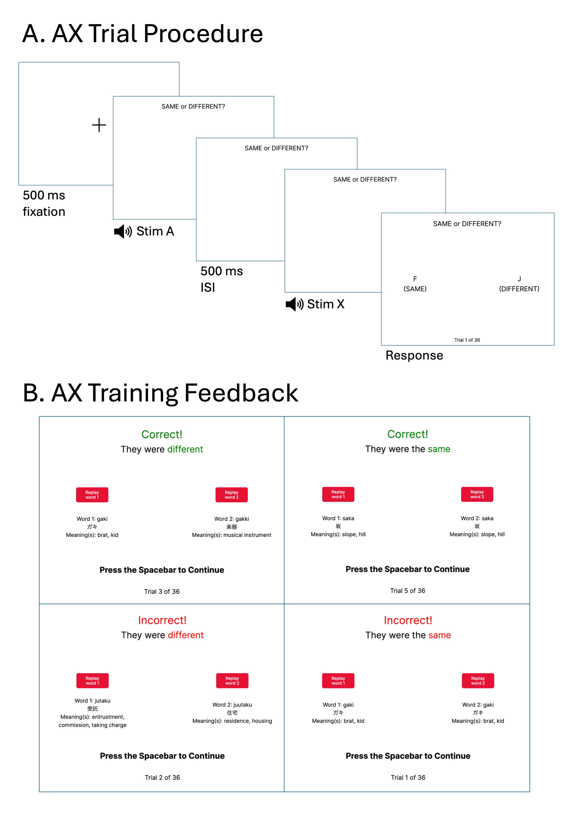
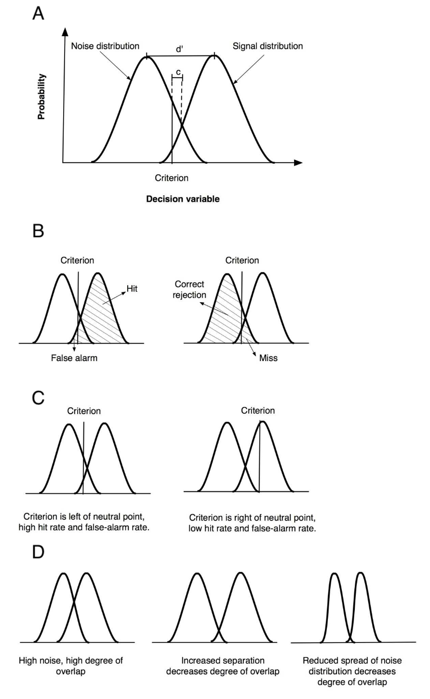
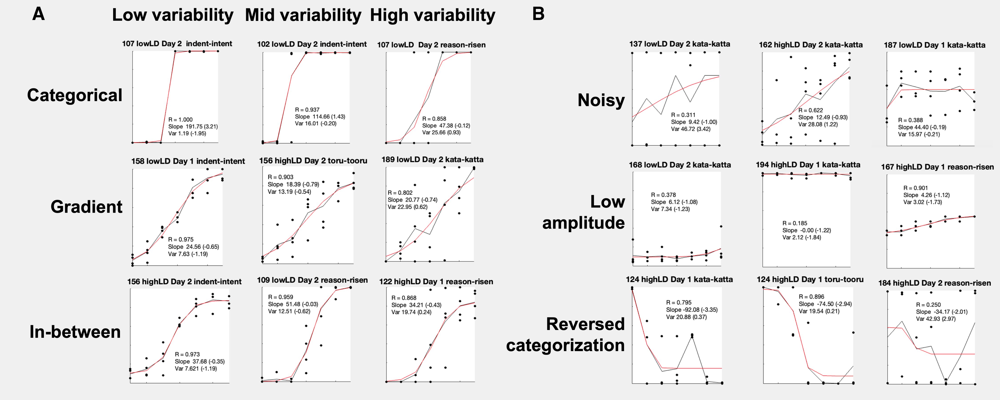
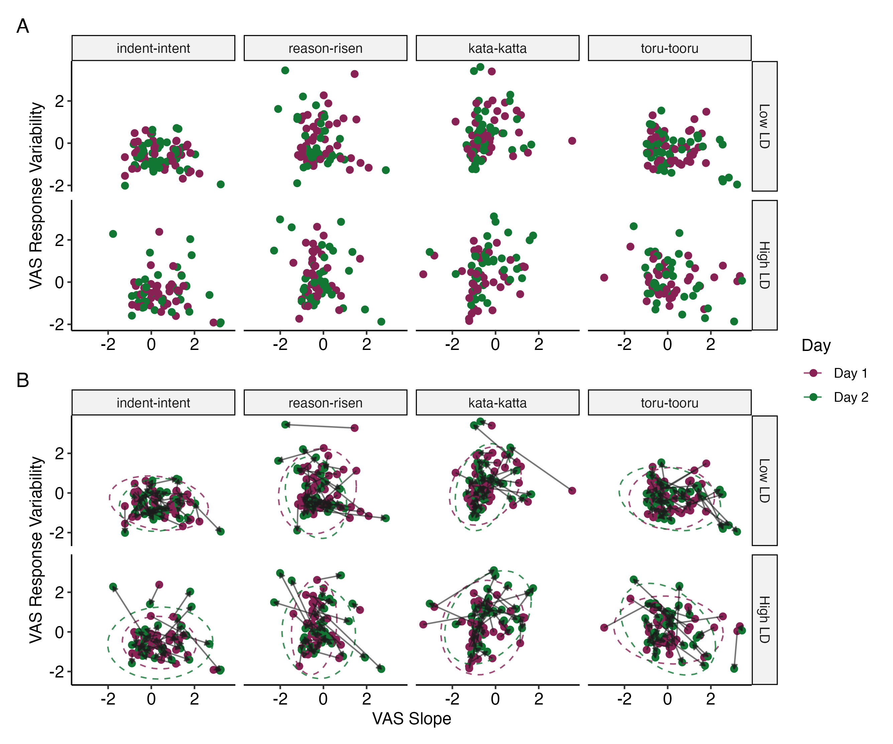
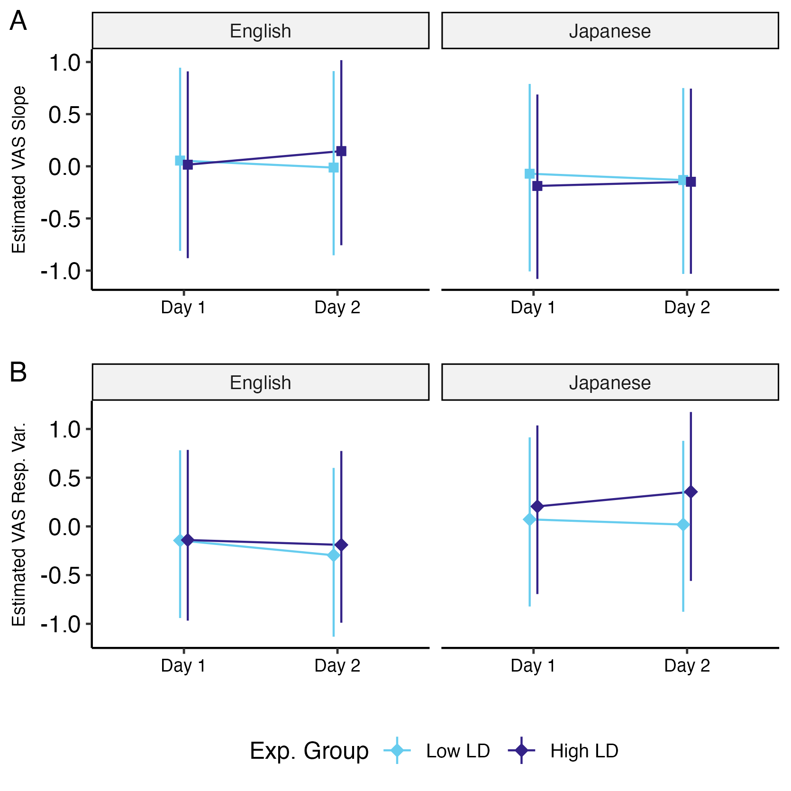
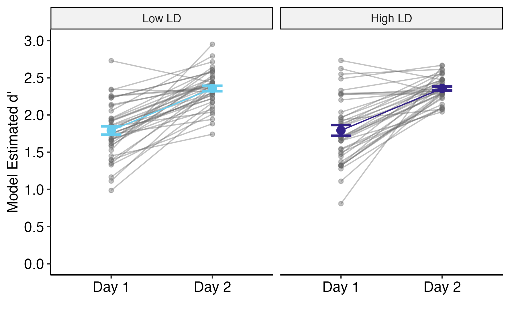
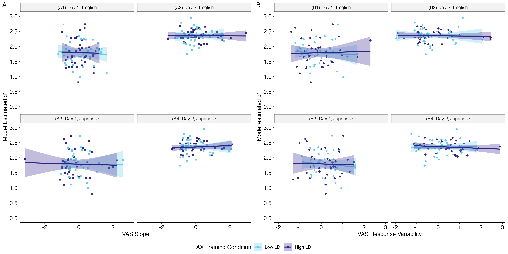
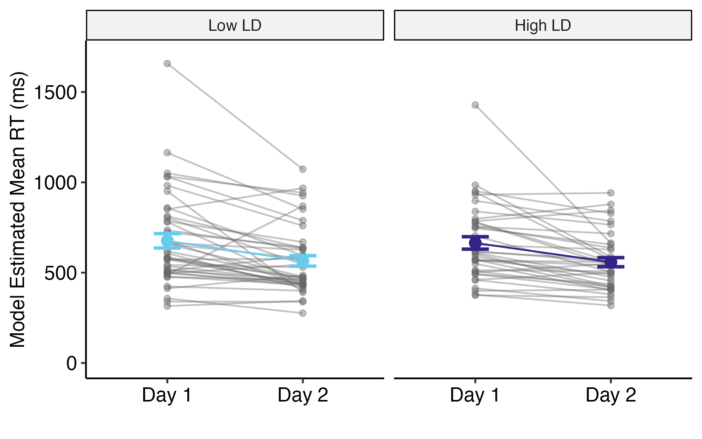
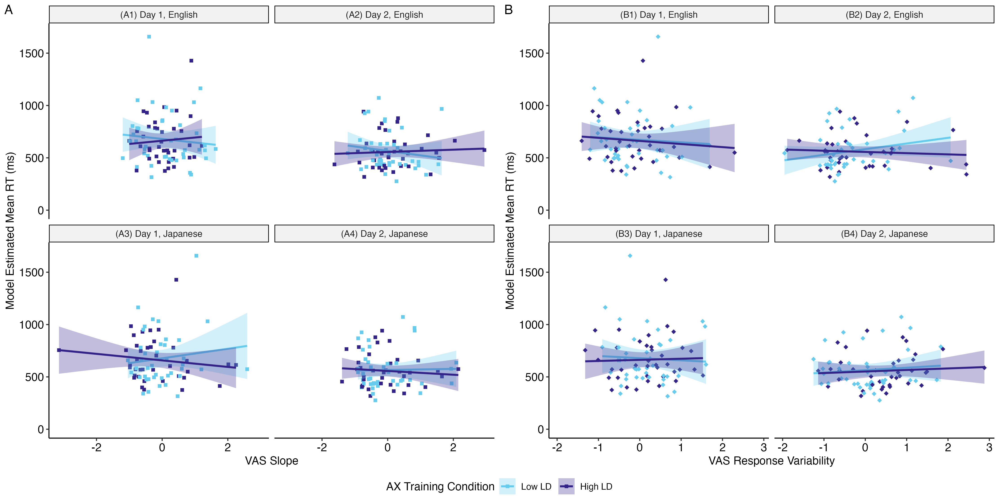

# Study 2 {#study2}

```{r, include=FALSE}

# all that needs to be changed is seq_id in the run_autonum function, which restarts figure/table numbering with each chapter

# create functions for table and figure captions using officer functions

# these functions use the chunk label to enable cross-referencing with bookdown syntax 

table_caption <- function(caption){
  block_caption(label = caption,
              style = "Table Caption",
              autonum = run_autonum(seq_id = "chp4tab", 
                       pre_label = "Table ", 
                       tnd = 1, tns = ".", 
                       bkm = opts_current$get("label"),
                       prop = fp_text_lite(bold = TRUE)))
}

figure_caption <- function(caption){
  block_caption(label = caption,
              style = "Image Caption",
              autonum = run_autonum(seq_id = "chp4fig", 
                       pre_label = "Figure ", 
                       tnd = 1, tns = ".", 
                       bkm = opts_current$get("label"),
                       prop = fp_text_lite(bold = TRUE)))
}

# an alternative to include_graphics - figures are in their original aspect ratio (but huge in the output, usually like 200% so I might have to manually go in and change everything...)

officer_figure <- function(file){
fpar(external_img(file, guess_size = T), fp_p = fp_par_lite(word_style = "Figure", keep_with_next = T))
}
```

<!-- opening section is done! -->

In the previous chapter, I explored how experiential linguistic diversity predicted measures of categorization gradiency and secondary cue integration in the categorization of L1 English and L2 Japanese contrasts. The next step of exploration was to consider whether linguistic diversity can be a factor that is directly manipulated for the benefit of L2 speech learning. The theoretical basis of this consideration was that exposing the perceptual system to a set of exemplars of the target contrast has differential effects based on how diverse the exemplar contrast pairs are in their category boundaries along the primary acoustic dimension. Specifically, I theorized that having more than one language represented in the speech input present the perceptual system with a broad range of what can be considered good category exemplars for each category of the target contrast. That is, for a perceptual system that is unfamiliar with using duration as primary acoustic cue to differentiate between vowels or consonants of the same quality, hearing not only multiple different minimal pairs that differ only by whether the vowel is short or long in one language, but in two languages provides an additional degree of "variability" for High-Variability Perceptual Training (HVPT) that potentially aids in the category learning of novel L2 contrasts.

In Study 2, I explored whether specific exposure to linguistic diversity, through a brief period of perceptual training, impacted measures of categorization gradiency of L1 and L2 speech. To this end, RQ2 asked: Can we promote gradient categorization in listeners through specific exposure to linguistic diversity via perceptual training? If so, does gradient categorization increase perceptual sensitivity to discriminate between target language phonemic contrasts?

To answer each part of the research question, I conducted a two-day experimental study with a pre-post design for the VAS speech categorization rating task and the AX perceptual discrimination sensitivity test to measure changes in measures of L1 English and L2 Japanese categorization gradiency and L2 Japanese perceptual sensitivity, respectively, before and after perceptual training. As the aim of this study was to determine whether specific linguistic diversity as a training manipulation can change listeners' categorization response patterns to be more gradient-like, I had presumed it would be advantageous to recruit from a population where the sample is likely to have a larger proportion of participants with non-gradient perceptual starting points. Based on the Study 1 hypothesis that those exposed to more experiential linguistic diversity would show higher degrees of categorization gradiency, the research plan for Study 2 proposed focusing recruitment on functionally monolingual English speakers not enrolled in any foreign language classes. Additionally, recruiting from a population of monolingual English speakers naïve to Japanese speech was desirable to better assess speech learning gains in perceptual sensitivity after the training paradigm. The novel L2 target contrasts for the learners were Japanese vowel length and consonant gemination.

The perceptual training paradigm was an HVPT discrimination task. Perceptual training tasks, especially HVPT tasks, have taken a variety of forms, including discrimination and identification tasks, although use of an identification training task tends to be more popular [@Sakai2018Can]. As a training task in the present study, discrimination was preferrable to identification as discrimination does not require explicit labeling or lexical knowledge of a language [@Strange2008Speech], which makes discrimination ideal for a training paradigm that used non-target language items with which most participants were not familiar. Further, discrimination training has been shown to be just as effective as identification training for L2 learners [@Flege1995Two; @Carlet2015Identification; @Shinohara2018High], and has been shown to produce neural pattern activity changes reflecting learning [@Kraus1995Central]. High-variability was achieved through talker variability, with two speakers per training language, and a wide range of minimal pairs. As the target phonemic contrast was quantity-focused rather than quality-focused, this allowed for the inclusion of a diverse set of minimal pairs that varied in vowel quality and consonant characteristics. This theoretically encourages listeners to use phonetic features to both create perceptual constancy across talkers and different phonemic contexts, i.e., the specific vowel or consonant contrasted in the minimal pair, and focus on the phonetic features, i.e., duration, that cue the phonemic contrast [@Flege1995Two]. This strategy integrates bottom-up (distributional) and top-down (lexical) influences, which motivates the use of high variability and minimal pairs, respectively [@Hayes-Harb2007Lexical]. The novelty in this study was the addition of another dimension of variability to the standard HVPT discrimination training task, that is, the use of either a one-language (low linguistic diversity) or two-language (high linguistic diversity) stimulus set of minimal pairs for speech training.

I hypothesized that listeners who underwent the high linguistic diversity training would exhibit changes in categorization gradiency measure reflecting more gradient patterns (lower slope, lower response variability) for VAS contrast pairs in either L1 English, L2 Japanese, or both. I subsequently hypothesized that those with more L1 and/or L2 gradient-like categorization patterns would exhibit higher degrees of discrimination sensitivity than those with more categorical-like (higher slope, lower response variability) or noisy-like (lower slope, higher response variability) response patterns.

## Methodology {#st2-methods}

<!-- done! -->

<!-- this top section (before participants) is done -->

The two-day procedure of Study 2 is presented in Table \@ref(tab:st2-proc-tab). This experiment took place entirely online; participants were recruited through the online participant recruitment platform Prolific (www.prolific.com) and completed the study on the online experiment builder platform Gorilla.sc [@Anwyl-Irvine2020Gorilla] on a desktop or laptop computer. All participants provided informed consent approved by the Carnegie Mellon University Institute Review Board (IRB). On the first day of the study, participants underwent a system check to ensure the auto play of sound at a comfortable level and a short task to ensure compliance with the use of wired binaural headphones [@Milne2021online]. After this, participants completed the pretraining Visual Analog Scale (VAS) task and AX discrimination pretest, followed by one 30-minute session of AX discrimination training. Participants were randomly assigned to either the Low Linguistic Diversity (Low LD) or High Linguistic Diversity (High LD) experimental condition for the AX discrimination training. On the second day of the study, participants performed the posttraining VAS task and AX discrimination posttest, which were identical to the pretraining tasks. To be able to compare the effects of different levels of specific linguistic diversity delivered during the perceptual training task, all participants across both experimental groups performed the same pre-posttraining tasks. After the two posttraining tasks, participants completed the Linguistic Diversity Questionnaire (LDQ), after which they were debriefed on the purpose of the experiment. The LDQ was used to obtain measures of experiential linguistic diversity to serve as control measures.

```{r tab.id="st2-proc-tab", label="st2-proc-tab"}

table_caption("Order and Description of Tasks for Study 2.")
st2e$ft.st2.proc

# 
```

There is evidence that sleep is beneficial for the consolidation of perceptual learning and the learning of phonetic categories [@Earle2014Building], thus Day 1 and Day 2 took place at least 24 hours apart. Participants were restricted from returning to the study until 24 hours had passed since finishing Day 1 and were asked to complete Day 2 within 24 hours of being sent the second part of the study. All participants who returned for Day 2 finished within 48 hours of finishing Day 1. Participants were monetarily compensated for their time through Prolific upon completion of each part of the study. To encourage retention, participants were offered a small bonus for completing both Day 1 and Day 2 tasks on top of their base compensation. Overall, the study took no more than two hours to complete in total, with each day taking no longer than one hour.

### Participants {#st2-participants}

<!-- done! -->

A total of 103 participants were recruited from Prolific. Prolific users who participated in Study 1 were excluded from the recruitment pool. Recruitment targeted young adults aged 18-40 with self-reported normal hearing and no history of learning disability, memory impairment, or auditory processing disorder. Additionally, recruitment targeted functionally monolingual L1 English users. Given the desired sample, more exclusion criteria were applied to the recruitment process. As in Study 1, an L1 user is defined as someone for whom English a) was the first language acquired and used in the home before the age of five; b) is the primary language used in daily life; and c) is a language that the participant self-identifies as being a fluent in @Brown2023Searching. As a first measure, the following Prolific questions were used for pre-screening, which only allowed participants to find the study if they answered as indicated:

-   "What is your first language?" (Answer must include English)
-   "What language(s) did you speak earliest in life?" (Answer must include English)
-   "Which of the following languages are you fluent in?" (Answer must include English)
-   "Which of the following is your primary spoken language?" (Answer must include English)
-   "Were you raised monolingual?" (Answer must be the option "I was raised with my native language only")
-   "Apart from your native language, do you speak any other languages fluently?" (Answer must be the option "none just my native language")
-   "Are you an English-speaking monolingual, that is, are you fluent only in English? Or are you fluent in any other language(s)? (Answer must be the option "I only know English")

As an additional measure, participants were screened at the time of consent using criteria that defines Functional Monolinguals as determined by @Sabourin2016language from the validation of short and long versions of their Language Background Questionnaire. The goal was only to control for active verbal linguistic diversity in regular use (i.e., exclusion of both early- and late-in-life bilinguals, and those actively learning a language), not to control for all sources of linguistic diversity (e.g., passive exposure through listening), so the following screeners were the extent of the inclusion/exclusion criteria. Participants must have answered "Correct" to all of the following statements in order to continue with the rest of the study:

-   "My native language is English and only English."
-   "My place of birth is in an English-speaking region."
-   "I have never lived in a non-English-speaking region."
-   "The only language I have ever been immersed in is English."
-   "My proficiency in all other languages is low or non-existent."
-   "I am not currently learning a language."

Of the 103 participants recruited, 90 returned to complete Day 2 of the experiment. Of the 90 participants that completed both Day 1 and Day, 10 participants did not provide usable answers to the questionnaire necessary to calculate Multilingual Language Diversity (MLD) scores[^04-study2-1]. This resulted in a total of n = 80 participants included in the statistical analyses (44 female, 35 male, 1 non-binary; mean age = 31.3, SD = 5.6, range = 19-40; condition Low LD n = 42, condition High LD n = 38). Due to IRB restrictions, participation was limited to persons present in the US at the time of the study, excluding 11 states with certain data privacy laws.

### VAS task {#st2-vas}

<!-- done I'm pretty sure! -->

#### Stimuli {#st2-vas-stim}

<!-- I think this is good -->

As in Study 1, the VAS task in Study 2 was used to measure gradient categorization of L1 (English) and L2 (Japanese) speech. However, perceptual flexibility was not a construct of interest for RQ2, thus listeners were asked to judge one-dimensional speech continua rather than two-dimensional stimuli. Study 2 used a subset of the VAS stimuli from Study 1 (see Section \@ref(st1-vas-stim)). Listeners judged the same L1 English contrasts (minimal pairs *indent*-*intent* & *reason*-*risen*) and L2 Japanese contrasts (minimal pairs *kata*-*katta* & *toru*-*tooru*), varying along only the primary auditory dimension at the midpoint (3^rd^ step) of the secondary dimension from the Study 1 set of stimuli. Table \@ref(tab:st2-continua-1d) summarizes the acoustic characteristics of the one-dimensional continua.

```{r tab.id="st2-continua-1d", label="st2-continua-1d"}

table_caption("Acoustic Characteristics of One-Dimensional VAS Continua.")
st2e$ft.continua

#
```

#### Procedure {#st2-vas-proc}

<!-- done! I think -->

Participants completed the VAS task both before and after discrimination training to gauge any changes in L1 and L2 categorization gradiency. The VAS trial procedure is the same as in Study 1 (see Section \@ref(st1-vas-proc)). To summarize, on each trial, participants heard a stimulus token while viewing a fixation cross, after which they were presented the horizontal scale with each word of the contrast pair at either end. Participants were instructed to move an anchor point (that appeared after clicking on the scale) to a location corresponding to their judgement of how much the token sounded like one word versus the other. As the phoneme contrasts only varied along the primary dimension, each continuum had seven tokens, which were repeated four times per block in randomized order for a total of 28 trials per block. As with Study 1, the left-right position of each word on the endpoints of the scale was randomized to be counterbalanced across participants.

Participants completed four blocks, one for each continuum. The two L1 English continua were presented first followed by the two L2 Japanese continua. Participants were randomized into conditions that counterbalanced the order of within-language continuum blocks for each the pre- and posttraining VAS tasks. There were a grand total of 112 trials (7 primary cue steps x 4 repetitions x 4 continua), which took participants approximately 8-10 minutes to complete. Participants were able to take a timed 30-second break between blocks. The pre- and posttraining VAS tasks were identical.

#### Data pre-processing {#st2-vas-prep}

<!-- done I think, but kinda rough -->

As mentioned in Section \@ref(st1-vas-prep), one-dimensional VAS data can be fitted using a four-parameter logistic function from which four parameters can be estimated: minimum (*b~1~*) and maximum asymptotes (*b~2~*), slope (*s*), and the cross-over point along the one-dimensional continuum (*x~0~*). Study 2 VAS response data were fit using the four-parameter logistic curve function in the Non-linear Curvefitting MATLAB package [@McMurray2017Nonlinear].

The data were cleaned and filtered prior to fitting. The data (21616 trials from n = 103 participants) were first filtered to exclude trials exceeding 10 seconds in reaction time to exclude trials unlikely to reflect task engagement, while minimizing unnecessary data loss. Then, reaction times were log-transformed to normalize the distribution, and the data were further filtered to remove trials with reaction times three median absolute deviations (MAD) above or below each participant's median log reaction time, resulting in 20894 trials. Ultimately, the data used in the logistic curve fitting process excluded those for whom MLD scores from the LDQ were not able to be calculated (17372 trials from n = 80 participants).

The logistic curve function was fit for each contrast pair at each of the pre- and posttraining time points, resulting in eight sets of VAS response curve estimates per participant. As in Study 1, response variability was calculated as the root mean square error (RMSE) of each curve [@Kapnoula2017Evaluating]. Following initial exploratory fits, the upper and lower boundaries for the slope parameter estimate were adjusted to account for amplitude scale and an amplitude-dependent penalty was added to the least-squares error function, reducing instability in slope estimates when response amplitude was low. This was most beneficial in reducing inflation of estimated slope for noisy response data. Additional details on the fitting process are available in the supplementary materials online.

The raw VAS slope values ranged from -92.1 to 206.2 (median = 41.9, mean = 52.7 SD = 43.3). Raw slope values with low absolute values indicated shallower response curves whereas high absolute values indicated steeper response curves. Negative slopes indicated reversed categorization. The raw response variability values ranged from 0.7 to 48.4 (median = 16.2, mean = 17.7, SD = 8.5). Low response variability indicated more consistent categorization whereas high response variability indicated less consistent, noisier categorization.

As these one-dimensional VAS slope values were estimated from a different function than the two-dimensional VAS slopes, unlike Study 1, the slope values were not log-transformed; natural log transformation did not normalize the distribution. Instead, to standardize the data, both VAS slope and response variability values were each grand mean centered and scaled by one standard deviation (z-transformed) across all participants, contrast pairs, and time points. The z-transformed values were used in the analysis models. Table \@ref(tab:st2-vas-stats-table) presents the summary statistics of the z-transformed VAS slope and response variability estimates from the logistic curve fit for each contrast pair on Day 1 and Day 2, averaged across n = 80 participants.

```{r tab.id="st2-vas-stats-table", label="st2-vas-stats-table"}

# this table was coming out ugly in word so I'm using a png of the flextable
table_caption("Summary Statistics of VAS Measures Estimated from Logistic Curve Fitting, by Contrast Pair and Day.")
officer_figure("table/st2-ft-estimates-grouped.png")

#st2e$ft.estimates.grouped
```

### AX discrimination perceptual training and pre-posttests {#st2-ax}

<!-- done! I'm pretty sure -->

#### Stimuli {#st2-ax-stim}

<!-- done -->

In the AX perceptual discrimination task, participants were asked to judge whether two speech stimuli (token A and token X) presented in succession were the same or different words (token X may take on the same identity as A, or a different one, B). Specific exposure to linguistic diversity was manipulated as training condition for the perceptual discrimination training task. For the Low LD condition group, participants were tasked with learning Japanese vowel and consonant length contrast minimal pairs, while for the High LD condition group, participants learned both Japanese and Modern Standard Arabic (MSA) vowel and consonant length contrast minimal pairs. All groups were tested on discrimination sensitivity before and after training with a novel set of Japanese minimal pairs.

The Japanese minimal pair stimuli used in the Low LD and High LD training conditions and the Japanese stimuli used in the pre-posttests were recorded by two L1 Japanese users: one male (age 25, Standard Tokyo Japanese dialect) and one female (age 38, Standard Tokyo Japanese dialect; same speaker as used for the VAS stimuli). The MSA minimal pair stimuli used in the High LD training condition were recorded by two fluent users of MSA: one male (age 28, L1 General Saudi Arabic) and one female (age 24, L1 Palestinian Arabic).

Each keyword was embedded in a carrier sentence at two positions, roughly translating to "I say \_\_ [once] again. \_\_." The Japanese carrier sentence was また「\_\_」と言います。「\_\_」(*mata* [\_\_] *to iimasu.* [\_\_]), and the MSA carrier sentence was أنا أقول(\_\_) مرة أخرى. (\_\_). (*anaa aquulu* (\_\_) *marrata ukhraa.* (\_\_). The speakers were recorded in a sound-attenuated booth with a Shure SM48 microphone fitted with foam windscreen connected via XLR cable to a Focusrite Scarlett 4i4 3rd Gen USB audio interface connected to a 2021 M1 MacBook Pro laptop. The speakers were presented with the carrier sentence with each keyword one-by-one on a computer screen and asked to produce each sentence three times at a natural speaking rate with a 1-2 second pause between each repetition. The speech was recorded in mono via Gorilla.sc with a sampling rate of 48,000 Hz. The Gorilla recording output were in .webm format and were converted to .wav format using FFmpeg [@tomar2006converting] for further processing in Praat.

The keywords in the second position were excised from the recordings and the best of the three repetitions (most clear production) was chosen as the token to be used in the experiment. The "best" repetitions for each word of a minimal pair were also chosen on the basis of sounding the most acoustically similar to each other across the two within-language speakers, excluding the acoustics of the contrasting phoneme. The chosen tokens were all RMS normalized to 67 dB using the `Scale intensity` function in Praat, were appended with at least 50 ms of silence before and after the word, and were saved in both .wav and .mp3 formats.

There were 18 Japanese minimal pairs and 18 MSA pairs used for training. For each language, there were six vowel length minimal pairs in word-medial positions, two pairs each for /a-aː, i-iː, u-uː/, and 12 consonant gemination minimal pairs in word-medial positions, three pairs each for /t-tt, k-kk, s-ss, ɕ-ɕɕ/ (the /ʃ/ consonant in MSA was treated as equivalent to the /ɕ/ consonant in Japanese). There were 25 Japanese minimal pairs used for testing: 13 vowel pairs in word-initial, word-medial, or word-final positions, /a-aː, i-iː, u-uː, e-eː, o-oː/, and 12 consonant pairs in word-medial positions, /t-tt, k-kk, s-ss, ɕ-ɕɕ, tɕ-ttɕ, n-nn/.

The minimal pairs used in training and testing varied in segment identity, word position, and speaker identity, as is typical for high-variability phonetic training, or HVPT [@Logan1991Training; @Lively1993Training; @Lively1994Training; @Bradlow1997Training; @Bradlow1999Training]. As such, the test items included more word positions and more contrasting segments for Japanese, beyond what was featured in training, in order to gauge generalizability and transfer of learning to novel positions and novel segments. The full stimulus list for the training and testing minimal pairs can be found in Appendix D.


#### Procedure {#st2-ax-proc}

<!-- done! -->

Perceptual discrimination training consisted of a single training session lasting approximately 30 minutes. Participants were instructed to judge as quickly and as accurately as possible whether the two speech stimuli were the same or different words, after which they received feedback on the correctness of their response. Participants were given specific instructions to ignore speaker identity and focus on the words themselves and to use the feedback to learn how to tell the words apart.

Figure \@ref(fig:st2-ax-trial-procedure)A shows the procedure for each AX trial. Following a fixation period of 500 ms, participants heard stimulus A followed by stimulus X with an interstimulus interval (ISI) of 500 ms [@Gerrits2004Categorical]. The participant made their response of SAME or DIFFERENT using the F or J keyboard buttons (participants were randomized into conditions that counterbalanced the mapping of SAME and DIFFERENT to the F and J keys). Reaction time was measured following the offset of stimulus X. After responding, participants saw an un-timed feedback screen, where they saw either "Correct!" in green text or "Incorrect!" in red text, as well as a confirmation of whether the pair were the "same" or "different", with the text in either green or red depending on the correctness of their answer. Figure \@ref(fig:st2-ax-trial-procedure)B shows all of the possible different feedback screens. Participants had the opportunity to re-listen to the recordings of Word A and Word X of the trial any number of times and also saw the transcriptions of the words and their meanings in English. Participants pressed the spacebar to continue to the next trial.

```{r fig.id="st2-ax-trial-procedure", label="st2-ax-trial-procedure"}
#

officer_figure("figure/st2-ax-trial-procedure.png")
figure_caption("A. Procedure of AX discrimination trial procedure for both the training task and pre-posttests. B. Four possible of feedback screens displayed during AX discrimination training.")
```

Each minimal pair was presented in four AX trial types: two "same" trial types (AA, BB) and two "different" trial types (AB, BA). The four trial types were repeated twice for each minimal pair, resulting in eight repetitions per pair. The speakers for stimuli A and X were independently randomized for each trial, meaning that trials were characterized both by the type of signal ("same" or "different") and speaker congruency (whether A and X are spoken by the "same" or "different" speaker). This resulted in sixteen possible AX trial type x speaker congruency combinations (4^2^; A~F~A~F~, B~F~B~M~, A~M~B~F~, B~M~A~M~, etc.).

Participants were randomly assigned to either the Low LD (trained on Japanese minimal pairs only) or High LD (trained on Japanese and MSA minimal pairs) experimental groups. To equalize the number of training trials between the two experimental groups, the Japanese minimal pairs were repeated for the Low LD group. This decision was made based on previous research on the auditory category learning of non-speech stimuli with identification training, which showed no differences in learning outcomes when training with a full set of non-repeating stimuli versus a subset of stimuli repeated to achieve the same number of training trials [@Obasih2023Auditory]. Here, I made the assumption that this outcome would transfer to discrimination training with speech stimuli and that the Low LD group would not gain additional benefit from being exposed to more repetitions of the same Japanese minimal pairs compared to the High LD group.

There were 288 total training trials (High LD: 18 minimal pairs x 8 repetitions x 2 languages; Low LD: 18 minimal pairs x 16 repetitions), randomized and divided into eight blocks of 36 trials each. For the High LD group, trials were blocked by training language (and randomized within language), and block order was randomized across the four Japanese blocks and four MSA blocks. Participants were able to take a timed 20-second break between blocks. The training session took approximately 20-30 minutes to complete.

Before and after training, participants completed identical AX discrimination tests on minimal pairs not used in training. Participants were tested on novel minimal pairs in Japanese only and did not receive feedback. The trial procedure for testing was the exact same as in training, excluding the feedback, with the speaker used for stimuli A and X randomized per trial. Participants saw each of the four trial types (AA, BB, AB, BA) once per minimal pair, resulting in a total of 100 testing trials (25 minimal pairs x 4 trial types), randomized and divided into four blocks of 25 trials each. Participants were able to take a timed 15-second break between blocks. The pre-posttests took approximately 8-10 minutes to complete.

#### Data cleaning {#st2-ax-prep}

<!-- done! -->

Data from perceptual discrimination tasks are typically analyzed by using the Signal Detection Theory (SDT) framework [@Hautus2021Detection; @MacMillan2002Signal]. In the case of AX speech discrimination tasks, the "signal" of interest which listeners must detect is the contrasting phonemes of minimal pairs. Participants responses to trials as "different" (they think they've detected the signal) and "same" (they think they've detected noise) are a function of some latent decision variable, which represents the amount of sensory information needed to make a response decision. The probability of responding "different" vs. "same" vary at different values of the decision variable, creating theoretical signal (responded "different") and noise (responded "same") distributions. Figure \@ref(fig:ong-visualize-sdt) [@Ong2011Evaluating] presents a graphical representation of SDT and these theoretical signal and noise response distributions. Using SDT, one can estimate two perceptual constructs: sensitivity and bias. Sensitivity refers to the accurate detection of the signal of interest amidst noise. The estimate of sensitivity, d-prime (d'), is measured as the difference in means between the two distributions after standardizing the distributions values into z-scores (Figure \@ref(fig:ong-visualize-sdt)A). Importantly, the calculation of d' is unaffected by the estimate of response bias, *c*. Bias refers to a particular listener's tendency to respond in particular way compared to a neutral baseline, regardless of the presence or absence of the signal (e.g., a preference for responding with "different").

```{r fig.id="ong-visualize-sdt", label="ong-visualize-sdt"}
#

officer_figure("figure/ong-sdt-visualization.png")
figure_caption("Visualization of Signal Detection Theory (from Ong and Coiera, 2011). A. Noise and signal response probability distributions as a function of a latent decision variable. D-prime (d') is calculated as the difference in distribution means and is independent from the calculation of response bias c. Bias c is calculated as the difference between the decision criterion to respond that the signal is present and the neutral point, which is the crossover between distributions. B. Types of responses for the signal response distribution (hit, false alarm) and noise response distribution (correct rejection, miss). C. The location of response criterion impacts the rate of hits and false alarms. D. Distribution attributes that affect the degree of overlap between the response distributions.")
```

By the SDT framework, there are two ways to be correct in the AX discrimination task and two ways to be incorrect. Figure \@ref(fig:ong-visualize-sdt)B depicts these outcomes as their parts of either the signal or noise response distribution, separated by the response criterion. An accurate response can occur by correctly detecting that two different stimuli were different (hit - signal detected) or detecting that two of the same stimuli were the same (correct rejection - noise identified). Consequently, an inaccurate response can occur by responding that two stimuli were the same when they were different (miss - signal not detected) or responding that two stimuli were different when they were the same (false alarm - noise misidentified). Thus, a simple calculation of response accuracy does not fully capture the sensory construct of perceptual sensitivity; for example, a participant who has a strong response bias and always responds with "different" would have 100% accuracy among the "different" trials but 0% accuracy among the "same" trials. Thus, to control for response bias, perceptual sensitivity is instead calculated by measuring accuracy based on the signal distribution (Figure \@ref(fig:ong-visualize-sdt)B, left), that is, the trials where listeners responded with "different" regardless of whether the signal was present or absent. Mathematically, d' is calculated as the z-scored hit rate minus the z-scored false alarm rate. The hypothetical participant who responds "different" 100% of the time only has a 50% sensitivity accuracy when accounting for response bias, because only half of the trials to which they responded "different" truly contained the "different" signal. Figure \@ref(fig:ong-visualize-sdt)C shows how different values of response criterion changes the hit rate and false alarm rate, though it is critical to note the two examples still result in the same sensitivity d' value as the distribution means are separated by the same distance, reinforcing the idea that d' is independent response bias. Additionally, the degree to which these distributions overlap corresponds with the degree to which noise obfuscate the signal, and a listener's sensory sensitivity dictates their ability to separate the distributions enough to maximize hits while minimizing false alarms (Figure \@ref(fig:ong-visualize-sdt)D). The spread of the distributions also contributes to the degree of sensory strength of the signal, as a larger spread of noise further obfuscates the signal by increasing the overlap between distributions, while a lower spread of noise reduces the overlap between distributions.

Although d' can be simply mathematically calculated, a more effective analysis method to analyze discrimination data is to estimate d' through a statistical model. In the d' equation, hit rate and false alarm rate are obtained by averaging over trial responses, which masks variability in response decision from trial-to-trial and across minimal pairs. A generalized linear model can be used to estimate d' by predicting participant responses as a function of the true trial signal and other predictors that may comprise the latent decision variable. This method is preferred over using the manual calculation of d' as a continuous outcome variable in a statistical model, as it allows for the predictor covariates to contribute to explaining trial-level and item-level variability in the estimation of d' while still controlling for response bias.

The statistical model used to estimate d' from the discrimination pretest and posttest data was a generalized linear mixed-effects model of a binomial distribution with a probit link transformation. The binomial model with the probit link predicts the probability of one of two responses from the participant ("different" = 1, "same" = 0), based on the true signal of the trial ("different" or "same") and models whether other variables moderate this effect [@Wright2009Functions]. This analysis method was chosen as it has been successfully used before in previous literature that examined how categorization gradiency and consistency predicted non-native discrimination sensitivity [@Fuhrmeister2023Relationships].

As the statistical model estimates d' at the trial-level, very little data pre-processing was needed. However, the data were cleaned and filtered prior to fitting the model. Starting with the full dataset (19300 trials from n = 103 participants), participants who did not return for Day 2 were first removed from the data. From the remaining data (16000 trials from n = 80 participants), reaction times (RTs) were natural log-transformed to normalize the RT distributions. The data were filtered on a per participant basis to remove trials with log-RTs three median absolute deviations (MAD) above or below the participant's median log-RT (15654 trials). From here, all trials with raw RTs above 10 s and below 150 ms were removed from the data. The upper threshold was chosen to exclude trials unlikely to reflect task engagement while minimizing unnecessary data loss, and the lower threshold was chosen to exclude trials unlikely to reflect true cognitive processing as the RT was under the typical minimum RT needed for physiological stimulus perception and motor responses [@Whelan2008Effective]. The final dataset consisted of 15236 trials from n = 80 participants.

The reaction time data from the discrimination pretest and posttest were also analyzed, as RT is another proxy measurement of learning; in general, faster RTs at posttest reflect faster processing after a period of training and suggest that learning has occurred. The log-transformed RTs at pre- and posttest were modeled with a linear mixed-effects model to investigate the effects of experimental condition and VAS measures on change in accurate discrimination speed. The data fit to the reaction time model were further filtered from the dataset used in the d' estimation model to include only correct trials, resulting in 11876 trials from n = 80 participants.

### LDQ {#st2-ldq}

<!-- done! I think -->

Participants completed the LDQ, which is described in detail in Section \@ref(st1-ldq) and can be found in Appendix A. As in Study 1, the LDQ was used to measure active and passive use of and exposure to linguistic diversity through one's language background, history, use, and experiences. The LDQ produced two aggregate scores for indices of experiential linguistic diversity: Active Multilingual Language Diversity (MLD-A) and Passive Multilingual Language Diversity (MLD-P). While experiential linguistic diversity was not a variable of interest for RQ2, the MLD-A and MLD-P scores were added to the statistical analyses as control variables. Figure \@ref(fig:st2-mld-scores) shows the distribution of the calculated MLD-A and MLD-P scores for the n = 80 participants included in the analyses. These histograms show that a majority of participants reported active and/or passive use of only one language, English. Of the 80 participants, 18 had non-zero MLD-A scores, 23 has non-zero MLD-P scores, and 8 had non-zero scores for both.

```{r fig.id="st2-mld-scores", label="st2-mld-scores"}
#include_graphics(path = "figure/st2-mld-hists.png")

officer_figure("figure/st2-mld-hists.png")
figure_caption("Histograms of MLD-A (A) and MLD-P (B) scores calculated from the LDQ. Grid lines indicate the score corresponding to balanced use of n languages. Scores in between these breakpoints represent imbalanced use of two, three, and four languages as MLD scores approach 1, 1.58, and 2, respectively.")
```

## Analyses and Results {#st2-results}

<!-- I think all done -->

### Analysis models and predictions {#st2-analysis}

<!-- done!! -->

Recall that RQ2 asks: Can we promote gradient categorization in listeners through specific exposure to linguistic diversity via perceptual training? If so, does gradient categorization increase perceptual sensitivity to discriminate between target language phonemic contrasts? Much like Study 1, the original research plan for Study 2 had involved using the L1 and L2 slope and response variability VAS measures estimated by the logistic curve fit in latent profile analysis (LPA) to bin participants into the three *a priori* response profiles hypothesized by the work of @Kutlu2024Social of categorical (high slope, low variability), gradient (low slope, low variability), and noisy (low slope, high variability) response patterns. Using the estimated LPA profiles at each the pretraining and posttraining time points, the analysis plan then proposed to use latent transition analysis (LTA) to estimate the transition probability of an individual transitioning to Profile B at Time 2 given profile membership in Profile A at Time 1 [@Nylund-Gibson2023Ten] for L1 and L2 categorization. The LTA transition probabilities would have been used in the subsequent statistical analyses to answer RQ2 and explore the extent to which the AX training condition predicted transitioning to the gradient response pattern profile at Time 2 given categorical or noisy profile membership at Time 1. However, here too, the Study 2 sample's estimated slope and response variability data did not support the 3-profile hypothesis at either Time 1 or Time 2. Thus, instead of combining them, I used the z-transformed slope and response variability values separately in the subsequent analyses to answer RQ2.

To answer the first part of the question, I fit a Bayesian multivariate mixed-effects regression model to examine the effects of specific linguistic diversity delivered via perceptual discrimination training on changes in VAS slope and response variability. The model was fit using the *brms* R package [@Burkner2017brms]. VAS slope and response variability were the response variables. Day (pretraining on Day 1 vs. posttraining on Day 2), VAS contrast language (L1 English vs. L2 Japanese), and AX discrimination training condition (Low LD vs. High LD) were used as predictor variables, including their interactions, while MLD-A, MLD-P, and the baseline AX discrimination sensitivity (d') at pretest were used as control variables[^04-study2-2]. The AX pretest d' value was manually calculated using the `dprime` function of the *psycho* R package [@psycho2018].

The random effects included random intercepts by participant and AX word pair, which allows for VAS slope and response variability to vary across participants and contrast pairs on day 1. Random slopes for day and contrast language were also modeled by participant. The residual correlation between VAS slope and response variability was moderately negative (median = -0.36, 95% CrI [-0.44, -0.26]), which robustly supports the use of the multivariate model over multiple univariate models.

While mostly exploratory, I did hypothesize a change in VAS measures after a short period of training, so I predicted a significant effect of Day and a significant interaction with AX training condition such that the changes in VAS slope and response variability from Day 1 to Day 2 would be different between the two training conditions. Specifically, I predicted that both groups would show changes in VAS measures towards more shallow slopes and lower response variability, but that this effect would be stronger for the High LD condition group. The addition of the interaction terms with VAS contrast language was largely exploratory, as I did not have specific predictions as to how the changes in VAS measures would be different between L1 and L2 categorization.

To answer the second part of the question, I ran a generalized linear mixed-effects model of the binomial distribution with the probit link function to examine the effects of the linguistic diversity training paradigm and L1/L2 VAS categorization measures on changes in L2 discrimination sensitivity. Discrimination sensitivity was modeled at the trial level by predicting participant response ("different" = 1, "same" = 0) as a function of the true signal of the trial (numerically transformed such that "different" = 0.5, "same" = -0.5), day (pretest on Day 1 vs. posttest on Day 2), and AX training condition (simple effects coded: Low LD = -0.5, High LD = 0.5) and their three way interactions. These three predictor variables were also interacted with L1 and L2 VAS slope and response variability (averaged between the within-language contrast pairs to obtain a singular estimate of slope and response variability for L1 English and L2 Japanese). The effect coefficient of signal using the probit link function represents the SDT measure of sensitivity (d'), and interaction effects with signal represent changes in d' as a function of the interacting predictor[^04-study2-3]. MLD-A and MLD-P were included as control variables, as well as the congruency of speaker identity (i.e., whether the speaker for Word A and Word X was the same or different) to control for the fact that discrimination may be easier for trials for which the speaker is congruent between stimuli A and X. Speaker congruency (*Speaker Signal* in the model) as a control variable was simple effects coded ("different" = 0.5, "same" = -0.5).

The model also included random intercepts and random slopes for signal, by participant and AX word pair, which accounts for inherent differences between participants in discrimination ability and inherent differences in difficulty between different stimuli word pairs of stimuli. A random slope of the interaction between signal and day was also modeled by participant to allow participants to vary in their degree of change in d' from Day 1 to Day 2.

The AX discrimination reaction time data were analyzed using a linear mixed-effects model to predict log-transformed RT of correct trials as a function of day, AX training condition, and their interactions with L1 and L2 VAS slope and response variability. The model also included MLD-A, MLD-P, and speaker congruency as control variables[^04-study2-4]. Random intercepts were modeled by participant and AX word pair, as well as a random slope for day by participant.

For both of these models, I predicted that both experimental groups would improve in discrimination sensitivity, resulting in higher d' scores and faster RTs for Day 2, and I predicted a significant interaction with experimental group based on the hypothesis that those in the High LD experimental group would show greater improvements in both measures than the Low LD group. I had initially predicted that those showing gradient categorization patterns after training would also see greater improvement in the discrimination measures, compared to those showing posttraining categorical and noisy categorization patterns. However, due to being unable to use LTA probabilities of profile membership across time as a predictor variable, the inclusion of the L1 and L2 VAS measures in the current models are largely exploratory rather than confirmatory.

### VAS pre- and posttraining results {#st2-vas-results}

<!-- done I think -->

#### Descriptive statistics {#st2-vas-summary-stats}

<!-- done! -->

Figure \@ref(fig:st2-vas-curvefit-example) shows some examples of the VAS response curve fitting output. The figure serves to display the diversity of response patterns among participants. Figure \@ref(fig:st2-vas-curvefit-example)A shows examples of categorical, gradient, and in-between response curves at levels of low, mid, and high response variability. Figure \@ref(fig:st2-vas-curvefit-example)B shows several examples of noisy or unconventional response curves. For example, the middle row of Figure \@ref(fig:st2-vas-curvefit-example)B shows three participants who had low amplitude between the minimum and maximum asymptotes of the curve, indicating consistent use of only a small range of ratings across the entire continuum. The bottom row also shows examples of reversed categorization, as these participants responded with high ratings (near 100, Word B) at lower steps of the primary acoustic dimension (which correspond with Word A), and vice versa. Although this figure shows just a small subset of the data, these responses patterns from the VAS task showcase the range of individual differences in categorization gradiency and consistency across the different L1 and L2 phoneme pairs.

```{r fig.id="st2-vas-curvefit-example", label="st2-vas-curvefit-example"}
#

officer_figure("figure/st2-vas-curvefit-examples.png")
figure_caption("Examples of VAS response curves as a function of primary dimension step from the logistic curve fitting process. Above each subplot is the participant ID, their AX training condition, and the day and contrast pair for which the response curve was estimated. The x-axis represents primary dimension step (steps 1-7) and the y-axis represents VAS rating (0-100). Each subplot shows the mean curve (black line) at each step of the primary dimension based on the observed data (black points) compared to the estimated logistic curve (red line). Each subplot is labeled with the correlation between the data and the fit (R), and the raw values of estimated slope and response variability (z-scored slope and response variability in parentheses). A. Examples of categorical, gradient, and in-between response curves with low, mid, and high levels of response variability. B. Examples of unconventional response patterns, including noisy patterns with extremely high response variability, response curves with low amplitudes between the min and max asymptotes and extremely low response variability, and reversed categorization patterns with high response variability, suggesting noisy and potentially confused categorization patterns.")
```

Figure \@ref(fig:st2-vas-slope-var-arrow)A plots the two-dimensional space of the VAS slope and response variability measures from the curve fit estimation, by day, VAS pair, and AX training condition. Each subplot has two dots per participant, one per day, and Figure \@ref(fig:st2-vas-slope-var-arrow)B adds arrows to plot the trajectory of each participant's change in VAS slope and response variability from Day 1 to Day 2, along with the group-level Day 1 and Day 2 spread for each subplot (dashed ellipses).

```{r fig.id="st2-vas-slope-var-arrow", label="st2-vas-slope-var-arrow"}
#

officer_figure("figure/st2-vas-slope-var-arrow.png")
figure_caption("A. VAS slope (x-axis) and response variability (y-axis) of each participant on Day 1 (raspberry dots) and Day 2 (green dots) by contrast pair and AX training condition (Low LD n = 42, High LD n = 38). B. Same as A, but with directional arrows and summary ellipses. The directional arrows plot the change in VAS slope and response variability from Day 1 to Day 2 by participant. The colored dashed ellipses represent the 95% confidence interval about the x-y coordinates representing the pair-by-condition group mean for slope and response variability on Day 1 (raspberry) and Day 2 (green), assuming a bivariate t-distribution.")
```

This figure has several purposes. It shows individual-level trajectories for change in slope and response variability from pretraining to posttraining. It also shows group level trends by contrast pair and AX training condition. This figure would reveal if, for example, there was a group-level trend that reflected a change towards gradient response patterns (low slope, low variability); we would expect to see most of the arrows pointing down and to the right , and the green ellipses would also be shifted relative to the raspberry ellipse to indicate such a trend. If there was a group-level trend that reflected a change towards categorical response patterns (high slope, low variability), we would expect to see most of the arrows pointing down and to the left, and for the green ellipse to be shifted as well. Similarly, if there were differential effects in change in slope and response variability based on training condition, assuming no difference at pretraining between the condition groups, we would see clear differences in the change from the raspberry ellipse to the green ellipse between the Low LD and High LD groups.

Instead, on visual inspection, the overall directions of the arrows indicate that there was not a consistent group-level trend in any particular direction from before to after training for either of the training condition groups nor for any of the contrast pairs. The change in the Day 1 to Day 2 ellipses further imply that any group-level changes reflected a change in the spread of the bivariate distributions rather than the location means for slope and response variability. For example, the Day 1 to Day 2 change in VAS slope and response variability for the *indent*-*intent* contrast pair for the Low LD training condition indicate that the group's distribution decreased in spread for VAS slope (smaller diameter of the green ellipse in the horizontal plane of direction), while the High LD training condition shows that the group distribution increased for both VAS slope and response variability (larger diameter of the green ellipse in both planes of direction). This figure serves to visualize both individual and group-level trends in changes in VAS slope and response variability, which are further statistically explored using the Bayesian multivariate mixed effects model.

#### Effect of predictors on change in VAS slope and response variability {#st2-vas-model}

<!-- I think this is now done -->

The results of the Bayesian multivariate mixed-effects model predicting change in the VAS response curve measures of slope and response variability from pretraining (Day 1) to posttraining (Day 2) are presented in Table \@ref(tab:st2-vas-fixed-effects). The model estimated the median of the posterior probability distribution *b* of the predictor and interaction effects, the 95% highest-density interval (HDI) as the 95% credible interval (CrI), and the *p*-value based on the Probability of Direction (*pd*) reflecting the degree of confidence in the direction (positive or negative) of the effect. The random effects parameters of the model, including the standard deviation of the random intercepts and slopes, their correlations, and indices of model fit are presented in Table \@ref(tab:st2-vas-random-effects).

```{r tab.id="st2-vas-fixed-effects", label="st2-vas-fixed-effects"}

table_caption("Fixed Effects of the Bayesian Multivariate Mixed-Effects Model Predicting VAS Slope and Response Variability by Day.")
#officer_figure("table/st2-ft-vas-fixed.png")
st2e$ft.vas.fixed
```

The analysis revealed that there were no robust effects on VAS slope and response variability, as all the predictors had credible intervals that contained zero. These results suggest that not only did AX training condition have no effect on changing VAS slope and response variability for either L1 or L2, but that VAS slope and response variability at the group-level did not significantly change at all from pretraining to posttraining.

```{r tab.id="st2-vas-random-effects", label="st2-vas-random-effects"}

table_caption("Random Effects and Model Fit of the Bayesian Multivariate Mixed-Effects Model Predicting VAS Slope and Response Variability by Day.")
#officer_figure("table/st2-ft-vas-random.png")
st2e$ft.vas.random
```

Figure \@ref(fig:st2-vas-random-slopes) shows the estimated marginal effects for VAS slope and response variability at the contrast language by training condition group level, estimated and visualized using the *emmeans* R package [@Lenth2025emmeans]. As evidenced by the wide CrIs, these figures show that at the group level, there was no strong evidence that participants changed in their VAS measures from pre- to posttraining, for L1 or L2, nor did the two training condition groups show robustly different trends. Thus, the hypothesis proposing that specific linguistic diversity delivered via a perceptual training paradigm would push listeners to more gradient VAS response patterns was not supported.

```{r fig.id="st2-vas-random-slopes", label="st2-vas-random-slopes"}
#
# old caption: Figure X. Individual-level change in [response variability / categorization slope] across training.
# emmeans is not individual-level but I can use this

officer_figure("figure/st2-vas-emmeans.png")
figure_caption("Estimated marginal effects for VAS slope (A) and response variability (B) at Day 1 and Day 2 by VAS contrast language and AX training condition, at mean values of covariates. The figure plots the estimated median of the marginal effects with 95% highest density interval as the credible interval (CrI).")
```

### AX discrimination pre- and posttest results {#st2-ax-results}

<!-- I think done -->

#### Effect of predictors on change in discrimination sensitivity {#st2-dprime-model}

<!-- done -->

The generalized linear mixed-effects model was run to examine the effects of training condition and VAS measures on change in AX discrimination sensitivity from pre- to posttest. As shown in Figure \@ref(fig:st2-dprime-by-day), both groups showed improvement in d' scores from Day 1 to Day 2, indicating increased sensitivity after training. However, both groups showed similar degrees of improvement, suggesting no clear differential effects of training condition on d' improvement.

```{r fig.id="st2-dprime-by-day", label="st2-dprime-by-day"}

#

officer_figure("figure/st2-dprime-model-means.png")

figure_caption("Model-estimated Day 1 and Day 2 d' values by experimental condition group. Gray lines represent individual participant trajectories from Day 1 to Day 2. Colored points and error bars indicate group means with standard error of the mean.")
```

Table \@ref(tab:st2-dprime-fixed-effects) presents the results of the model. Only the effects of Signal, which is the model estimate of d', and its interactions with other predictors are presented in the table, as d' was the main effect of interest. There was a significant main effect of signal (*b* = 1.79, 95% CI [1.51, 2.07], *p* \< .001), which indicates that the mean d' score on Day 1 was 1.79, representing the baseline sensitivity across mean values of all other factors. Statistically, this d' value indicated that participants on average responded "different" more than "same" when the true signal was "different". There was additionally a significant interaction between Day and Signal (*b* = 0.57, 95% CI [0.34, 0.79], *p* \< .001), which indicates that on average, participants increased in perceptual sensitivity and responded with "different" more than "same" to a greater degree for "different" trials after training, as was shown in Figure \@ref(fig:st2-dprime-by-day). However, the only gradiency measure that significantly predicted d' was L1 English Response Variability on Day 1. The interaction between Signal and L1 Resp. Var. suggested that higher L1 response variability predicted (*b* = -0.25, 95% CI [-0.51, 0.00], *p* = 0.048), indicating that having a higher L1 response variability predicted lower perceptual sensitivity before training. No other VAS measures, for either L1 or L2, significantly predicted discrimination pretest baseline sensitivity or change in sensitivity after training.

```{r tab.id="st2-dprime-fixed-effects", label="st2-dprime-fixed-effects"}

table_caption("Fixed Effects of the Binomial Generalized Linear Mixed-Effects Model Predicting AX Discrimination Sensitivity by Day.")
st2e$ft.dprime.fixed
# keep this as is (don't use png of table), but use block_caption to keep numbering consistent

# potentially might need to add this to the flextable instead to get the officer bookmark to work
# `r run_reference(id = "st2-dprime-interactions")`
# the footnote might need to be an fpar object idk
# fpar(ftext("Interaction effects which are depicted in the corresponding subplots of Figure), run_reference("st2-dprime-interactions"))
```

Figure \@ref(fig:st2-dprime-interactions) displays the effects of the L1 and L2 VAS measures on d' for Day 1 and Day 2 for each participant by experimental condition. The predictor interaction effects that are visualized in each subplot are correspondingly tagged in Table \@ref(tab:st2-dprime-fixed-effects). These figures clearly display the lack of differential effects of training condition on L1 and L2 VAS measures before and after training, and overall how L1 and L2 VAS measures do not predict d' values before and after training. The effect that was found to be significant, that being L1 response variability on Day 1 averaged between condition groups, was very slight, subplot B1 of Figure \@ref(fig:st2-dprime-interactions). The population-level random effects parameters are presented in Table \@ref(tab:st2-dprime-random-effects).

```{r fig.id="st2-dprime-interactions", label="st2-dprime-interactions"}
#

officer_figure("figure/st2-dprime-model-interactions.png")
figure_caption("Modeled estimated d' as a function of VAS slope (A) and response variability (B) by VAS contrast language, day, and training condition (color). Each point represents an individual's d' score for the VAS-language-by-day grouping, estimated from the fixed effects and random slopes, as a function of their VAS measures, averaged within language. Trend lines are plotted with 95% confidence intervals.")
```

```{r tab.id="st2-dprime-random-effects", label="st2-dprime-random-effects"}

table_caption("Random Effects of the Binomial Generalized Linear Mixed-Effects Model Predicting AX Discrimination Sensitivity by Day.")
st2e$ft.dprime.random
```

#### Effect of predictors on change in discrimination reaction time {#st2-rt-model}

<!-- done -->

Reaction time was also analyzed using the linear mixed-effects model to assess factors that predict changes in perceptual discrimination sensitivity. Figure \@ref(fig:st2-rt-by-day) shows that at a group level across both experimental conditions, reaction time decreased from Day 1 to Day 2, indicating that participants became quicker in accurate discrimination after training. Much like d', there was no apparent effect of experimental condition on RT improvement.

```{r fig.id="st2-rt-by-day", label="st2-rt-by-day"}
#

officer_figure("figure/st2-rt-model-means.png")
figure_caption("Model-estimated Day 1 and Day 2 mean reaction time values by experimental condition group. Gray lines represent individual participant trajectories from Day 1 to Day 2. Colored points and error bars indicate group means with standard error of the mean.")
```

The fixed-effects results of the RT model are presented in Table \@ref(tab:st2-rt-fixed-effects). The model was run using natural-log transformed reaction time, and the model coefficient estimates were back-transformed into the original RT units of milliseconds by exponentiating the estimates. Thus, the slope effects for the predictor variables are multiplicative rather than additive. The statistically significant intercept estimates that the mean reaction time for accurate discrimination trials on Day 1, across mean values of all other factors, was 635.51 ms (95% CI [574.35, 703.18], *p* \< .001). There was a significant effect of Day (*b* = 0.85, 95% CI [0.78, 0.92]), which indicates that participants were 15% faster in making accurate discrimination decisions after perceptual training; multiplying the intercept by the slope for Day produces the estimated mean reaction time for Day 2, which is 540.18 ms. There was also a significant effect of L2 VAS Response Variability on Day 2 (*b* = 1.16, 95% CI [1.02, 1.31], *p* = 0.02), which indicated that a one unit increase in the posttraining L2 Japanese VAS Resp. Var. value predicted reaction times that were 16% slower. Additionally, there was a significant interaction between AX training condition and L1 VAS Response Variability on Day 2 (*b* = 1.25, 95% CI [1.01, 1.56], *p* = 0.044), which indicated that the effect of a one unit increase in the posttraining L1 English Resp. Var. value on discrimination posttest RT was 25% higher for the High LD condition compared to the Low LD condition. The interactions between AX condition and the VAS measures are visualized in Figure \@ref(fig:st2-rt-interactions) (each interaction represented in the figure is tagged with the corresponding subplot label in the table).

```{r tab.id="st2-rt-fixed-effects", label="st2-rt-fixed-effects"}

table_caption("Fixed Effects of the Linear Mixed-Effects Model Predicting AX Discrimination Reaction Time by Day.")
st2e$ft.rt.fixed
# keep this as is (don't use png of table), but use block_caption to keep numbering consistent

# potentially might need to add this to the flextable instead to get the officer bookmark to work
# `r run_reference(id = "st2-rt-interactions")`
# the footnote might need to be an fpar object idk
# fpar(ftext("Interaction effects which are depicted in the corresponding subplots of Figure), run_reference("st2-rt-interactions"))
```

Figure \@ref(fig:st2-rt-interactions) makes clear the source of the significant effects found by the model. For the effect of L2 response variability on Day 2 (subplot B4, averaged between condition groups), the effect of increasing L2 response variability predicting slower reaction times seems to come from the fact that those with lower L2 response variability improved to a greater degree than those with higher L2 response variability, who on average remained at the same mean reaction time between Day 1 and Day 2. Further, the interaction effect between L1 response variability and AX condition group on Day 2 (subplot B2) seems to show a similar trend that manifested differently between the two groups. Specifically, among both the Low LD and High LD groups, participants with lower L1 response variability improved in reaction time to a greater degree than those with higher L1 response variability, who on average remained at the same mean reaction time between Day 1 and Day 2. However, it appears that the Low LD group had a higher spread in Day 1 mean reaction times for those with lower L1 response variability, such that the improvement of reaction time on Day 2 at the group level was a much more dramatic effect than for the High LD group.

```{r fig.id="st2-rt-interactions", label="st2-rt-interactions"}
#

officer_figure("figure/st2-rt-model-interactions.png")
figure_caption("Modeled estimated mean reaction time (ms) as a function of VAS slope (A) and response variability (B) by VAS contrast language, day, and training condition (color). Each point represents an individual's mean reaction time for the VAS-language-by-day grouping, estimated from the fixed and random slopes and intercepts, as a function of their VAS measures, averaged within language. The fixed and random effects were exponentiated to get the estimates in the original reaction time scale. Trend lines are plotted with 95% confidence intervals.")
```

The population-level random effects parameters are presented in Table \@ref(tab:st2-rt-random-effects). Note that the random effects are based on natural log-transformed RT that was used in the model, as back-transformation of variance effects through exponentiation is not recommended.

```{r tab.id="st2-rt-random-effects", label="st2-rt-random-effects"}

table_caption("Random Effects of the Linear Mixed-Effects Model Predicting AX Discrimination (Log-Transformed) Reaction Time by Day.")
st2e$ft.rt.random
```

## Study 2 Discussion {#st2-discussion}

<!-- okay I think done -->

The purpose of Study 2 was to investigate the effects of short-term exposure to specific linguistic diversity via perceptual training on gradient categorization of L1 and L2 speech and L2 phoneme discrimination. Naïve L1 monolingual English speakers underwent an AX discrimination perceptual training paradigm to learn novel L2 Japanese phonemic length contrasts, with participants randomly assigned to either the Low LD training, who trained only with Japanese minimal pairs, or the High LD training group, who trained with Japanese and MSA minimal pairs. Before and after training, participants performed the VAS task to obtain categorization measures for L1 English and L2 Japanese contrast pairs and an AX discrimination test to assess perceptual discrimination sensitivity.

As a whole, participants showed signs of learning after training, as they significantly improved in the sensitivity and reaction time measures from Day 1 to Day 2. However, learning gains did not differ between the two experimental conditions, which means that my hypothesis that training with High LD minimal pairs would lead to greater gains in perceptual sensitivity was not supported.

Further, I investigated whether training had an impact on VAS measures to test my hypothesis that training with High LD minimal pairs would push learners towards gradient categorization patterns (low slope, low response variability). This hypothesis not supported by the data, and more surprisingly, neither was the assumption on which this hypothesis was made. The hypothesis assumed that participants would show changes in the VAS measures from Day 1 to Day 2, however, as a whole, participants did not significantly differ in their estimates of VAS slope and response variability, for neither the L1 nor L2 contrasts.

Lastly, I explored whether change in VAS measures predicted degree of improvement in perceptual discrimination. Although the change in VAS measures was not found to predict improvements in perceptual discrimination, as no changes in VAS measures were found, VAS response variability in some cases was found to predict some degree of improvement. This effect seemed to suggest that those with lower response variability for L1 and L2 categorization decreased in their RT of accurate perceptual discrimination after training. This effect was not seen in the pre- and posttest d' results.

The lack of effect of perceptual training on the VAS measures has a few possible explanations. For one, it may be the case that 24 hours is not enough time to reflect changes in categorization gradiency and response variability, if any changes were induced. Further, participants only engaged in a single 30-minute training session, and it is plausible that this short period of training, while enough to produce behaviors indicative of learning, was not enough to produce changes in the categorization behaviors reflected in the VAS measures. Indeed, this may also suggest that while there are individual differences in gradiency and response variability that are contrast-specific, these measures may reflect a stable trait that is resistant to change from perceptual learning, even if the measures themselves are not consistent across phoneme contrasts. Aside from the ongoing Growing Words Project measuring categorization in children [see preregistration at @McMurray2019Growing], there have not been many studies to my knowledge that have published results of longitudinal VAS measures following the same individuals. @Kong2016Individual reported that participants' VAS response patterns were consistent across two sessions separated by one week. Further, as part of the Growing Words Project, @Sorensen2024Bayesian in his dissertation analyzed longitudinal VAS data and also seemed to find no effect of time that would reflect shifts in categorization measures. These pieces of evidence suggest that categorization may be a stable trait that takes years over development to change, if at all.

The lack of effect of training condition on learning also has several possible explanations. Again, the single 30-minute training session is likely to not have been long enough exposure to linguistic diversity to produce any differential effects. Indeed, the previous literature motivating this study that found effects of environmental linguistic diversity [@Bice2019English; @Todd2023Language; @Oh2020NonMaorispeaking] or experience with a language with similar contrasts as the target contrast [@Patihis2015Phoneme; @Wiener2019Second] on perceptual sensitivity to non-L1 languages were studies on the effects of years, if not a lifetime, of such experience with language exposure and/or knowledge. As such, the short degree of exposure presented by this experiment is unlikely to have had any detectable effects.

### Limitations {#st2-limitations}

<!-- done -->

This study had several limitations, primarily regarding the use of AX discrimination as the training and testing tasks. One limitation is that the "High" LD experimental manipulation was the addition of just one other language, which may not have been sufficient to simulate any possible benefits of being exposed to linguistic diversity. This study was further limited by sample size, as the number of participants in each training group possibly did not provide high enough power to detect training group effects. Another limitation is that the AX discrimination task may have lacked the sensitivity to detect differential learning outcomes between the two experimental groups. In fact, it is possible that training effects could not be detected by the behavioral measures used at all. The pivotal study from @Bice2019English that found differences in sensitivity to non-L1 speech categories between populations of English monolinguals with different levels of exposure to linguistic diversity did not see these differences in their behavioral measures as well. Instead, the effects were present in the neural activity patterns measured with event-related potentials. As this study did not employ any neural measurements, the possibility of any effects present that were undetectable by the behavioral measures used remains unclear. 


[^04-study2-1]: Details of the data cleaning process, including explanations for why certain responses were unusable, are discussed in the questionnaire cleaning R code in the supplementary materials online.

[^04-study2-2]: Pretest d' used as a control variable was grand mean centered. MLD-A and MLD-P as control variables were not centered, for both the reason that 0 is a meaningful MLD score and a majority of the MLD-A and MLD-P scores were 0, thus, mean centering was not appropriate in this case. This applies to all models in Study 2.

[^04-study2-3]: The intercept value and effects that did not interact with signal were estimates associated with response bias *c* in SDT, effects which were not of interest in the model interpretation and thus were not included in the results tables. See the supplementary materials online for the full fixed-effects tables from Study 2.

[^04-study2-4]: For both the models predicting discrimination d' and RT, some of the control variables (including interactions with signal) were found to be significant. The effect of Speaker Signal and its interactions were often found to be significant, suggesting that speaker-same trials were easier for participants to detect the "different" signal than speaker-different trials. See the supplementary materials online for the full fixed-effects tables.
