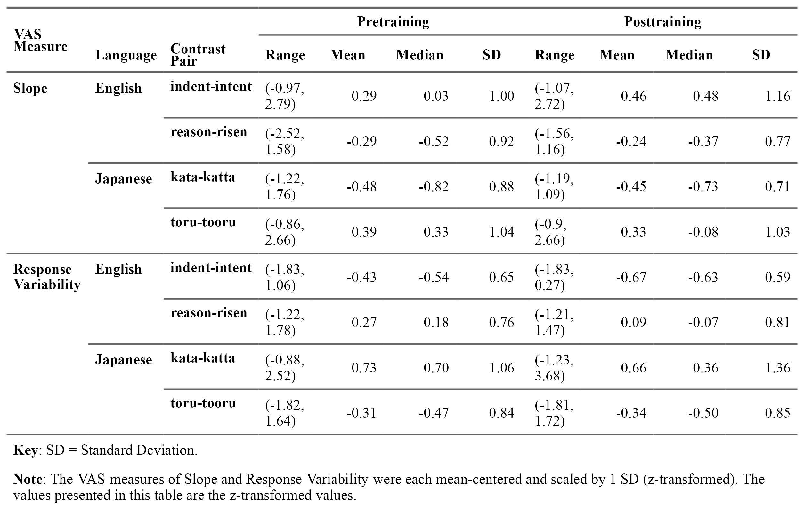
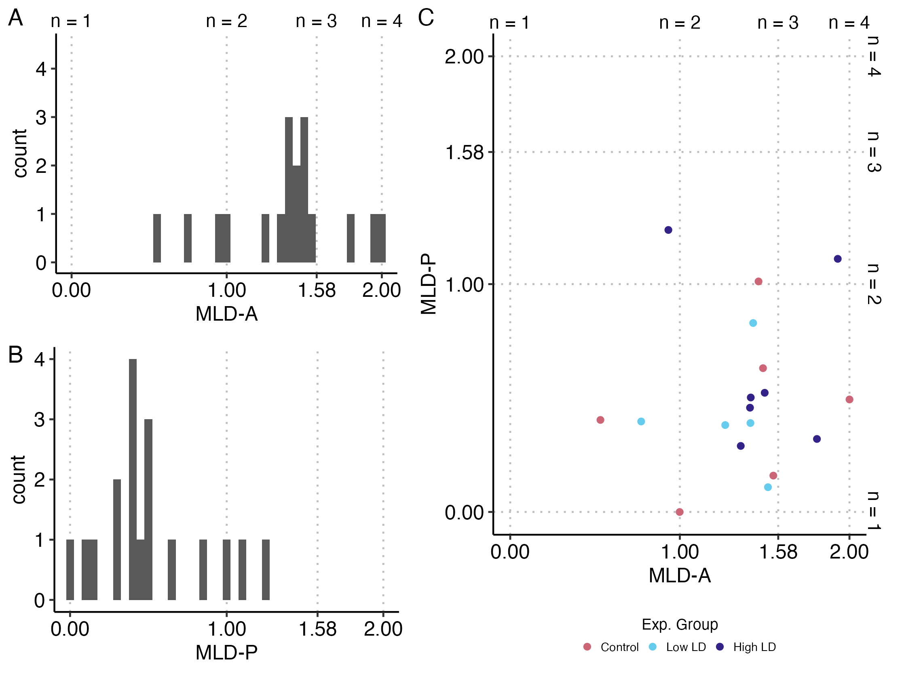
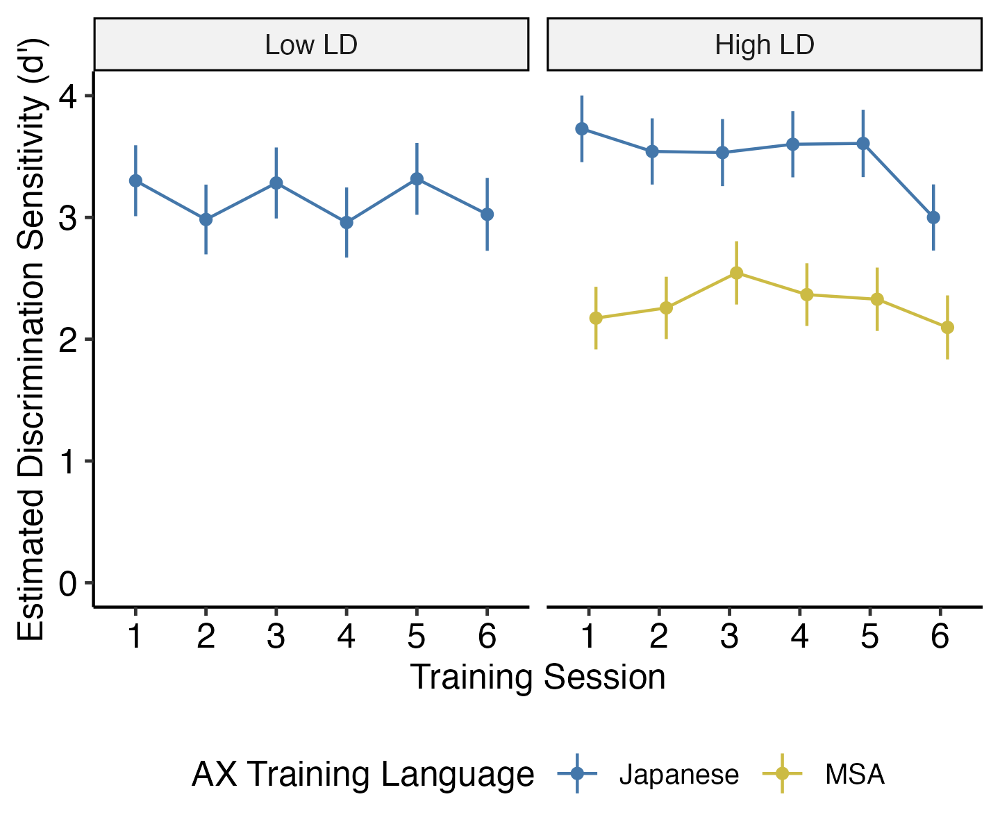
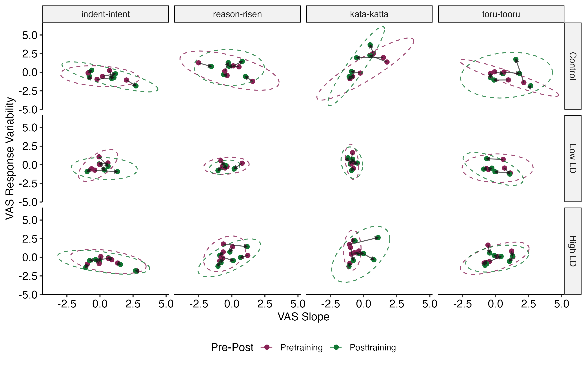
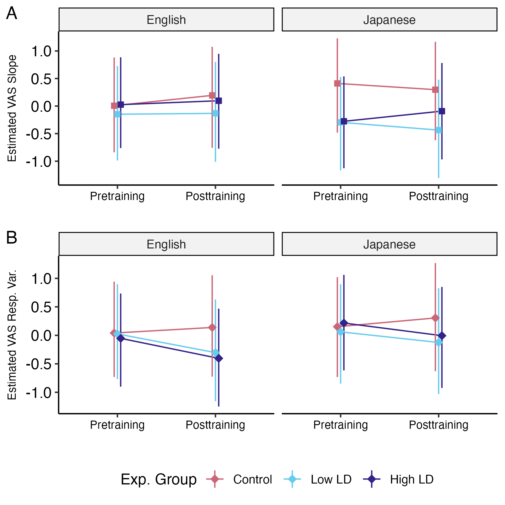
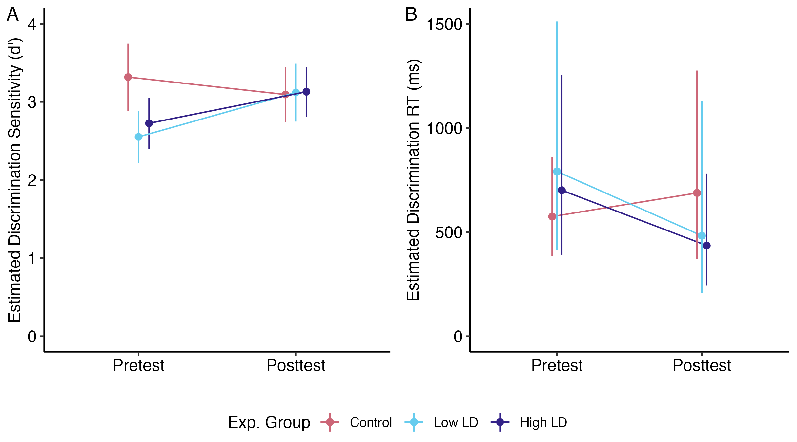
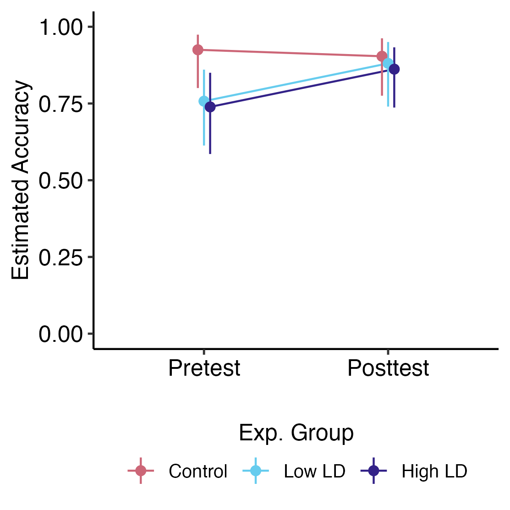

# Study 3 {#study3}

```{r, include=FALSE}

# all that needs to be changed is seq_id in the run_autonum function, which restarts figure/table numbering with each chapter

# create functions for table and figure captions using officer functions

# these functions use the chunk label to enable cross-referencing with bookdown syntax 

table_caption <- function(caption){
  block_caption(label = caption,
              style = "Table Caption",
              autonum = run_autonum(seq_id = "chp5tab", 
                       pre_label = "Table ", 
                       tnd = 1, tns = ".", 
                       bkm = opts_current$get("label"),
                       prop = fp_text_lite(bold = TRUE)))
}

figure_caption <- function(caption){
  block_caption(label = caption,
              style = "Image Caption",
              autonum = run_autonum(seq_id = "chp5fig", 
                       pre_label = "Figure ", 
                       tnd = 1, tns = ".", 
                       bkm = opts_current$get("label"),
                       prop = fp_text_lite(bold = TRUE)))
}

# an alternative to include_graphics - figures are in their original aspect ratio (but huge in the output, usually like 200% so I might have to manually go in and change everything...)

officer_figure <- function(file){
fpar(external_img(file, guess_size = T), fp_p = fp_par_lite(word_style = "Figure", keep_with_next = T))
}
```

<!-- I'm gonna say this top section is good enough -->

In the previous chapter, I explored the effects of short-term exposure to specific linguistic diversity via a perceptual training paradigm on L1 and L2 categorization and the learning of novel L2 phonemic contrasts of monolingual L1 English listeners. Although listeners on average showed signs of learning following training, learning did not differ significantly between the Low LD and High LD groups, and the training did not have a significant impact on the VAS categorization measures of slope and response variability for L1 nor L2. The next step of exploration was to test the perceptual training with linguistic diversity paradigm in a relatively more ecologically valid environment. Instead of examining the effects of specific linguistic diversity in naïve listeners, it became of interest to explore the effects of the training paradigm in active L2 learners and whether the training paradigm accelerated the learning of L2 phonemes when used as a supplement to foreign language classroom instruction. Subsequently, to act as classroom supplementation, the length of perceptual training was extended over the span of weeks rather than being contained to a single 30-minute session. With this new direction in exploration, RQ3 asked: Does specific exposure to linguistic diversity through perceptual training lead to improvements in L2 speech perception and listening? This research question was asked in addition to RQ2 to gauge not only L2 speech learning when listening to isolated minimal pairs, but L2 speech learning when listening to naturalistic speech. In summary, Study 3 was conducted to investigate the effects of long-term perceptual training with specific linguistic diversity as a supplement to foreign language classroom instruction on (1) gradient categorization of L1 and L2 speech, (2) L2 phoneme discrimination, and (3) L2 speech perception and listening.

To carry out this investigation, I conducted a longitudinal experimental study comparing a control group (classroom instruction only) to two training groups who completed perceptual training with stimulus sets of vowel length and consonant gemination minimal pairs that varied in linguistic diversity (Low LD and High LD). All three experimental groups were compared using a pre-post design for (1) the VAS task to measure changes in L1 English and L2 Japanese categorization gradiency, (2) the AX perceptual discrimination task to measure changes in L2 Japanese perceptual sensitivity, and (3) a multiple-choice partial dictation listening assessment to assess changes in L2 speech perception and listening. I had hypothesized that learners who performed the perceptual training would exhibit changes in categorization gradiency reflecting more gradient patterns (lower slope, lower response variability) compared to the control group, and that this effect would be stronger for the High LD group compared to the Low LD group. I subsequently hypothesized that those who performed the perceptual training would show signs of greater L2 learning, that is, greater improvements in L2 phoneme discrimination sensitivity and L2 listening accuracy, compared to the control group, and that, again, this effect would be stronger for the High LD group. 

I chose to use a multiple-choice partial dictation task as the L2 listening assessment for several reasons. Typically, dictation tests have the test-taker listen to dialogue about a paragraph in length and write down everything they hear; partial dictation tests are several sentence-length recordings rather than one or two paragraph-length recordings. Another difference of partial dictation is that test-takers are presented with the audio recordings and text transcription of the audio with certain words omitted, which the test-taker must fill in [@Buck2001Assessing; @Cai2014Dictation]. Dictation has often been used at multiple levels of proficiency in L2 English placement exams [@Cai2013Partial; @Henning1983Listening; @Kimura2016Developing; @Leeming2016Using; @Wong2014Using]. As an assessment, partial dictation is a type of gap-filling integrative task that may measure constructs of both bottom-up and top-down listening processes [@Buck2001Assessing; @Cai2013Partial]. In terms of the bottom-up processes of interest in the present study, namely, discrimination sensitivity, dictation scores have been shown to moderately correlate with scores on a phonological discrimination test [@Oller1971Dictation]. In terms of higher-level processes and general L2 proficiency, dictation scores have been shown to correlate well with other English overall proficiency test scores, such as the TOEFL and TOEIC [@Irvine1974Cloze; @Leeming2016Using; @Oller1975Dictation; @Oller1971Dictation; @Shizuka2016How; @Wong2014Using]. Partial dictation has also been used to measure L2 Japanese proficiency [@Kaga1991Dictation], and in fact, a popular Japanese placement test, the Simple Performance-Oriented Test (SPOT), is itself a speeded partial dictation listening test [@Ford-Niwa1999SPOT].

In the study design, I used partial dictation, and the omitted key words contained the target contrasts. Further, I chose to use multiple choice, rather than fill-in-the-blank, because it made scoring simpler and because I am interested in the learners' perception (answer recognition) rather than production (written answer) of the target contrast in the key word. Additionally, multiple-choice allowed me to assess the learners' acquisition of the target contrasts by presenting them with competing answer options that contain both long and short segments, meaning they must accurately perceive the audio in order to make the correct choice amidst options containing the phoneme contrasted with that of the key word. The construction of the multiple-choice partial dictation was informed by conventions suggested by @Kimura2016Developing and @Shizuka2016How.

## Methodology {#st3-methods}

<!-- I think this is done!! -->

<!-- this top section is done I think -->

The longitudinal procedure for Study 3 is presented in Table \@ref(tab:st3-proc). This experiment took place entirely online. Recruitment and participant screening were conducted via email and Google Forms. After screening, participants were randomly assigned to either the Control group, the Low Linguistic Diversity (Low LD) training group, or the High Linguistic Diversity (High LD) training group. Participants completed the experiment on their personal laptop or desktop computer via Gorilla.sc [@Anwyl-Irvine2020Gorilla]. All participants provided informed consent approved by the Carnegie Mellon University Institute Review Board (IRB).

On the first day of the study, participants underwent a system check to ensure the auto play of sound at a comfortable level and a short task to ensure compliance with the use of wired binaural headphones [@Milne2021online]. After this, they completed the listening assessment pretest, the pretraining VAS task, and the AX discrimination pretest. At least 24 hours following the pretest battery, participants in the experimental training groups (Low LD and High LD) received an email reminder to return to the research website to complete the first of six AX discrimination training sessions. Upon completion of each training session, a 48-hour waiting period ensued, after which participants received an email reminder to return to the study for their next training session. At the start of each training session, participants were prompted to put on headphones to recalibrate their audio volume. Subsequent email reminders were sent to participants who did not complete their training sessions within 48 hours of the initial email reminder.

At least 24 hours after their final training session, participants received an email reminder to return to the research website for the final day of posttests. For participants in the control group, the email reminder to return for the final day of posttests was sent after at least 21 days had passed from their first day of the study. For the final day, all participants completed the AX discrimination posttest, the post-training VAS task, and the listening assessment posttest. After this, participants completed the LDQ and read a debriefing of the purpose of the study. The total time commitment for the study was two hours for the Control group and five hours for experimental training groups.

All participants were compensated for their participation at an hourly rate with their choice of a virtual gift card. To encourage retention, participants were offered a bonus if they completed all parts of the study up to and including the final day. Participants who dropped out early were still compensated according to the number of hours completed, but did not receive a bonus.

```{r tab.id="st3-proc", label="st3-proc"}

table_caption("Order and Description of Tasks for Study 3.")
st3e$ft.st3.proc

#
```

### Participants {#st3-participants}
<!-- okay I think I'm done -->

A total of 24 participants were recruited from university-level Japanese language courses. Due to IRB restrictions, participation was limited to persons present in the US at the time of the study, excluding 11 states with certain data privacy laws. All participants were contacted via recruitment emails forwarded to students by classroom instructors. Recruitment emails were sent to Japanese instructors at 20 universities across the U.S., and six universities were represented among the 24 students who participated. As one of the priorities for Study 3 was to test the perceptual training paradigm in a more ecologically valid environment, controlling for confounding factors such as participants' linguistic backgrounds was less of a priority compared to Study 2. As such, there were no exclusion criteria with regards to L1, and the major eligibility requirement was to be enrolled in a Japanese language course, which participants confirmed by reporting their university and course number. Participants confirmed the following eligibility criteria at screening and reconfirmed at the time of consent:

-   Must be between the ages of 18-40
-   Must self-report having normal hearing
-   Must self-report having no history of learning disability, memory impairment, or auditory processing disorder
-   Must be currently enrolled in a Japanese language course (must be able to read ひらがな *hiragana*)

Of the 24 recruited participants, five participants dropped out of the study partway through or did not return for the final day, and one participant was removed from the data due to experiencing technical difficulties that prohibited completion of the study. This resulted in a total of n = 18 participants included in the statistical analyses (10 female, 8 male; mean age = 21.5, SD = 3.4, range = 18-32; Control n = 6, Low LD n = 5, High LD n = 7). Table \@ref(tab:st3-participant-levels) describes the proficiency levels of the 18 participants by experimental group, based on the year of their reported course in the course sequence of their university's Japanese language program.

```{r tab.id="st3-participant-levels", label="st3-participant-levels"}

table_caption("Distribution of Language Proficiency Levels by Experimental Group, as Determined by University Course Level.")
st3e$ft.participant.levels

```


Although the study was intended to last 3-4 weeks, with two training sessions per week for the experimental training groups, participants varied in the time taken to complete the study. For the experimental training groups, the time between the first and final days of the study was dictated by how closely participants adhered to the study schedule and how quickly they responded to study session reminders. Study reminders to return for the final day were sent to the Control group at least 21 days after their first day of the study, though the actual time between the first and final days varied based on how quickly participants responded to the final day reminder. The distribution of days between the first and final days ranged from 23-48 days (mean = 31 days, SD = 6.9 days), and for the experimental training groups, the distribution of days between the first and last training sessions ranged from 17-38 days (mean = 25 days, SD = 5.2 days).

### VAS task {#st3-vas}

<!-- I think this is sufficiently done -->

#### Stimuli {#st3-vas-stim}

<!-- I think this is sufficient -->

Study 3 used the same set of one-dimensional VAS stimuli as in Study 2 (see Section \@ref(st2-vas-stim)). To briefly reiterate, listeners judged the same L1 English contrasts (minimal pairs *indent*-*intent* & *reason*-*risen*) and L2 Japanese contrasts (minimal pairs *kata*-*katta* & *toru*-*tooru*), varying along only the primary auditory dimension at the midpoint (3^rd^ step) of the secondary dimension from the Study 1 set of stimuli. Refer to Table \@ref(tab:st2-continua-1d) for a summary of the acoustic characteristics of the one-dimensional continua.

#### Procedure {#st3-vas-proc}

<!-- I think this is sufficient -->

The procedure for the pretraining and posttraining VAS task was the same as in Study 2 (see Section \@ref(st2-vas-proc)). As a reminder, participants completed four blocks of 28 trials each (7 continuum steps x 4 repetitions), for a total of 112 trials, which took approximately 8-10 minutes to complete. Participants were able to take a timed 30-second break between blocks. The two L1 English continua blocks were followed by the two L2 Japanese blocks. Participants were randomized into conditions that counterbalanced the order of within-language continuum blocks for each the pre- and posttraining VAS tasks. Participants in all experimental training conditions completed the VAS tasks.

#### Data pre-processing {#st3-vas-prep}

<!-- done -->

Before the curve fitting process, data were cleaned and filtered. Starting with the full dataset (4707 trials from n = 24 participants), participants who did not return for the final day of the study were first removed from the data. From the remaining data (4032 trials from n = 18 participants), reaction times (RTs) were natural log-transformed to normalize the RT distributions. The data were filtered on a per participant basis to remove trials with log-RTs three median absolute deviations (MAD) above or below the participant's median log-RT (3943 trials). The range of RTs following this filtering was from about 560 ms to about 8600 ms.

As in Study 2 (Section \@ref(st2-vas-prep)), the VAS pre- and posttraining data were fitted with a four-parameter logistic curve function to obtain measures of VAS slope and response variability using the Non-linear Curvefitting MATLAB package [@McMurray2017Nonlinear]. As before, the upper and lower boundaries for the slope parameter estimate were adjusted to account for amplitude scale and an amplitude-dependent penalty was added to the least-squares error function, reducing instability in slope estimates when response amplitude was low and/or when response patterns were noisy.

The raw VAS slope values ranged from -59.3 to 190.2 (median = 45.4, mean = 59.2, SD = 47.0). Raw slope values with low absolute values indicated shallower response curves whereas high absolute values indicated steeper response curves. Negative slopes indicated reversed categorization. The raw response variability values ranged from 1.1 to 43.2 (median = 13.8, mean = 15.1, SD = 7.6). Low response variability indicated more consistent categorization whereas high response variability indicated less consistent, noisier categorization.

To standardize the data, VAS slope and response variability values were each grand mean centered and scaled by one standard deviation (z-transformed). The z-transformed values were used in subsequent analyses. Table \@ref(tab:st3-vas-stats-table) presents the summary statistics of the z-transformed VAS slope and response variability estimates for each contrast pair at pretraining and posttraining, averaged across n = 18 participants.

```{r tab.id="st3-vas-stats-table", label="st3-vas-stats-table"}
#st3e$ft.estimates.grouped

# the table was coming out ugly so I'm going to use a png of the flextable
table_caption("Summary Statistics of VAS Measures Estimated from Logistic Curve Fitting, by Contrast Pair and Time.")
officer_figure("table/st3-ft-estimates-grouped.png")
#
```

### AX discrimination perceptual training and pre-posttests {#st3-ax}

<!-- done! -->

#### Stimuli {#st3-ax-stim}

<!-- probably good enough -->

The stimuli for the AX discrimination tasks were the same as in Study 2 (see Section \@ref(st2-ax-stim) and Appendix D). To briefly reiterate, there were 18 Japanese minimal pairs and 18 MSA pairs used for training (six vowel length pairs and 12 consonant gemination pairs) and 25 additional Japanese minimal pairs used for testing (13 vowel length pairs and 12 consonant gemination pairs). There was one male and one female speaker for each language.

#### Procedure {#st3-ax-proc}

<!-- I think done -->

Participants in the Low LD and High LD groups took part in perceptual discrimination training for six training sessions over the span of a few weeks. Each training session lasted 15-30 minutes, depending on the participant's own speed, and the procedure of each training session was exactly as described in Study 2 (see Section \@ref(st2-ax-proc)). For the first training session, participants received full instructions describing the task and encouraging listeners to ignore speaker identity, focus on the words themselves, and to use the feedback to learn how to tell the words apart. Subsequent sessions provided abbreviated instructions as a refresher. Training sessions were spaced apart to have at least 48 hours of waiting time between sessions, and the experiment was configured such that participants could not start the next training session before 48 had passed since finishing the last training session.

Each training session consisted of eight blocks of 36 trials each, for a total of 288 training trials. The same set of training stimuli were used for each session. For the High LD group, this consisted of the 18 Japanese minimal pairs and 18 MSA minimal pairs, with each pair presented eight times over the course of the training session across four trial types (AA, BB, AB, BA). For the Low LD group, this consisted of the 18 Japanese minimal pairs, with each pair presented 16 times over the course of the training session across the four trial types.

The control group did not undergo any perceptual training. Instead, to assess the effects of the added perceptual training compared to receiving only classroom instructions on change in discrimination sensitivity, all participants completed the same AX discrimination pre- and posttest. The discrimination tests used 25 Japanese minimal pairs not used in training. The trial procedure was the same as the training trial procedure, excluding the feedback. Participants saw each of the four trial types (AA, BB, AB, BA) twice per minimal pair, resulting in a total of 200[^05-study3-1] testing trials, randomized and divided into four blocks of 50 trials each. Participants were able to take a timed 30-second break between blocks. The pre- and posttests took approximately 10-15 minutes to complete.

#### Data cleaning {#st3-ax-prep}
<!-- done! -->
The discrimination testing data were filtered prior to running the generalized linear mixed-effects model used to estimate d'. Starting with the full dataset (8625 trials from n = 24 participants), participants who did not return for the final day of the study were first removed from the data. From the remaining data (7200 trials from n = 18 participants), reaction times (RTs) were natural log-transformed to normalize the RT distributions. The data were filtered on a per participant basis to remove trials with log-RTs three median absolute deviations (MAD) above or below the participant's median log-RT (7057 trials). Following this, all trials with raw RTs above 10 s and below 150 ms were removed from the data to exclude slow trials that were unlikely to reflect task engagement and fast trials that were unlikely to reflect true cognitive processing [@Whelan2008Effective]. The final dataset consisted of 6760 trials from n = 18 participants. The data fit to the linear mixed-effects model estimating mean log-RT were further filtered to include only correct trials, resulting in 5884 trials. 

The discrimination testing data were also analyzed with a generalized linear mixed-effects model to estimate d' for each training session. The same cleaning process was used. Starting with the full dataset for the training groups (25918 trials from n = 17 participants), then removing those who did not come back for the final day of the study (20735 trials from n = 12 participants), trials were filtered out that were above and below 3 MAD intervals around participants' median log-RT (20208 trials), followed by trials with raw RTs above 10 s and below 150 ms. The final training dataset consisted of 18693 trials from n = 12 participants from the Low LD and High LD training groups.

### Multiple-choice partial dictation (MCPD) listening assessment {#st3-mcpd}

<!-- pretty sure this is done -->

#### Stimuli {#st3-mcpd-stim}

<!-- done -->

L2 speech perception and listening was measured with a multiple-choice partial dictation (MCPD) listening assessment, which attempted to assess perception of the target phonemic contrast in more relatively naturalistic speech (i.e., sentence context), rather than as decontextualized isolated words, as was assessed in the discrimination task. The idea of the MCPD assessment was to challenge participants to rely on phonemic recognition and discrimination to identify the spoken word, and accurately identity the correct choice amidst phonologically similar competitors among the written multiple-choice answers.

The MCPD assessment consisted of 20 Japanese sentences, each with one missing word that contained a target phoneme. The other multiple-choice options were one *competing distractor*, which was a word that is contrastive according to the target phonemic contrast, and two *noncompeting distractors*, which were phonetically/phonologically similar to the target word and/or phonemically contrastive according to a non-target phonemic contrast. The key words with the target phoneme and the competing distractor were minimal pairs featured in either the discrimination training or testing tasks. Most noncompeting distractors were real words, with a few items being phonotactically valid non-words or real words that occur at low frequency in every day Japanese speech. The sentences were structurally simple and non-specific in content to enable any of the answer options to fit in the blank space both semantically and syntactically. Some sentence frames were sourced from past literature [@Hirata2007Training; @Hirata2004Training].

Below is a breakdown of an example sentence, with explanations for each of the distractor choices:

> *kinoo kare ga (kiita).* 'Yesterday he (asked).'
>
> (\*) *kiita* 'asked'
>
> ( ) *kita* 'came'
>
> ( ) *kitta* 'cut [it]'
>
> ( ) *kieta* 'disappeared'

Here, *kiita* is the correct answer, *kita* is the competing distractor that is contrastive according to the vowel length target contrast, *kitta* is a phonologically similar noncompeting distractor that contrasts with the correct answer by containing geminate consonant instead of a long vowel, and *kieta* is a phonetically similar noncompeting distractor. This sentence was used as the example trial in the instructions of the task (see Figure \@ref(fig:st3-mcpd-trial) in the following section).

The 20 sentences used in the assessment was recorded by the same 38-year-old female speaker who provided her voice for the VAS stimuli and the AX discrimination stimuli. The speaker recorded the MCPD sentences at the same time as the AX discrimination stimuli, using the same recording set up and procedure (see Section \@ref(st2-ax-stim)). The speaker was presented with each MCPD sentence one-by-one on a computer screen and asked to produce each sentence three times at a natural speaking rate with a 1-2 second pause between each repetition. The recordings selected for the stimulus set selected recordings were all RMS normalized to 67 dB using the `Scale intensity` function in Praat, were appended with at least 50 ms of silence before and after the sentences, and were saved in both .wav and .mp3 formats.

Of the 20 target keywords, 10 were words that were used in discrimination training and 10 were words that were used in the discrimination pre- and posttests. The 20 keywords were balanced to consist of 10 vowel length contrast targets and 10 consonant gemination contrast targets, and phonemically balanced across the length contrast, i.e., 10 target words being a short quantity phoneme and 10 target words being a long quantity phoneme. For a full list of sentences, target keywords, distractors, and their translations, see Appendix E.

#### Procedure {#st3-mcpd-proc}

<!-- done -->

In the MCPD listening assessment, participants received instructions describing the trial procedure followed by an example trial (Figure \@ref(fig:st3-mcpd-trial)). In each trial, participants saw a written sentence on the screen with a blank space indicating a missing word. There was a play button for participants to manually start listening to the audio recording in order to choose the correct option among four choices to fill in the blank. The positions of the correct answer and distractor choices were randomized. The "Next" button to move on to the next trial was disabled until a choice was selected, and participants could change their selection any number of times before continuing to the next trial. Participants had the option to listen to the recording one additional time. Feedback was not provided. The 20 trials were presented in randomized order, the pre- and posttests were identical. The task took less than five minutes to complete. Participants in all experimental conditions completed the MCPD listening assessments.

```{r fig.id="st3-mcpd-trial", label="st3-mcpd-trial"}
#
officer_figure("figure/st3-mcpd-example-trial.png")
figure_caption("Example trial for the MCPD listening assessment.")
```

#### Data cleaning {#st3-mcpd-prep}
<!-- I'm gonna say this is good enough -->

Although MCPD accuracy can be simply calculated per participant by dividing the number of correct trials but the number of total trials, I chose to use a generalized linear mixed-effects model of the binomial distribution with the logit link to estimate accuracy at the trial level. Modeling the number of correct trials out of n = 20 trials as a binomial response variable allows for the predictor covariates to contribute to explaining both trial-level and item-level variability in the estimation of accuracy.

Initial data cleaning steps followed that of the VAS and AX discrimination data pre-processing, starting with the full MCPD dataset (840 trials from n = 24 participants) and removing those who did not return for the final day of the study (720 trials from n = 18 participants). However, filtering using the MAD process only resulted in the removal of 6 trials based on their log-RT. Due to the small number of trials per participant (40 trials between pretest and posttest data), these 6 trials were retained to preserve the maximum number of trials such that all participants could have pre- to posttest accuracy trajectories modeled for all MCPD items. Thus, the final dataset consisted of 720 trials.


### LDQ {#st3-ldq}

<!-- I think this is good enough, didn't say much by way of interpretation, just described the distributions -->

Participants completed the LDQ, which is described in detail in Section \@ref(st1-ldq) and can be found in Appendix A. As in Studies 1 and 2, the LDQ was used to measure active and passive use of and exposure to linguistic diversity through one's language background, history, use, and experiences. The LDQ produced two aggregate scores for indices of experiential linguistic diversity: Active Multilingual Language Diversity (MLD-A) and Passive Multilingual Language Diversity (MLD-P).

Figure \@ref(fig:st3-mld-plot) visualizes the distributions of the MLD-A and MLD-P scores of the Study 3 participants. The distribution of MLD-A had a range of 0.53-2 and a median of 1.42 (mean = 1.38, SD = 0.377) and the distribution of MLD-P had a range of 0-1.24 and a median of 0.43 (mean = 0.513, SD = 0.338). By virtue of being foreign language students, all participants had non-zero MLD-A scores, meaning that all participants reported language experience with at least two languages. Fourteen of the 18 participants reported language experience with three or more languages, and of these 14, three participants reported language experience with four languages. Five participants reported a non-English L1. All but one participant had non-zero MLD-P scores. There was no significant correlation between MLD-A and MLD-P scores (Pearson's *r*(16) = .11, *p* = 0.677). While experiential linguistic diversity was not a variable of interest for RQ2 and RQ3, the MLD-A and MLD-P scores were added to the statistical analyses as control variables.

```{r label="st3-mld-plot", fig.id="st3-mld-plot"}
#
officer_figure("figure/st3-mld-plot.png")
figure_caption("Histograms of MLD-A (A) and MLD-P (B) scores and scatterplot of correlation between MLD-A and MLD-P where each dot represents an individual (C). Grid lines indicate the score corresponding to balanced use of n languages. Scores in between these breakpoints represent imbalanced use of two, three, and four languages as MLD scores approach 1, 1.58, and 2, respectively.")
```

## Analyses and Results {#st3-results}

<!-- DONE! -->

### Analysis models and predictions {#st3-analysis}

<!-- ALL DONE!! -->

Recall that the aim of Study 3 was to investigate the effects of long-term specific exposure to linguistic diversity through perceptual training, in conjunction with foreign language classroom instruction, and to answer RQ2 and RQ3. RQ2, which was also explored in Study 2, asked whether specific exposure to linguistic diversity through perceptual training leads listeners to more gradient categorization strategies and whether this leads to improved L2 discrimination sensitivity. Additionally, RQ3 asks: Does specific exposure to linguistic diversity through perceptual training lead to improvements in L2 speech perception and listening? To answer these research questions, I performed largely the same set of analyses as in Study 2. I ran set of five (generalized) linear mixed-effects models to explore the effects of the perceptual training paradigm on changes in (1) gradient categorization of L1 and L2 speech, (2) L2 phoneme discrimination, and (3) L2 speech perception and listening.

The small number of participants in Study 3 necessitated the simplification of some models that were similarly run in Study 2. For the models used to predict L2 discrimination ability, and additionally the model predicting L2 speech perception and listening, higher-order interaction terms between the key effects of interest, that is, time and experimental group, and the VAS covariate predictors of L1 and L2 slope and response variability became less central to the research questions. At initial modeling attempts, the reduced number of data points was not able to support such complex fixed and random effects structures, and so these interaction terms were removed to reduce multicollinearity, avoid overparameterization, and encourage model convergence. The final models all included interactions between time and experimental condition, and where relevant, time and the VAS covariate predictors, which maintained interpretable estimates with acceptable variance inflation, reflecting manageable levels of multicollinearity between the fixed effects. That being said, the limited number of participants warrant the cautious interpretation of all model outcomes.

As with Study 2, I had originally planned to analyze the VAS data using latent transition analysis, however, there was not enough data to support modeling VAS response profile membership. As such, like the previous two studies, I fit a Bayesian multivariate mixed-effects regression model to explore changes in gradient categorization of L1 and L2 speech using the *brms* R package [@Burkner2017brms]. VAS slope and response variability were predicted by time (Pre vs. Post), VAS contrast language (L1 English vs. L2 Japanese), and experimental condition (Control vs. Low LD vs. High LD) were used as predictor variables, including their interactions. Random intercepts and random slopes for time and VAS contrast language were modeled by participant, and random intercepts were modeled by VAS contrast pair. The residual correlation between VAS slope and response variability was moderately negative (median = -0.35, 95% CrI [-0.50, -0.16]), which robustly supports the use of the multivariate model over multiple univariate models.

I had hypothesized that long-term perceptual training would have an effect on VAS measures, so I predicted a significant interaction between time and experimental group. I predicted that while VAS slope and response variability for the Control group would not change much from pretraining to posttraining, I predicted that the training groups would show changes in the VAS measures, specifically that both training groups would show changes in VAS measures towards more shallow slopes and lower response variability, but that this effect would be stronger for the High LD group compared to the Low LD group. The addition of the interaction terms with VAS contrast language was largely exploratory, as I did not have specific predictions as to how the changes in VAS measures would be different between L1 and L2 categorization.

To explore changes in L2 phoneme discrimination, I modeled discrimination sensitivity at the trial level using a generalized linear mixed-effects model of a binomial distribution with a probit link transformation. The probability of binomial participant responses ("different" = 1, "same" = 0) was predicted by the true signal of the trial (numerically transformed such that "different" = 0.5, "same" = -0.5), time (Pre vs. Post), and their interactions with each other, experimental condition (Control vs. Low LD vs. High LD), and the continuous covariates of L1 and L2 VAS slope and response variability (averaged between the within-language contrast pairs to obtain a singular estimate of slope and response variability for L1 English and L2 Japanese). The effect of signal using the probit link function represents the SDT measure of sensitivity (d'), and interaction effects with signal represent changes in d' as a function of the interacting predictor[^05-study3-2].

Initially, the random intercepts and random slopes for the interaction between signal and time were modeled by participant and AX word pair in order to estimate participant- and item-level variation in discrimination sensitivity across both time points. However, this maximal random effects structure resulted in singular fits and failed to converge, even after extensive attempts with multiple optimizers. The model was unable to estimate individual-level changes in sensitivity over time as there was not enough variation in the degree of change in d' from pretest to posttest among participants to justify the inclusion of the slope interaction, which contributed to the singular fit. The random structure was iteratively simplified, and the final model included uncorrelated random slopes for the signal predictor at pretest only, by participant and AX word pair, which still captures the baseline individual- and item-level variability in d'. The model was ultimately able to successfully converge without singular fit using the *glmmTMB* R package [@Brooks2017glmmTMB]. As intercepts and effects that do not interact with signal are estimations of the SDT measure of response bias criterion *c*, which were not of interest and were not modeled in the random effects structure.

To explore changes in the speed of accurate L2 phoneme discrimination with regards to reaction time (RT), I modeled the per-trial natural log-transformed RT using a linear mixed-effects model. Log-RT was predicted by time and its interactions with experimental condition and L1/L2 VAS slope and response variability. Here, random intercepts and random slopes for Pre-Post were able to be modeled by participant and AX word pair, and the model successfully converged without singular fit using the *lme4* R package [@Bates2015Fitting].

To explore changes in L2 speech perception and listening, I modeled per-trial MCPD accuracy using a generalized linear mixed-effects model of a binomial distribution with the logit link using *lme4*. The predicted log-odds of a correct trial was estimated as a function of time (Pre vs. Post) and its interactions with experimental condition, and L1/L2 VAS slope and response variability. Initially, the model included random intercepts and slopes for time by participant and trial (i.e., the keyword for the MCPD trial sentence, which each appeared once at pretest and posttest) to allow for participant-level variability in change in accuracy and item-level variability in change in difficulty (which can answer the question, for example, did participants struggle with a particular keyword at pretest that then was easier at posttest?). However, the model was reaching singular fit because of perfect correlations between the random slopes and intercepts. After simplifying both the fixed and random effects structure, only the random intercepts per participant and trial were estimated, which allowed the model to successfully converge without singular fit. Overall, the model was structured to answer RQ3, that is, whether training with specific linguistic diversity leads to improvements in L2 speech perception and listening, and addresses whether individual differences in measures of categorization gradiency predict changes in listening assessment accuracy following training.

For these three models predicting discrimination sensitivity, discrimination RT, and MCPD accuracy, I expected to see overall improvements on average for participants from pretest to posttest, reflected by a main effect of time with increased d' scores, decreased RTs, and increased accuracy. I also predicted a significant interaction between time and experimental condition such that the training groups would improve to a greater degree compared to the Control group, and that the High LD group would show greater improvements compared to the Low LD group. Regarding the VAS covariates, I predicted that at both time points, lower values of both VAS slope and response variability, reflecting gradient categorization patterns, would predict higher accuracy, and that this effect would be stronger at posttest. However, I did not have specific predictions that differentiated the effect of the L1 vs. L2 VAS covariates.

Finally, as an exploratory analysis, discrimination sensitivity was modeled across training sessions for the Low LD and High LD experimental conditions. This was also modeled using a binomial generalized linear mixed-effects model with the probit link with *glmmTMB*. The probability of participants responding "different" on a trial was predicted as a function of the true signal of the trial, session (for six training sessions), training experimental group (Low LD vs. High LD), and the language of the AX training blocks in the case of the High LD training group. This model estimates d' (the effect of signal) and changes in d' across sessions, training groups, and across training languages for the High LD group (interaction effects with signal). Random intercepts and random slopes were estimated for signal by AX word pair. Random intercepts and slopes were estimated for signal and the interaction between signal and session by participant; these random effects were modeled as uncorrelated across participants (using the \|\| syntax) in order to facilitate model convergence and avoid overfitting of complex random effects covariance structures. This allowed for the modeling of d' at each of the six training sessions while simplifying the random effects structure.

All models included MLD-A and MLD-P, each grand mean centered, as control variables. When applicable, models also included the control variables of baseline AX discrimination sensitivity (d') at pretest (manually calculated using the `dprime` function of the *psycho* R package [@psycho2018]) and baseline MCPD accuracy at pretest (manually calculated by dividing the number of correct trials by the total number of trials), both mean-centered. Additionally, as each participant varied in the time taken in between the first and final days of the study, a variable representing the number of days in between pretest and posttest (or the number of days in between the first and final training sessions in the case of the model predicting d' for the training sessions) was added as a control variable, which was centered at the minimum observed value. For all models concerning the estimation of discrimination sensitivity (Pre vs. Post and training) and reaction time, the congruency of speaker identity (i.e., whether the speaker for Word A and Word B was the same or different) was also included as a control variable[^05-study3-3].

Categorical variables were contrast coded consistently between models. Time was dummy coded (Pre = reference level for Pre vs. Post models; Session 1 = reference level for AX training model). Experimental condition was orthogonally coded with two contrasts: Control group vs. Training groups (Control = -2/3, Low LD = 1/3, High LD = 1/3) and Low LD vs. High LD (Control = 0, Low LD = -1/2, High LD = 1/2). Note that for the AX training model, only the training groups were contrasted (Low LD = -0.5, High LD = 0.5). For models estimating AX discrimination results, speaker congruency (*Speaker Signal* in the models) was simple effects coded (same speaker = -0.5, different speakers = 0.5).

The following sections present the results of the analyses exploring the effects of the perceptual training paradigm on the gradient categorization, phoneme discrimination, and speech perception and listening. First, I provide an overview of the results from the perceptual discrimination training itself between the Low LD and High LD experimental training groups. Then, I discuss the results of the statistical models used to analyses the pre- and posttest data for the VAS task, the AX discrimination task, and the MCPD listening assessment task. The figures that accompany these results are visualizations of the estimated marginal means and slopes for the effects of interest, with covariates held at their mean values, which were estimated using the functions of the *emmeans* R package [@Lenth2025emmeans].

### AX discrimination training results {#st3-training-results}

<!-- okay it's done -->

The fixed-effects estimates of the generalized mixed-effects model predicting d' across training sessions is summarized in Table \@ref(tab:st3-training-fixed). Averaged across the experimental training groups, participants started off with very high sensitivity for the Japanese minimal pairs at Session 1 (*b* = 4.64, 95% CI [3.98, 5.29], *p* \< .001). Interestingly, d' significantly dropped from Session 1 to 2 by -0.27 (95% CI [-0.93, -0.01], *p* = 0.046) and from Session 1 to 6 by -0.74 (95% CI [-1.23, -0.25], *p* = 0.003). The experimental groups did not differ significantly in their average Japanese pairs d' values at Session 1 (*b* = 0.43, 95% CI [-0.32, 1.17], *p* = 0.264), and the three-way interaction terms between d', session, and experimental group indicate that the average difference in Japanese pairs d' between the Low LD and High LD groups did not significantly change from Session 1 to any of the subsequent sessions. The d' values for MSA minimal pairs, relevant only for the High LD group, were significantly lower than the d' values for Japanese minimal pairs at Session 1 by -1.55 units (95% CI [-2.03, -1.07], *p* \< .001). The interaction terms for between session and MSA pairs each describe the difference between the change in d' for the Japanese pairs and change in d' for the MSA pairs from Session 1 to the session in the interaction effect. Thus, the significant interaction between d' x Session 3 x MSA pairs (*b* = 0.57, 95% CI [0.09, 1.04], *p* = 0.020) indicates that the difference in mean d' between Japanese and MSA start at -1.55 at Session 1, with the d' for MSA being lower, and changed by 0.57, suggesting that the gap between the d' for each training language was closing (-1.55 + 0.57 = -0.98 difference in d' between Japanese and MSA at Session 3). Similarly, the significant interaction between d' x Session 6 x MSA pairs (*b* = 0.65, 95% CI [0.20, 1.10], *p* = 0.004) indicates that the distance between d' for Japanese and MSA became closer from Session 1 to Session 6 by 0.65 units (-1.55 + 0.65 = -0.90 difference in d' between Japanese and MSA at Session 6).

```{r label="st3-training-fixed", tab.id="st3-training-fixed"}
#st3e$ft.training.effects

# table was coming out ugly so using png of flextable
#

table_caption("Fixed Effects of the Binomial Generalized Linear Mixed-Effects Model Predicting AX Discrimination Sensitivity Across Training Sessions.")
#officer_figure("table/st3-ft-training-fixed.png")
st3e$ft.training.fixed
```

The trends for d' across training session by experimental group and training language are better understood by the visualization of the marginal effects of the three-way interactions, which are presented in Figure \@ref(fig:st3-ax-training-emmeans). The figure shows the Low LD group (left panel) and High LD group (right panel) both decreased in d' for the Japanese pairs at Sessions 2 and 6, leading to the significant interaction between d' x Session 2/6 averaged between the two training groups. The figure also makes clear that there was not a significant difference between the Japanese d' mean values between the two training groups. Additionally, the figure displays the trends that lead to the significant three-way interaction between d' x Session 3/6 x MSA pair for the High LD group. Specifically, the effect decreasing the distance between mean Japanese and MSA d' at Session 3 occurred due to the MSA d' increasing for Session 3, while the same effect was found at Session 6 due to the Japanese d' decreasing at Session 6. Overall, the results suggest that learners in the High LD did not significantly improve in discrimination sensitivity for the Japanese nor MSA pairs across training sessions, and that there was no significant difference between the Low LD and High LD groups in discrimination sensitivity for the Japanese pairs across the training sessions.

```{r label="st3-ax-training-emmeans", fig.id="st3-ax-training-emmeans"}
#
officer_figure("figure/st3-ax-training-emmeans.png")
figure_caption("Estimated marginal slopes of signal per training session, i.e., the estimated d' value on the probit link scale, by training language (color) and experimental training group, at mean values of covariates. Error bars reflect 95% confidence intervals. Note that the Low LD group did not train with MSA minimal pairs.")
```

The random effects of the model are presented in Table \@ref(tab:st3-training-random). The random slopes indicate that the standard deviation among Session 1 d' values for participants was 0.43 and 0.16 for Session 6, the model did not find substantial variation in d' scores for Session 2-5, which contributed to the decision not to model correlation between the random parameters.

```{r label="st3-training-random", tab.id="st3-training-random"}
#st3e$ft.training.effects

#

table_caption("Random Effects of the Binomial Generalized Linear Mixed-Effects Model Predicting AX Discrimination Sensitivity Across Training Sessions.")
#officer_figure("table/st3-ft-training-random.png")
st3e$ft.training.random
```

### VAS pre- and posttraining results {#st3-vas-results}

<!-- aight I think this is done -->

Figure \@ref(fig:st3-vas-slope-var-arrow) plots the two-dimensional space of the VAS slope and response variability measures from the curve fit estimation, by time (Pre vs. Post), VAS contrast pair, and experimental training. Each subplot has two dots per participant with directional arrows plotting the trajectory of each participant's change in VAS slope and response variability from pretraining to posttraining, along with the group-level Pre vs. Post spread for each subplot (dashed ellipses). Most subplots show that there was not much change in slope or response variability at the group level, as the shape of the pretraining and posttraining ellipses remain roughly the same. Interestingly, the pretraining and posttraining ellipses seem to be less stable in shape across the contrast pairs for the Control group. However, with the small sample sizes for each experimental condition, I hesitate to make any judgements based on the visualization. Still, the figure serves to visualize both individual and group-level measurements for VAS slope and response variability, which are statistically explored using the Bayesian multivariate mixed-effects model. 


```{r label="st3-vas-slope-var-arrow", fig.id="st3-vas-slope-var-arrow"}
#

officer_figure("figure/st3-vas-slope-var-arrow.png")
figure_caption("VAS slope (x-axis) and response variability (y-axis) of each participant at pretraining (raspberry dots) and posttraining (green dots) by VAS contrast pair and experimental condition (Control n = 6, Low LD n = 5, High LD n = 7) with directional arrows and summary ellipses. The directional arrows plot the change in VAS slope and response variability from pretraining to posttraining by participant. The colored dashed ellipses represent the 95% confidence interval about the x-y coordinates representing the pair-by-condition group mean for slope and response variability on pretraining (raspberry) and posttraining (green), assuming a bivariate t-distribution.")
```

The results of the Bayesian multivariate mixed-effects model predicting change in VAS slope and response variability are presented in Table \@ref(tab:st3-vas-fixef). The analysis revealed that there were almost no robust effects on VAS slope and response variability, as most the predictors had credible intervals that contained zero. The only effect considered robust was the interaction effect between VAS contrast language and the Control vs training groups at Pretest (*b* = -0.64, 95% CrI [-1.16, -0.12], *pd-p* = 0.02). However, this effect merely suggests that the difference in VAS slope between L1 and L2 was more negative for the training groups (averaged between Low LD and High LD) compared to the Control group at the time of pretraining. 

```{r label="st3-vas-fixef", tab.id="st3-vas-fixef"}

# 


table_caption("Fixed Effect of the Bayesian Multivariate Mixed-Effects Model Predicting Pre-Posttraining VAS Slope and Response Variability.")
#officer_figure("table/st3-ft-vas-fixed.png")
st3e$ft.vas.fixed
```

The interaction effect between VAS contrast language and experimental groups on VAS slope is visualized in Figure \@ref(fig:st3-vas-emmeans)A. This figure shows that at pretraining, L1 VAS slope values were similar amongst the experimental conditions, but for the L2 VAS slope values, the Control group has a higher mean value than the two training groups. The fact that the training groups have different baseline values at pretraining may suggest a random sampling error during the random assignment of experimental groups. Another trend seen in Figure \@ref(fig:st3-vas-emmeans)B shows that on average, the two training groups had decreasing trends for L1 and L2 VAS response variability means from pretraining to posttraining, while the Control group had flat or slightly increasing trends. The model revealed weak evidence for this trend, which was estimate of the effect of Control vs. Training on change from Pre to Post for VAS response variability, averaged across the VAS contrast languages (*b* = -0.40, 95% CrI [-0.86, 0.08], *pd-p* = 0.09). Again, with the small sample sizes for the experimental groups, this effect is highlighted with caution.

```{r label="st3-vas-emmeans", fig.id="st3-vas-emmeans"}
#

officer_figure("figure/st3-vas-emmeans.png")
figure_caption("Estimated marginal effects for VAS slope (A) and response variability (B) at pre- and posttraining by VAS contrast language and experimental group, at mean values of covariates. The figure plots the estimated median of the marginal effects with 95% highest density interval as the credible interval (CrI).")
```

The random effects parameters of the model, including the standard deviation of the random intercepts and slopes, their correlations, and indices of model fit are presented in Table \@ref(tab:st3-vas-ranef).

```{r label="st3-vas-ranef", tab.id="st3-vas-ranef"}


#

table_caption("Random Effects and Model Fit of the Bayesian Multivariate Mixed-Effects Model Predicting Pre-Posttraining VAS Slope and Response Variability.")
#officer_figure("table/st3-ft-vas-random.png")
st3e$ft.vas.random
```

### AX discrimination pre- and posttest results {#st3-ax-results}

<!-- alright I think I'm done -->

Figure \@ref(fig:st3-ax-dprime-rt-emmeans) shows the estimated marginal effects from the AX discrimination pre- and posttests for both discrimination sensitivity (d') and reaction time (RT). Figure \@ref(fig:st3-ax-dprime-rt-emmeans)A shows that the two training groups increased in d' from pretest to posttest while the Control group had a relatively flat or slightly decreasing trend, however, the Control group and training groups had different pretest baseline d' values. On the other hand, Figure \@ref(fig:st3-ax-dprime-rt-emmeans)B shows that the training groups decreased in RT from pretest to posttest, while the Control group increased in RT. These trends are discussed as results of the statistical analyses in the following sections.

```{r label="st3-ax-dprime-rt-emmeans", fig.id="st3-ax-dprime-rt-emmeans"}
#

officer_figure("figure/st3-dprime-RT-emmeans.png")
figure_caption("Estimated marginal effects for AX discrimination measures at pre- and posttest by experimental group, at mean values of covariates. Error bars reflect 95% confidence intervals. A. Estimated marginal slopes of signal, i.e., the estimated d' value on the probit link scale. B. Estimated marginal means of reaction time, back-transformed into the original response scale of milliseconds.")


```


#### Discrimination sensitivity results {#st3-dprime-results}

<!-- done I think  -->

The fixed- and random-effects of the generalized mixed-effects model predicting d' at pretest and posttest are summarized in Table \@ref(tab:st3-dprime-effects). These results of the model reveal that there was no significant effect of time on d' averaged across participants (*b* = 0.17, 95% CI [-0.45, 0.79], *p* = 0.589). Additionally, despite the trend suggested in Figure \@ref(fig:st3-ax-dprime-rt-emmeans)A, the interaction effect of d' x Control vs. Training groups on change from pretest to posttest was also not significant (*b* = 0.71, 95% CI [-0.30, 1.72], *p* = 0.170). These results fail to provide evidence of improvement in L2 discrimination sensitivity from pretest to posttest.

```{r label="st3-dprime-effects", tab.id="st3-dprime-effects"}


#

table_caption("Fixed and Random Effects of the Binomial Generalized Linear Mixed-Effects Model Predicting Pre-Posttest AX Discrimination Sensitivity.")
#officer_figure("table/st3-ft-dprime-effects.png")
st3e$ft.dprime.effects
```

#### Discrimination reaction time results {#st3-rt-results}

<!-- done I think  -->

The fixed-effects results of the linear mixed-effects model predicting log-RT are summarized in Table \@ref(tab:st2-rt-fixed-effects). The model estimates were back-transformed into the original RT units of milliseconds by exponentiating the coefficients, thus the slope effects for the predictor variables are multiplicative rather than additive. The model revealed that there was no significant effect of time on RT when averaging across participants (*b* = 0.91, 95% CI [0.64, 1.30], *p* = 0.608). However, there was a significant interaction of the effect of Control vs. Training groups on change from pretest to posttest (*b* = 0.51, 95% CI [0.30, 0.89], *p* = 0.018), which indicates the change in RT from pretest to posttest was 49% lower for the training groups compared to the Control group. This corroborates the difference in RT trends between the Control and training groups in Figure \@ref(fig:st3-ax-dprime-rt-emmeans)B, suggesting that the training groups became faster in accurate L2 discrimination after training compared to the Control group, who did not receive training.

```{r label="st3-rt-fixef", tab.id="st3-rt-fixed"}


#

table_caption("Fixed Effects of the Linear Mixed-Effects Model Predicting Pre-Posttest AX Discrimination Reaction Time.")
#officer_figure("table/st3-ft-rt-fixed.png")
st3e$ft.rt.fixed
```

The population-level random effects parameters are presented in Table \@ref(tab:st3-rt-ranef). Note that the random effects are based on natural log-transformed RT that was used in the model, as back-transformation of variance effects through exponentiation is not recommended.

```{r label="st3-rt-ranef", tab.id="st3-rt-ranef"}


# 

table_caption("Random Effects of the Linear Mixed-Effects Model Predicting Pre-Posttest AX Discrimination (Log-Transformed) Reaction Time.")
#officer_figure("table/st3-ft-rt-random.png")
st3e$ft.rt.random
```

### MCPD pre- and posttest listening assessment accuracy results {#st3-mcpd-results}

<!-- I think this is finished -->

The fixed- and random-effects of the generalized mixed-effects model predicting MCPD accuracy at pretest and posttest are summarized in Table \@ref(tab:st3-mcpd-effects). The table presents the Odds Ratio (OR) of the fixed-effects. Surprisingly, there was no significant effect of time (OR = 2.99 [0.75, 11.88], *p* = 0.119), indicating that participants did not improve in accuracy when averaging across experimental groups. The only significant predictor effect was for the difference in accuracy between the control and training groups at pretest, which found that the odds of accurate responses from the training groups (averaged between Low LD and High LD) were 0.24 times lower than the Control group (95% CI [0.06, 0.90], *p* = 0.034). As this effect was at pretest, this reflects that the Control group and training groups were starting at different baselines before the training period. This may be the result of random sampling error during the random assignment of experimental groups.

```{r label="st3-mcpd-effects", tab.id="st3-mcpd-effects"}


#
table_caption("Fixed and Random Effects of the Binomial Generalized Linear Mixed-Effects Model Predicting Pre-Posttest MCPD Accuracy.")
#officer_figure("table/st3-ft-mcpd-effects.png")
st3e$ft.mcpd.effects
```

Figure \@ref(fig:st3-mcpd-emmeans) visualizes the difference in the estimated marginal mean accuracy at pretest baseline between the Control group and training groups. The trajectory of accuracy from pretest to posttest is mostly flat for the Control group, while both training groups show a positive trend from pretest to posttest. However, this trend, represented by the interaction effect between time and Control vs. Training groups, was not statistically significant in the model (OR = 2.99, 95% CI [0.52, 17.18], *p* = 0.219). These results fail to provide evidence of improvement in L2 listening accuracy from pretest to posttest.


```{r label="st3-mcpd-emmeans", fig.id="st3-mcpd-emmeans"}
#

officer_figure("figure/st3-mcpd-emmeans-acc-only.png")
figure_caption("Estimated marginal mean accuracy at pre- and posttest by experimental group, plotted on the probability scale, at mean values of covariates. Error bars reflect 95% confidence intervals.")
```

## Study 3 Discussion {#st3-discussion}

<!-- good -->

The purpose of Study 3 was to investigate the effects of long-term specific exposure to linguistic diversity via perceptual training, as a supplement to classroom instruction, on gradient categorization of L1 and L2 speech, L2 phoneme discrimination, and L2 speech perception and listening. Active L2 Japanese learners enrolled in Japanese language courses at the time of the study underwent six sessions of AX discrimination perceptual training across several weeks to learn L2 Japanese phonemic length contrasts, with participants randomly assigned to either the Low LD training, who trained only with Japanese minimal pairs, or the High LD training group, who trained with Japanese and MSA minimal pairs. Learners in the training groups were compared to learners in the Control group, who did not receive perceptual training and only received classroom instruction. Before and after training (or an equivalent amount of time for the Control group), learners performed the VAS task to obtain categorization measures for L1 English and L2 Japanese contrast pairs, an AX discrimination test to assess perceptual discrimination sensitivity, and the MCPD listening assessment task to assess L2 speech perception and listening using naturalistic speech stimuli.

I hypothesized that perceptual training would not only push learners towards gradient categorization patterns, but would also lead to greater improvement in the L2 speech learning measures from discrimination and MCPD tasks for the training groups compared to the Control group, and that this effect would be stronger for the High LD group compared to the Low LD. However, these hypotheses were not supported by the results. First, there was no strong evidence that participants' VAS measures changed after the training time period, for either L1 or L2 categorization. Second, participants did not show consistent signs of L2 speech learning, for either L2 discrimination sensitivity or L2 listening accuracy, after the training time period. 

The lack of learning effects was unexpected, especially when comparing these AX discrimination pre- and posttest results to those of Study 2 (Section \@ref(st2-ax-results)). This may reflect that learners were already at ceiling and any additional gains in learning could not be measured using the AX discrimination task or MCPD task. It is possible that compared to the naïve listeners, perceptual training does not lead to learning for those with formal classroom experience with Japanese. However, previous literature would suggest that this is not the case, as HVPT has been found to benefit both learners with and without experience with the target language [e.g., @Iverson2012Auditory; @Georgiou2021Effects; @Cebrian2014SecondLanguage].

### Limitations {#st3-limitations}

<!-- done -->

The primary limitation of Study 3, and a more likely explanation for the lack of effects, is that the sample size was too limited to detect effects. While the visualizations of the AX discrimination and MCPD results (Figures \@ref(fig:st3-ax-dprime-rt-emmeans) & \@ref(fig:st3-mcpd-emmeans), respectively) suggested possible differences between the Control group and training groups (which was statistically supported for the AX discrimination reaction time results only), the complexity of the regression models required far more individuals per experimental group to detect any possible existing training effects.

Another limitation of the study could be the alignment between the population and the training method. As these are L2 classroom learners, a simple perceptual training paradigm using isolated minimal pairs may not have provided rich enough input to have an impact on learning. It is possible that a learning effect would have been larger had participants had trained with the words in semantically meaningful context, with phrase or sentence-long stimuli. The results of previous studies suggest that the background of the participant, whether naïve or actively learning the target language, plays a role in how the training context affects learning. For example,  monolingual L1 English speakers improved in perception of Japanese long vowels after perceptual training compared to a control group, but improvement was not significantly different between those who trained with words in isolation versus words in sentences [@Hirata2004Training]. On the other hand, L1 Korean speakers who were active L2 learners of Japanese improved when training with both words in isolation versus words with sentences, but those who trained with sentences showed improved generalizability [@Sonu2011Perceptual]. It is possible that proficiency level may also have an impact on the effectiveness of the training context, and the method of presentation of the target phonemes (using words in isolation, carrier sentences, or both) should be considered in relation to learners' proficiency levels in future studies.

Additionally, possible sampling error in the random assignment to experiment conditions made it difficult to draw conclusions on pre- to posttest effects, as the Control group was observed to have different baseline values for many of the measures collected. The impact of the sampling error may also have been exacerbated by the small sample sizes, as the Control group mean values could have been easily influenced by the presence of outlier individuals. Alternatively, the distribution of proficiency levels between experimental groups may have played a role. Although higher proficiency individuals (third and fourth years) were equally dispersed among the experimental groups, there was only one first year in the Control group; this could have artificially inflated the pretest scores of the Control group compared to the Low LD and High LD groups, which had more first-year students. Given the small number of individuals with different proficiency levels distributed between the experimental groups, the effect of course level could not be examined as an additional predictor of training effects on learning. Overall, the results of Study 3 cannot be confidently discussed due to small sample sizes and the lack of statistical power.


[^05-study3-1]: Note that this is double the number of testing trials as used in Study 2. The number of trials was doubled to increase power while adding minimal additional time to the task.

[^05-study3-2]: The intercept value and effects that did not interact with signal were estimates associated with response bias *c* in SDT, effects which were not of interest in the model interpretation and thus were not included in the results tables. See the supplementary materials online for the full fixed-effects tables from Study 3.

[^05-study3-3]: Control variable effects were not included in the results tables. See the supplementary materials online for the full fixed-effects tables.
